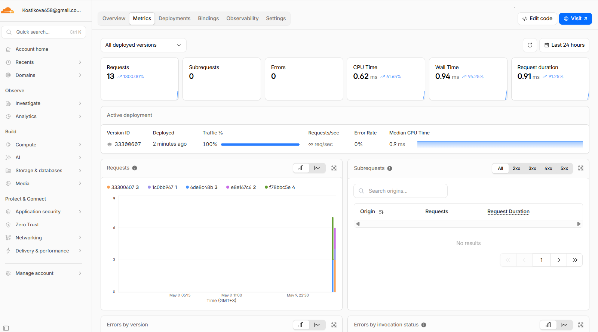
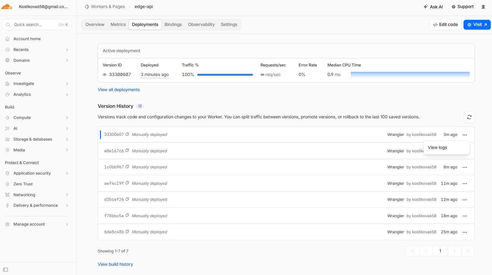
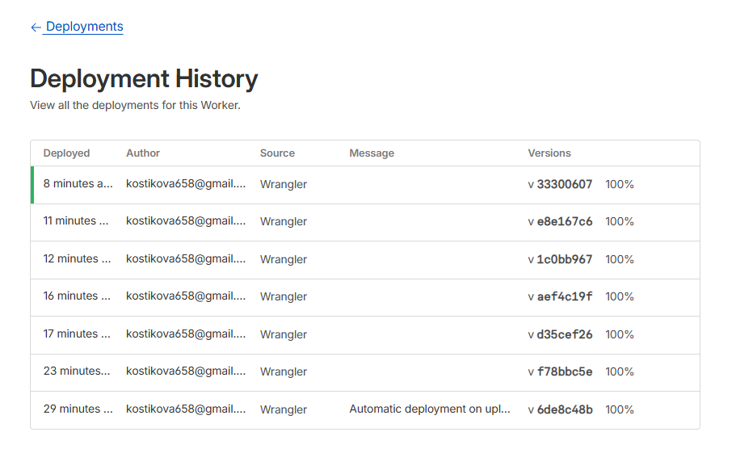
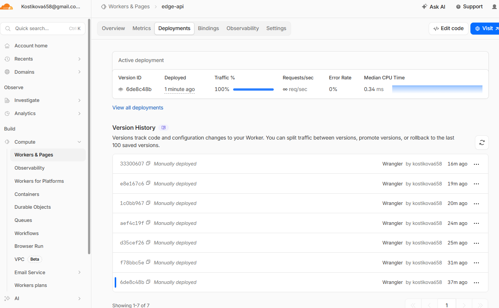

# Lab 17 — Cloudflare Workers Edge Deployment

## Task 1 — Cloudflare Setup

### 1.1 Account and Project Creation
A new Cloudflare account was created, and a Workers project named `edge-api` was initialized using `npm create cloudflare@latest`. The project was configured with the "Hello World" TypeScript template.

### 1.2 CLI Authentication
The Wrangler CLI was authenticated by running `npx wrangler login`. Verification was successful, as confirmed by the output of `npx wrangler whoami`:

```powershell
(venv) PS D:\INNOPOLIS\DEVOPS ENGINEERING\DevOps-course\edge-api> npx wrangler whoami

 ⛅️ wrangler 4.90.0
───────────────────
Getting User settings...
👋 You are logged in with an OAuth Token, associated with the email kostikova658@gmail.com.
┌──────────────────────────────────┬──────────────────────────────────┐
│ Account Name                     │ Account ID                       │
├──────────────────────────────────┼──────────────────────────────────┤
│ Kostikova658@gmail.com's Account │ 94f7d5ad139a9ee913caf0db9e3f2b1d │
└──────────────────────────────────┴──────────────────────────────────┘
```

### 1.3 Platform Concepts

- **Workers Runtime:** A lightweight JavaScript/Wasm serverless environment based on the V8 engine. It runs code at the edge without containers or VMs, enabling extremely fast cold starts.
- **`workers.dev` URLs:** A free subdomain provided by Cloudflare for every Worker, allowing instant public access without needing a custom domain. The format is `my-worker.my-subdomain.workers.dev`.
- **Bindings:** A mechanism to connect a Worker to resources like environment variables (`vars`), encrypted secrets (`secrets`), and key-value storage (`KV namespaces`). This is how configuration and state are managed.

---

## Task 2 — Build and Deploy a Worker API

### 2.1 Implemented Routes
A simple router was implemented in `src/index.ts` to handle requests to three distinct endpoints:
- `GET /`: A welcome message.
- `GET /health`: A health check endpoint returning `OK` with status 200.
- `GET /info`: An endpoint returning basic deployment metadata as a JSON object.

### 2.2 Local and Remote Deployment

**Local Verification:**
The Worker was tested locally using `npx wrangler dev`. The terminal output confirms that all implemented routes responded correctly with a `200 OK` status.

```powershell
PS D:\INNOPOLIS\DEVOPS ENGINEERING\DevOps-course\edge-api> npx wrangler dev
...
⎔ Starting local server...
[wrangler:info] Ready on http://127.0.0.1:8787
[wrangler:info] GET / 200 OK (7ms)
[wrangler:info] GET /favicon.ico 404 Not Found (3ms)
[wrangler:info] GET /health 200 OK (3ms)
[wrangler:info] GET /info 200 OK (4ms)
```

**Remote Deployment:**
The Worker was then deployed to the Cloudflare global network using `npx wrangler deploy`.

- **Public URL:** `https://edge-api.kostikova658.workers.dev`

**Deployment Output:**
```powershell
PS D:\INNOPOLIS\DEVOPS ENGINEERING\DevOps-course\edge-api> npx wrangler deploy

 ⛅️ wrangler 4.90.0
───────────────────
Total Upload: 0.82 KiB / gzip: 0.42 KiB
Worker Startup Time: 4 ms
Uploaded edge-api (7.98 sec)
Deployed edge-api triggers (5.90 sec)
  https://edge-api.kostikova658.workers.dev
Current Version ID: 6de8c48b-0422-4f07-91fb-10787bb9eab6
```

### 2.3 Version Control
All changes were committed to Git with the message `feat: implement initial API routes for v1.0.0`, establishing a baseline for future deployments.
---

## Task 3 — Global Edge Behavior

### 3.1 Edge Metadata Endpoint
A new endpoint `GET /edge` was added to return metadata from the incoming request context (`request.cf`). This object provides information about the Cloudflare data center that handled the request.

**Code added to `src/index.ts`:**
```typescript
// Edge metadata endpoint
if (url.pathname === '/edge') {
    const edgeMetadata = {
        colo: request.cf?.colo,
        country: request.cf?.country,
        city: request.cf?.city,
        httpProtocol: request.cf?.httpProtocol,
        tlsVersion: request.cf?.tlsVersion,
        asn: request.cf?.asn,
    };
    return new Response(JSON.stringify(edgeMetadata, null, 2), {
        headers: { 'Content-Type': 'application/json' },
    });
}
```

### 3.2 Public Edge Execution Verification
After deploying the new version (`f78bbc5e-b847-44d0-9780-d28241854522`), the `/edge` endpoint was called. The response confirms that the code is running on Cloudflare's global network and has access to request-specific metadata. The request was routed through the Frankfurt data center.

**JSON Response from `https://edge-api.kostikova658.workers.dev/edge`:**
```json
{
  "colo": "IAD",
  "country": "DE",
  "city": "Frankfurt am Main",
  "httpProtocol": "HTTP/2",
  "tlsVersion": "TLSv1.3",
  "asn": 210644
}
```

### 3.3 Global Distribution Explained
Cloudflare Workers automatically deploys code to its entire global network of data centers (over 300 cities). When a user makes a request, Cloudflare's Anycast network routes it to the nearest data center. This is fundamentally different from traditional cloud platforms (VMs, PaaS, Kubernetes) where you must manually select specific regions (e.g., `us-east-1`, `eu-west-2`) for deployment. With Workers, there is no "deploy to 3 regions" step because it deploys to *all* regions by default, minimizing latency for users worldwide.

### 3.4 Routing Concepts

- **`workers.dev`:** A free, managed subdomain provided by Cloudflare for instant public access to a Worker. It's ideal for development, testing, and simple APIs without needing your own domain.
- **Routes:** A mapping that connects a specific path on a *custom domain* (e.g., `api.mycompany.com/v1/*`) to a specific Worker. This is used for production traffic on your own domains.
- **Custom Domains:** Your own registered domain (e.g., `mycompany.com`) that you add to your Cloudflare account. You can then create Routes to trigger Workers from traffic to that domain.
---

## Task 4 — Configuration, Secrets & Persistence

### 4.1 Environment Variables
A plaintext environment variable `API_VERSION` was defined in `wrangler.jsonc` and used in the `/info` endpoint.

**`wrangler.jsonc` configuration:**
```jsonc
"vars": {
  "API_VERSION": "v1.1.0"
}
```
**Why not for secrets:** Plaintext variables in `wrangler.jsonc` are committed to version control, making them visible to anyone with repository access. This is a major security risk for sensitive data like API keys or passwords.

### 4.2 Secrets
Two secrets, `API_KEY` (value: `secret_key1`) and `ADMIN_EMAIL` (value: `admin@example.com`), were created using `npx wrangler secret put`. They are accessible via the `env` object in the Worker but their values are not stored in Git. The `/config` endpoint confirms they are loaded without exposing the `API_KEY` value itself.

**Verification via `/config` endpoint:**
```json
{
  "apiVersion": "v1.1.0",
  "adminEmail": "admin@example.com",
  "apiKeyLoaded": "true"
}
```

### 4.3 Persistence with Workers KV
A Workers KV namespace named `EDGE_KV` was created using `npx wrangler kv namespace create EDGE_KV` and bound to the Worker in `wrangler.jsonc`. API endpoints `POST /kv/:key` and `GET /kv/:key` were implemented to store and retrieve data. The routing logic was updated to support hyphens in keys.

**`wrangler.jsonc` binding:**
```jsonc
"kv_namespaces": [
    {
        "binding": "EDGE_KV",
        "id": "1600409be4814f9aaf1a48fafbb7b263"
    }
]
```

**Persistence Verification:**
A value was stored and successfully retrieved using PowerShell, confirming the KV binding works. The deployment ID for this version is `e8e167c6-33f9-4e90-bc87-cf0b61655969`.
```powershell
# 1. Store a value
> Invoke-WebRequest -Uri "https://edge-api.kostikova658.workers.dev/kv/test-key" -Method POST -Body "hello from the edge"

StatusCode        : 201
StatusDescription : Created
Content           : Stored value for key: test-key

# 2. Retrieve the value
> Invoke-WebRequest -Uri "https://edge-api.kostikova658.workers.dev/kv/test-key"

StatusCode        : 200
StatusDescription : OK
Content           : hello from the edge
```
The value persisted across deployments, as it is stored in Cloudflare's distributed KV store, not in the Worker's ephemeral memory.
---

## Task 5 — Observability & Operations

### 5.1 Inspecting Logs
A `console.log()` statement was added to the `/health` endpoint to demonstrate logging. The `npx wrangler tail` command was used to view live logs from the deployed Worker.

**Live Log Output:**
```powershell
PS D:\INNOPOLIS\DEVOPS ENGINEERING\DevOps-course\edge-api> npx wrangler tail
...
Connected to edge-api, waiting for logs...
GET https://edge-api.kostikova658.workers.dev/health - Ok @ 09.05.2026, 22:37:18
  (log) Health check performed at 2026-05-09T19:37:18.373Z
GET https://edge-api.kostikova658.workers.dev/health - Ok @ 09.05.2026, 22:37:28
  (log) Health check performed at 2026-05-09T19:37:28.493Z
```

### 5.2 Inspecting Metrics
The Cloudflare dashboard provides real-time metrics for the Worker. I reviewed the **Requests** metric on the "Metrics" tab, which shows the total number of invocations over time (13 requests in the last 24 hours). This is a key indicator of traffic volume and application usage. I also observed the **CPU Time** (0.62ms average) and **Request Duration** (0.91ms average), which confirm the high performance of the Worker.



### 5.3 Managing Deployments
Cloudflare Workers maintains a history of all deployments, which can be managed via the dashboard or the Wrangler CLI.

- **Deployment History:** The `npx wrangler deployments list` command was used to view the history of all deployed versions. The active version before the rollback was `33300607...`.

- **Rollback via CLI:** A rollback to a previous, stable version (`6de8c48b...`) was performed using the command line. This provides a fast and scriptable way to revert changes in production.

**Rollback Command Output:**
```powershell
# 1. List deployments to find the target version ID
> npx wrangler deployments list
...
Created:     2026-05-09T19:36:54.696Z
...
Version(s):  (100%) 33300607-68c9-49b0-94f2-055d67a6ca5f
...
Created:     2026-05-09T19:15:09.002Z
...
Version(s):  (100%) 6de8c48b-0422-4f07-91fb-10787bb9eab6
...

# 2. Execute the rollback
> npx wrangler rollback 6de8c48b-0422-4f07-91fb-10787bb9eab6

 ⛅️ wrangler 4.90.0
───────────────────
...
√ Are you sure you want to deploy this Worker Version to 100% of traffic? ... yes
Performing rollback...
│
╰  SUCCESS  Worker Version 6de8c48b-0422-4f07-91fb-10787bb9eab6 has been deployed to 100% of traffic.

Current Version ID: 6de8c48b-0422-4f07-91fb-10787bb9eab6
```
The rollback was instantly applied, and the previously active version (`33300607...`) was replaced by the target version (`6de8c48b...`) in production.



After rollback:

---

## Task 6 — Documentation & Comparison

### 6.1 Deployment Summary

- **Worker URL:** `https://edge-api.kostikova658.workers.dev`
- **Main Routes:**
  - `GET /`: Welcome message
  - `GET /health`: Health check
  - `GET /info`: Basic deployment info
  - `GET /edge`: Edge location metadata
  - `GET /config`: Loaded configuration and secrets
  - `GET /kv/:key`, `POST /kv/:key`: KV storage operations
- **Configuration Used:**
  - **Vars:** `API_VERSION`
  - **Secrets:** `API_KEY`, `ADMIN_EMAIL`
  - **KV Namespace:** `EDGE_KV`

### 6.2 Evidence
*(All evidence is detailed in previous tasks)*
- **Cloudflare Dashboard:** Screenshot of metrics is in Task 5.2.
- **/edge JSON Response:** Included in Task 3.2.
- **Log/Metrics Screenshot:** Live log output is in Task 5.1.

### 6.3 Kubernetes vs Cloudflare Workers Comparison

| Aspect                  | Kubernetes                                       | Cloudflare Workers                               |
| ----------------------- | ------------------------------------------------ | ------------------------------------------------ |
| **Setup complexity**    | **High:** Requires cluster setup, networking, YAML | **Low:** `npm create`, `wrangler login`          |
| **Deployment speed**    | **Slow:** (Minutes) Image build, push, pod pull  | **Very Fast:** (Seconds) `wrangler deploy`       |
| **Global distribution** | **Manual:** Requires multi-cluster/region setup  | **Automatic:** Deploys to 300+ cities by default |
| **Cost (for small apps)** | **High:** ($50+/mo) Nodes, Load Balancers      | **Very Low:** Generous free tier                 |
| **State/persistence**   | **Flexible:** PVCs, `emptyDir`, external DBs     | **Limited:** Workers KV, Durable Objects         |
| **Control/flexibility** | **Total Control:** Any language, OS, binary      | **Constrained:** JS/Wasm runtime, API limits     |
| **Best use case**       | Complex microservices, stateful apps, enterprise | APIs, webhooks, auth, static site middleware   |

### 6.4 When to Use Each

**Scenarios favoring Kubernetes:**
- You have a large, complex application with many microservices.
- You need full control over the operating system, networking, and specific binaries.
- Your application is stateful and requires complex storage solutions like databases or message queues running in the cluster.
- You are building a platform for other developers in your company.

**Scenarios favoring Cloudflare Workers:**
- You need to build a fast, globally distributed API with minimal latency.
- Your application is stateless or has simple state needs (key-value).
- You have a small team and want to minimize infrastructure management overhead.
- You are building middleware for a static site, handling authentication, or running A/B tests at the edge.

**My Recommendation:**
For startups, personal projects, and API-driven services where global low latency is critical, **Cloudflare Workers** is a superior starting point due to its simplicity and cost-effectiveness. For large enterprises with complex, stateful systems and dedicated platform teams, **Kubernetes** remains the standard for its power and flexibility.

### 6.5 Reflection

- **What felt easier than Kubernetes?**
  Almost everything. The setup (`npm create`), deployment (`wrangler deploy`), secrets management, and instant global distribution were orders of magnitude simpler than managing Kubernetes manifests, clusters, and Ingress controllers.

- **What felt more constrained?**
  The runtime environment. In Kubernetes, I can run any Docker container (Python, Go, Java, etc.). With Workers, I am limited to JavaScript/TypeScript and Wasm. The persistence model (KV store) is also much simpler and less flexible than the variety of storage options in Kubernetes (PVCs, etc.).

- **What changed because Workers is not a Docker host?**
  The entire development mindset shifted. Instead of packaging an OS and application into a Docker image, I wrote code directly against the Cloudflare runtime API. There was no `Dockerfile`, no `docker build`, and no concern for the underlying operating system. The focus was purely on the application logic.

