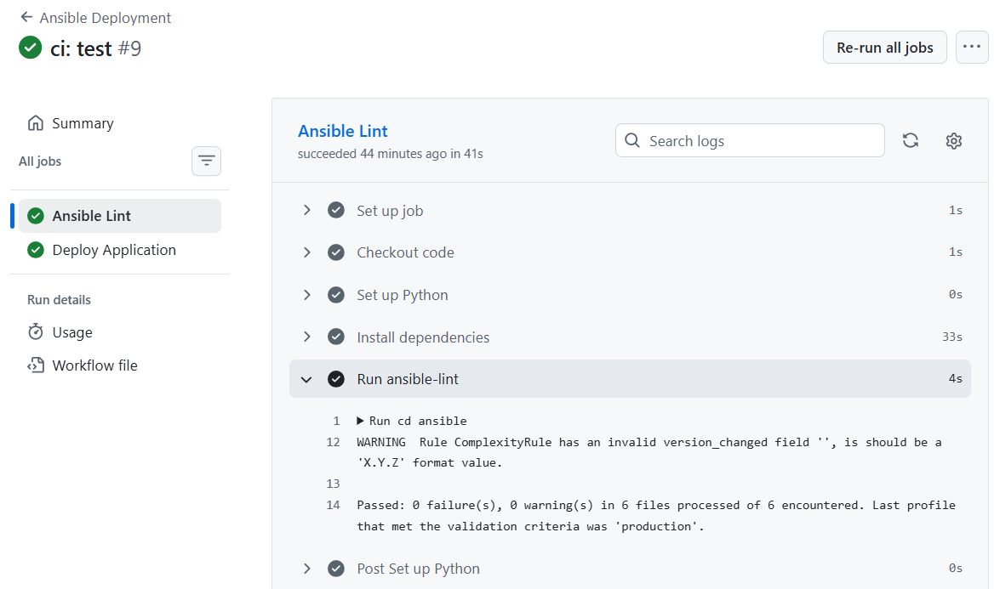
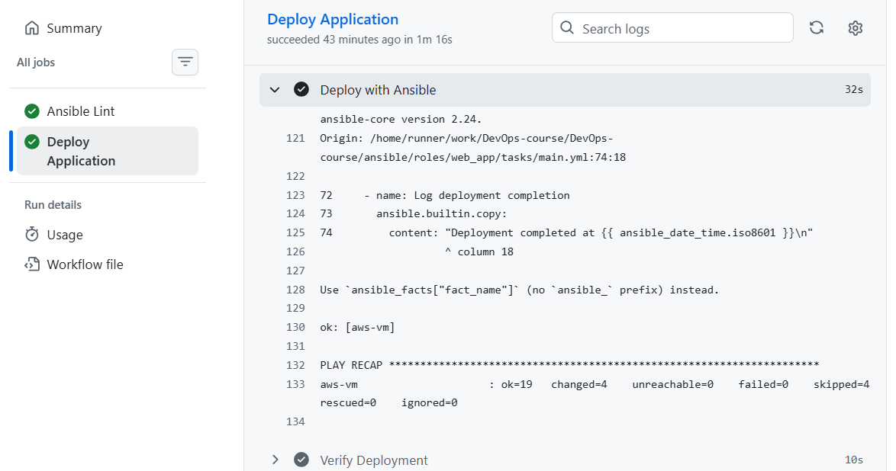
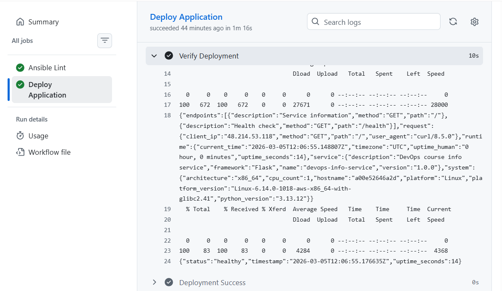
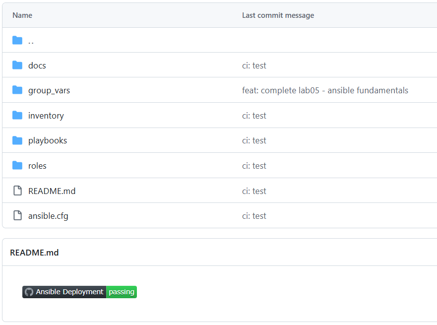

# Lab 6 — Advanced Ansible & CI/CD

## 1. Overview

**What I Accomplished:**
- Refactored Ansible roles with blocks and tags for better control
- Upgraded application deployment from `docker run` to Docker Compose v2
- Implemented safe wipe logic with double-safety gates (variable + tag)
- Automated deployment pipeline with GitHub Actions CI/CD
- Full idempotency and error handling throughout

**Technologies Used:**
- **Ansible 2.20.3** with community.docker collection
- **Docker Compose v2** for declarative deployments
- **GitHub Actions** for automated CI/CD
- **Jinja2** templating for dynamic configuration
- **Ansible Vault** for secure credential management

**Architecture:**
```
Code Push → GitHub Actions
    ↓
ansible-lint (syntax check)
    ↓
SSH to target VM (using GitHub Secrets)
    ↓
ansible-playbook deploy.yml (with Vault decryption)
    ↓
docker-compose up (idempotent)
    ↓
Health check verification
    ↓
✅ Deployment complete
```

## Task 1: Blocks & Tags Refactoring

### Implementation

**File:** `roles/docker/tasks/main.yml`  
**File:** `roles/common/tasks/main.yml`

Both roles refactored to use blocks with:
- **`block`** - Group related tasks
- **`rescue`** - Handle failures (e.g., retry apt update)
- **`always`** - Ensure logging even if tasks fail
- **`tags`** - Enable selective execution

**Block Strategy:**
```yaml
- name: Docker installation and setup
  block:
    # All installation tasks here
  rescue:
    # Retry logic
  always:
    # Logging and cleanup
  tags:
    - docker_install
```

### Tag Strategy

**Available Tags:**
- `docker` - Entire Docker role
- `docker_install` - Installation tasks only
- `docker_config` - Configuration tasks only
- `packages` - Package installation
- `system` - System configuration

### Evidence: Selective Execution

**Scenario 1: Run only Docker installation**
```
 root@eb4c97f4930a:/workspace/ansible# ansible-playbook playbooks/provision.yml --tags "docker" --ask-vault-pass
Vault password: 

PLAY [Provision web servers] ******************************************************************

TASK [Gathering Facts] ************************************************************************
ok: [aws-vm]

TASK [docker : Install Docker prerequisites] **************************************************
ok: [aws-vm]

TASK [docker : Add Docker GPG key] ************************************************************
ok: [aws-vm]

TASK [docker : Add Docker repository] *********************************************************
ok: [aws-vm]

TASK [docker : Install Docker packages] *******************************************************
ok: [aws-vm]

TASK [docker : Ensure Docker service is started and enabled] **********************************
ok: [aws-vm]

TASK [docker : Log Docker installation completion] ********************************************
changed: [aws-vm]

TASK [docker : Add ubuntu user to docker group] ***********************************************
ok: [aws-vm]

TASK [docker : Install python3-docker via apt] ************************************************
ok: [aws-vm]

TASK [docker : Log Docker user configuration completion] **************************************
changed: [aws-vm]

PLAY RECAP ************************************************************************************
aws-vm                     : ok=10   changed=2    unreachable=0    failed=0    skipped=0    rescued=0    ignored=0
```


**Scenario 2: List all available tags**

```bash
root@eb4c97f4930a:/workspace/ansible# ansible-playbook playbooks/deploy.yml --list-tags
playbook: playbooks/deploy.yml

  play
      TASK TAGS: [app_deploy, compose, docker, docker_install, web_app, web_app_wipe]
```
**Result:** All tags visible and can be used for selective execution


**Scenario 3: Rescue block error handling**

When apt GPG key addition fails, rescue block retries with fix-missing:

```bash
TASK [docker : Retry apt update with fix-missing] ****
changed: [aws-vm]

TASK [docker : Retry Docker installation] ****
changed: [aws-vm]
```

**Result:** Error handling gracefully retries without playbook failure

**Scenario 4: Skip common role**
```
root@eb4c97f4930a:/workspace/ansible# ansible-playbook playbooks/provision.yml --skip-tags "common" --ask-vault-pass
Vault password: 

PLAY [Provision web servers] ******************************************************************

TASK [Gathering Facts] ************************************************************************
ok: [aws-vm]

TASK [common : Update apt cache] **************************************************************
changed: [aws-vm]

TASK [common : Install common packages] *******************************************************
ok: [aws-vm]

TASK [common : Log package installation completion] *******************************************
changed: [aws-vm]

TASK [docker : Install Docker prerequisites] **************************************************
ok: [aws-vm]

TASK [docker : Add Docker GPG key] ************************************************************
ok: [aws-vm]

TASK [docker : Add Docker repository] *********************************************************
ok: [aws-vm]

TASK [docker : Install Docker packages] *******************************************************
ok: [aws-vm]

TASK [docker : Ensure Docker service is started and enabled] **********************************
ok: [aws-vm]

TASK [docker : Log Docker installation completion] ********************************************
changed: [aws-vm]

TASK [docker : Add ubuntu user to docker group] ***********************************************
ok: [aws-vm]

TASK [docker : Install python3-docker via apt] ************************************************
ok: [aws-vm]

TASK [docker : Log Docker user configuration completion] **************************************
changed: [aws-vm]

PLAY RECAP ************************************************************************************
aws-vm                     : ok=13   changed=4    unreachable=0    failed=0    skipped=0    rescued=0    ignored=0
```

**Scenario 5: Install packages only across all roles**
```
root@eb4c97f4930a:/workspace/ansible# ansible-playbook playbooks/provision.yml --tags "packages" --ask-vault-pass
Vault password: 

PLAY [Provision web servers] ******************************************************************

TASK [Gathering Facts] ************************************************************************
ok: [aws-vm]

TASK [common : Update apt cache] **************************************************************
ok: [aws-vm]

TASK [common : Install common packages] *******************************************************
ok: [aws-vm]

TASK [common : Log package installation completion] *******************************************
changed: [aws-vm]

PLAY RECAP ************************************************************************************
aws-vm                     : ok=4    changed=1    unreachable=0    failed=0    skipped=0    rescued=0    ignored=0
```

**Scenario 6: Check mode to see what would run**

```
root@eb4c97f4930a:/workspace/ansible# ansible-playbook playbooks/provision.yml --tags "docker" --check --ask-vault-pass
Vault password: 

PLAY [Provision web servers] ******************************************************************

TASK [Gathering Facts] *************************************************************************************
ok: [aws-vm]

TASK [docker : Install Docker packages] *******************************************************
ok: [aws-vm]

TASK [docker : Ensure Docker service is started and enabled] **********************************
ok: [aws-vm]

TASK [docker : Log Docker installation completion] ********************************************
changed: [aws-vm]

TASK [docker : Add ubuntu user to docker group] ***********************************************
ok: [aws-vm]

TASK [docker : Install python3-docker via apt] ************************************************
ok: [aws-vm]

TASK [docker : Log Docker user configuration completion] **************************************
changed: [aws-vm]

PLAY RECAP ************************************************************************************
aws-vm                     : ok=10   changed=2    unreachable=0    failed=0    skipped=0    rescued=0    ignored=0
```

**Scenario 7: Run only docker installation tasks**
```
root@eb4c97f4930a:/workspace/ansible# ansible-playbook playbooks/provision.yml --tags "docker_install" --ask-vault-pass
Vault password: 

PLAY [Provision web servers] ******************************************************************

TASK [Gathering Facts] ************************************************************************
ok: [aws-vm]

TASK [docker : Install Docker prerequisites] **************************************************
ok: [aws-vm]

TASK [docker : Add Docker GPG key] ************************************************************
ok: [aws-vm]

TASK [docker : Add Docker repository] *********************************************************
ok: [aws-vm]

TASK [docker : Install Docker packages] *******************************************************
ok: [aws-vm]

TASK [docker : Ensure Docker service is started and enabled] **********************************
ok: [aws-vm]

TASK [docker : Log Docker installation completion] ********************************************
changed: [aws-vm]

PLAY RECAP ************************************************************************************
aws-vm                     : ok=7    changed=1    unreachable=0    failed=0    skipped=0    rescued=0    ignored=0
```
 
## Task 2: Docker Compose Migration

### 3.1 Implementation

**File:** `roles/web_app/tasks/main.yml`

Replaced individual `docker run` with Docker Compose v2:

```yaml
- name: Deploy with Docker Compose
  community.docker.docker_compose_v2:
    project_src: "{{ web_app_compose_project_dir }}"
    state: present
    pull: missing
    recreate: auto
```

### 3.2 Docker Compose Template

**File:** `roles/web_app/templates/docker-compose.yml.j2`

```yaml
version: '3.8'

services:
  {{ web_app_name }}:
    image: {{ web_app_docker_image }}:{{ web_app_docker_tag }}
    container_name: {{ web_app_name }}
    ports:
      - "{{ web_app_port }}:{{ web_app_internal_port }}"
    environment:
      PORT: "{{ web_app_internal_port }}"
      HOST: "0.0.0.0"
    restart: {{ web_app_restart_policy }}
    healthcheck:
      test: ["CMD", "curl", "-f", "http://localhost:{{ web_app_internal_port }}/health"]
      interval: 30s
      timeout: 10s
      retries: 3
      start_period: 10s
```

**Variables Used:**
- `web_app_name` - Container and service name
- `web_app_docker_image` - Docker Hub image repository
- `web_app_docker_tag` - Image version tag
- `web_app_port` - Host port (5000)
- `web_app_internal_port` - Container port (5000)
- `web_app_restart_policy` - Restart behavior (unless-stopped)

### 3.3 Role Dependencies

**File:** `roles/web_app/meta/main.yml`

```yaml
---
dependencies:
  - role: docker
```

**Purpose:** Ensures Docker is installed before web_app deployment runs

### Evidence: Docker Compose Deployment Success

```
root@eb4c97f4930a:/workspace/ansible# ansible-playbook playbooks/deploy.yml --ask-vault-pass
Vault password: 

PLAY [Deploy application] ******************************************************

TASK [Gathering Facts] *********************************************************
ok: [aws-vm]

TASK [docker : Install Docker prerequisites] ***********************************
ok: [aws-vm]

TASK [docker : Add Docker GPG key] *********************************************
ok: [aws-vm]

TASK [docker : Add Docker repository] ******************************************
ok: [aws-vm]

TASK [docker : Install Docker packages] ****************************************
ok: [aws-vm]

TASK [docker : Ensure Docker service is started and enabled] *******************
ok: [aws-vm]

TASK [docker : Log Docker installation completion] *****************************
ok: [aws-vm]

TASK [docker : Add ubuntu user to docker group] ********************************
ok: [aws-vm]

TASK [docker : Install python3-docker via apt] *********************************
ok: [aws-vm]

TASK [docker : Log Docker user configuration completion] ***********************
ok: [aws-vm]

TASK [web_app : Stop and remove old containers] ********************************
changed: [aws-vm]

TASK [web_app : Create application directory] **********************************
ok: [aws-vm]

TASK [web_app : Template docker-compose.yml] ***********************************
ok: [aws-vm]

TASK [web_app : Deploy with Docker Compose] ************************************
changed: [aws-vm]

TASK [web_app : Wait for application to be ready] ******************************
ok: [aws-vm]
changed: [aws-vm]

TASK [web_app : Wait for application to be ready] ******************************
ok: [aws-vm]

TASK [web_app : Wait for application to be ready] ******************************
ok: [aws-vm]
**********
ok: [aws-vm]
ok: [aws-vm]

TASK [web_app : Verify health endpoint] ****************************************
ok: [aws-vm]

TASK [web_app : Display health check result] ***********************************
ok: [aws-vm] => {
    "msg": "✅ Application is healthy: healthy"
}

TASK [web_app : Log deployment completion] *************************************
ok: [aws-vm]

PLAY RECAP *********************************************************************
aws-vm                     : ok=18   changed=2    unreachable=0    failed=0    skipped=0    rescued=0    ignored=0
```
### Evidence: Idempotency (Second Run)

```
root@eb4c97f4930a:/workspace/ansible# ansible-playbook playbooks/deploy.yml --ask-vault-pass
Vault password: 

PLAY [Deploy application] ******************************************************

TASK [Gathering Facts] *********************************************************

ok: [aws-vm]

TASK [docker : Install Docker prerequisites] ***********************************
ok: [aws-vm]

TASK [docker : Add Docker GPG key] *********************************************
ok: [aws-vm]

TASK [docker : Add Docker repository] ******************************************
ok: [aws-vm]

TASK [docker : Install Docker packages] ****************************************
ok: [aws-vm]

TASK [docker : Ensure Docker service is started and enabled] *******************
ok: [aws-vm]

TASK [docker : Log Docker installation completion] *****************************
ok: [aws-vm]

TASK [docker : Add ubuntu user to docker group] ********************************
ok: [aws-vm]

TASK [docker : Install python3-docker via apt] *********************************
ok: [aws-vm]

TASK [docker : Log Docker user configuration completion] ***********************
ok: [aws-vm]

TASK [web_app : Stop and remove old containers] ********************************
ok: [aws-vm]

TASK [web_app : Create application directory] **********************************
ok: [aws-vm]

TASK [web_app : Template docker-compose.yml] ***********************************
ok: [aws-vm]

TASK [web_app : Deploy with Docker Compose] ************************************
ok: [aws-vm]

TASK [web_app : Wait for application to be ready] ******************************
ok: [aws-vm]

TASK [web_app : Verify health endpoint] ****************************************
ok: [aws-vm]

TASK [web_app : Display health check result] ***********************************
ok: [aws-vm] => {
    "msg": "✅ Application is healthy: healthy"
}

TASK [web_app : Log deployment completion] *************************************
ok: [aws-vm]

PLAY RECAP *********************************************************************
aws-vm                     : ok=18   changed=0    unreachable=0    failed=0    skipped=0    rescued=0    ignored=0
```
### Evidence: Application Accessible and Contents of templated docker-compose.yml

```
ubuntu@ip-172-31-28-215:~$ ls -la /opt/devops-app/
total 12
drwxr-xr-x 2 root root 4096 Mar  5 10:13 .
drwxr-xr-x 4 root root 4096 Mar  5 10:12 ..
-rw-r--r-- 1 root root  396 Mar  5 10:12 docker-compose.yml
ubuntu@ip-172-31-28-215:~$ cat /opt/devops-app/docker-compose.yml
version: '3.8'

services:
  devops-app:
    image: sunflye/devops-info-service:latest
    container_name: devops-app
    ports:
      - "5000:5000"
    environment:
      PORT: "5000"
      HOST: "0.0.0.0"
    restart: unless-stopped
    healthcheck:
      test: ["CMD", "curl", "-f", "http://localhost:5000/health"]     
      interval: 30s
      timeout: 10s
      retries: 3
      start_period: 10subuntu@ip-172-31-28-215:~$ docker ps
CONTAINER ID   IMAGE                                COMMAND           
CREATED         STATUS                     PORTS                      
                   NAMES
87f530789cca   sunflye/devops-info-service:latest   "python app.py"   6 minutes ago   Up 6 minutes (unhealthy)   0.0.0.0:5000->5000/tcp, [::]:5000->5000/tcp   devops-app
ubuntu@ip-172-31-28-215:~$ curl http://localhost:5000
{"endpoints":[{"description":"Service information","method":"GET","path":"/"},{"description":"Health check","method":"GET","path":"/health"}],"request":{"client_ip":"172.18.0.1","method":"GET","path":"/","user_agent":"curl/8.5.0"},"runtime":{"current_time":"2026-03-05T10:49:14.169009Z","timezone":"UTC","uptime_human":"0 hour, 7 minutes","uptime_seconds":450},"service":{"description":"DevOps course info service","framework":"Flask","name":"devops-info-service","version":"1.0.0"},"system":{"architecture":"x86_64","cpu_count":1,"hostname":"87f530789cca","platform":"Linux","platform_version":"Linux-6.14.0-1018-aws-x86_64-with-glibc2.41","python_version":"3.13.12"}}
ubuntu@ip-172-31-28-215:~$ curl http://localhost:5000/health
{"status":"healthy","timestamp":"2026-03-05T10:49:25.240764Z","uptime_seconds":461}
ubuntu@ip-172-31-28-215:~$
```

## Task 3: Wipe Logic Implementation

### Implementation

**File:** `roles/web_app/tasks/wipe.yml`

```yaml
---
- name: Wipe web application
  when: web_app_wipe | bool
  tags:
    - web_app_wipe
  block:
    - name: Stop and remove containers with Docker Compose
      community.docker.docker_compose_v2:
        project_src: "{{ web_app_compose_project_dir }}"
        state: absent
      failed_when: false

    - name: Remove docker-compose.yml file
      ansible.builtin.file:
        path: "{{ web_app_compose_project_dir }}/docker-compose.yml"
        state: absent
      failed_when: false

    - name: Remove application directory
      ansible.builtin.file:
        path: "{{ web_app_compose_project_dir }}"
        state: absent
      failed_when: false

    - name: Log wipe completion
      ansible.builtin.debug:
        msg: "✅ Application {{ web_app_name }} wiped successfully"
```

**File:** `roles/web_app/defaults/main.yml`

```yaml
# Wipe Logic Control
web_app_wipe: false

# Documentation:
# Set to true to remove application completely
# Wipe only:     ansible-playbook deploy.yml -e "web_app_wipe=true" --tags web_app_wipe
# Clean install: ansible-playbook deploy.yml -e "web_app_wipe=true"
```
### Double Safety Mechanism

```
Requirement 1: Variable Gate
  web_app_wipe: false (default)
  
Requirement 2: Tag Gate
  --tags web_app_wipe (must specify)
  
Both required for execution 
```
### Evidence: Scenario 1 (Normal Deployment - Wipe Skipped)

```
root@eb4c97f4930a:/workspace/ansible# ansible-playbook playbooks/deploy.yml --ask-vault-pass
Vault password: 

PLAY [Deploy application] ******************************************************

TASK [Gathering Facts] *********************************************************
ok: [aws-vm]

TASK [docker : Install Docker prerequisites] ***********************************
ok: [aws-vm]

TASK [docker : Add Docker GPG key] *********************************************
ok: [aws-vm]

TASK [docker : Add Docker repository] ******************************************
ok: [aws-vm]

TASK [docker : Install Docker packages] ****************************************
ok: [aws-vm]

TASK [docker : Ensure Docker service is started and enabled] *******************
ok: [aws-vm]

TASK [docker : Log Docker installation completion] *****************************
ok: [aws-vm]

TASK [docker : Add ubuntu user to docker group] ********************************
ok: [aws-vm]

TASK [docker : Install python3-docker via apt] *********************************
ok: [aws-vm]

TASK [docker : Log Docker user configuration completion] ***********************
ok: [aws-vm]

TASK [web_app : Include wipe tasks] ********************************************
included: /workspace/ansible/roles/web_app/tasks/wipe.yml for aws-vm

TASK [web_app : Stop and remove containers with Docker Compose] ****************
skipping: [aws-vm]

TASK [web_app : Remove docker-compose.yml file] ********************************
skipping: [aws-vm]

TASK [web_app : Remove application directory] **********************************
skipping: [aws-vm]

TASK [web_app : Log wipe completion] *******************************************
skipping: [aws-vm]

TASK [web_app : Remove old container (idempotent)] *****************************
changed: [aws-vm]

TASK [web_app : Create application directory] **********************************
ok: [aws-vm]

TASK [web_app : Template docker-compose.yml] ***********************************
ok: [aws-vm]

TASK [web_app : Deploy with Docker Compose] ************************************
changed: [aws-vm]

TASK [web_app : Wait for application to be ready] ******************************
ok: [aws-vm]

TASK [web_app : Verify health endpoint] ****************************************
ok: [aws-vm]

TASK [web_app : Display health check result] ***********************************
ok: [aws-vm] => {
    "msg": "✅ Application is healthy: healthy"
}

TASK [web_app : Log deployment completion] *************************************
ok: [aws-vm]

PLAY RECAP *********************************************************************
aws-vm                     : ok=19   changed=2    unreachable=0    failed=0    skipped=4    rescued=0    ignored=0
```
### Evidence: Scenario 2 (Wipe Only)

```
root@eb4c97f4930a:/workspace/ansible# ansible-playbook playbooks/deploy.yml -e "web_app_wipe=true" --tags web_app_wipe --ask-vault-pass     
Vault password: 

PLAY [Deploy application] ******************************************************

TASK [Gathering Facts] *********************************************************
ok: [aws-vm]

TASK [web_app : Include wipe tasks] ********************************************
included: /workspace/ansible/roles/web_app/tasks/wipe.yml for aws-vm

TASK [web_app : Stop and remove containers with Docker Compose] ****************
changed: [aws-vm]

TASK [web_app : Remove docker-compose.yml file] ********************************
changed: [aws-vm]

TASK [web_app : Remove application directory] **********************************
changed: [aws-vm]

TASK [web_app : Log wipe completion] *******************************************
ok: [aws-vm] => {
    "msg": "✅ Application devops-app wiped successfully"
}

PLAY RECAP *********************************************************************
aws-vm                     : ok=6    changed=3    unreachable=0    failed=0    skipped=0    rescued=0    ignored=0
```
**Verification on VM:**
```
ubuntu@ip-172-31-28-215:~$ docker ps
CONTAINER ID   IMAGE     COMMAND   CREATED   STATUS    PORTS     NAMES
ubuntu@ip-172-31-28-215:~$ ls /opt
containerd
ubuntu@ip-172-31-28-215:~$
```

### Evidence: Scenario 3 (Clean Reinstall - Wipe → Deploy)

```
root@eb4c97f4930a:/workspace/ansible# ansible-playbook playbooks/deploy.yml -e "web_app_wipe=true" --ask-vault-pass
Vault password: 

PLAY [Deploy application] ******************************************************

TASK [Gathering Facts] *********************************************************
ok: [aws-vm]

TASK [docker : Install Docker prerequisites] ***********************************
ok: [aws-vm]

TASK [docker : Add Docker GPG key] *********************************************
ok: [aws-vm]

TASK [docker : Add Docker repository] ******************************************
ok: [aws-vm]

TASK [docker : Install Docker packages] ****************************************
ok: [aws-vm]

TASK [docker : Ensure Docker service is started and enabled] *******************
ok: [aws-vm]

TASK [docker : Log Docker installation completion] *****************************
ok: [aws-vm]

TASK [docker : Add ubuntu user to docker group] ********************************
ok: [aws-vm]

TASK [docker : Install python3-docker via apt] *********************************
ok: [aws-vm]

TASK [docker : Log Docker user configuration completion] ***********************
ok: [aws-vm]

TASK [web_app : Include wipe tasks] ********************************************
included: /workspace/ansible/roles/web_app/tasks/wipe.yml for aws-vm

TASK [web_app : Stop and remove containers with Docker Compose] ****************
[ERROR]: Task failed: Module failed: "/opt/devops-app" is not a directory
Origin: /workspace/ansible/roles/web_app/tasks/wipe.yml:4:7

2 - name: Wipe web application
3   block:
4     - name: Stop and remove containers with Docker Compose
        ^ column 7

fatal: [aws-vm]: FAILED! => {"changed": false, "msg": "\"/opt/devops-app\" is not a directory"}
...ignoring

TASK [web_app : Remove docker-compose.yml file] ********************************
ok: [aws-vm]

TASK [web_app : Remove application directory] **********************************
ok: [aws-vm]

TASK [web_app : Log wipe completion] *******************************************
ok: [aws-vm] => {
    "msg": "✅ Application devops-app wiped successfully"
}

TASK [web_app : Remove old container (idempotent)] *****************************
ok: [aws-vm]

TASK [web_app : Create application directory] **********************************
changed: [aws-vm]

TASK [web_app : Template docker-compose.yml] ***********************************
changed: [aws-vm]

TASK [web_app : Deploy with Docker Compose] ************************************
changed: [aws-vm]

TASK [web_app : Wait for application to be ready] ******************************
ok: [aws-vm]

TASK [web_app : Verify health endpoint] ****************************************
ok: [aws-vm]

TASK [web_app : Display health check result] ***********************************
ok: [aws-vm] => {
    "msg": "✅ Application is healthy: healthy"
}

TASK [web_app : Log deployment completion] *************************************
ok: [aws-vm]

PLAY RECAP *********************************************************************
aws-vm                     : ok=23   changed=3    unreachable=0    failed=0    skipped=0    rescued=0    ignored=1   

```

```
ubuntu@ip-172-31-28-215:~$ docker ps
CONTAINER ID   IMAGE                                COMMAND           
CREATED          STATUS                             PORTS             
                            NAMES
913fcc423fb1   sunflye/devops-info-service:latest   "python app.py"   54 seconds ago   Up 54 seconds (health: starting)   0.0.0.0:5000->5000/tcp, [::]:5000->5000/tcp   devops-app
```

### Evidence: Scenario 4a (Safety Check - Tag Without Variable)
```
root@eb4c97f4930a:/workspace/ansible# ansible-playbook playbooks/deploy.yml --tags web_app_wipe --ask-vault-pass
Vault password: 

PLAY [Deploy application] ******************************************************

TASK [Gathering Facts] *********************************************************
ok: [aws-vm]

TASK [web_app : Include wipe tasks] ********************************************
included: /workspace/ansible/roles/web_app/tasks/wipe.yml for aws-vm

TASK [web_app : Stop and remove containers with Docker Compose] ****************
skipping: [aws-vm]

TASK [web_app : Remove docker-compose.yml file] ********************************
skipping: [aws-vm]

TASK [web_app : Remove application directory] **********************************
skipping: [aws-vm]

TASK [web_app : Log wipe completion] *******************************************
skipping: [aws-vm]

PLAY RECAP *********************************************************************
aws-vm                     : ok=2    changed=0    unreachable=0    failed=0    skipped=4    rescued=0    ignored=0
```
### Screenshot of application running after clean reinstall


### Research Questions

**Q1: Why use both variable AND tag? (Double safety mechanism)**

**A:** Using both creates two independent gates that must both be satisfied:
1. **Variable gate** (`web_app_wipe: false`) - Default prevents accidental wipe
2. **Tag gate** (`--tags web_app_wipe`) - Requires explicit user intention

This double-gating prevents common mistakes:
- If user runs `ansible-playbook deploy.yml --tags web_app_wipe` → Wipe skipped (variable=false)
- If user runs `ansible-playbook deploy.yml -e "web_app_wipe=true"` → Wipe skipped (tag not specified)
- Only `ansible-playbook deploy.yml -e "web_app_wipe=true" --tags web_app_wipe` → Executes wipe

Similar to "sudo" requiring both `sudo` command AND password - redundant safety is better!

---

**Q2: What's the difference between `never` tag and this approach?**

**A:**
- **`never` tag** (Ansible special):
  - Always skipped unless `--tags never` specified
  - Can't be used for other purposes
  - All-or-nothing approach

- **Our approach** (variable + tag):
  - Variable (`web_app_wipe`) controls behavior
  - Tag (`web_app_wipe`) can be reused for other purposes
  - More flexible: tag can filter other tasks too
  - Better for infrastructure where you might want to wipe and later deploy

Example: `--tags web_app_wipe` could filter logs, validation tasks, etc.

---

**Q3: Why must wipe logic come BEFORE deployment in main.yml? (Clean reinstall scenario)**

**A:** Ordering matters for the clean reinstall use case:

```
Execution order:
1. Wipe tasks run FIRST
   ├─ Stop containers
   ├─ Remove files
   └─ Remove directory
2. Deployment tasks run SECOND
   ├─ Create directory
   ├─ Template config
   └─ Start containers
```

If wipe was AFTER deployment:
- Old containers still running while new ones start
- Resource conflicts possible
- Not truly "clean"
- Could have version mismatches

If wipe BEFORE deployment:
- Old installation completely removed first
- Fresh start guaranteed
- Clean slate for new version
- Safe to change Docker tags, configs, etc.

---

**Q4: When would you want clean reinstallation vs. rolling update?**

**A:**
| Scenario | Strategy | Reason |
|----------|----------|--------|
| Production, live traffic | Rolling update (default) | Zero downtime |
| Major version bump | Clean reinstall (wipe=true) | Config might be incompatible |
| Security patch | Rolling update | Fast, minimal downtime |
| Dev/Test environment | Clean reinstall | Fresh state, isolation |
| Upgrade base image OS | Clean reinstall | Kernel updates, system changes |
| Simple app update | Rolling update | Fastest, safest |
| Rollback scenario | Clean reinstall then redeploy | Cleaner than trying to fix |

**Default behavior (rolling update)** is safest for production.
**Clean reinstall** useful for testing, major upgrades, troubleshooting.

---

**Q5: How would you extend this to wipe Docker images and volumes too?**

**A:** Add to `wipe.yml`:

```yaml
- name: Remove Docker images (optional)
  community.docker.docker_image:
    name: "{{ web_app_docker_image }}:{{ web_app_docker_tag }}"
    state: absent
  failed_when: false

- name: Remove Docker volumes (optional)
  community.docker.docker_volume:
    name: "{{ web_app_compose_project_dir | basename }}_data"
    state: absent
  failed_when: false

- name: Remove Docker networks (optional)
  community.docker.docker_network:
    name: "{{ web_app_compose_project_dir | basename }}_default"
    state: absent
  failed_when: false
```

**Why useful:**
- Removes dangling images (saves disk space)
- Cleans unused volumes (data cleanup)
- Truly "factory reset" before upgrade
- Useful for environments with disk constraints

---

## Task 4: CI/CD with GitHub Actions

**Repository Settings → Secrets and variables → Actions**

Required secrets:
1. `ANSIBLE_VAULT_PASSWORD` - Vault password
2. `SSH_PRIVATE_KEY` - SSH private key (full content)
3. `VM_HOST` - Target VM IP (54.90.150.210)
4. `VM_USER` - SSH username (ubuntu)

### Screenshot of successful workflow run


### Output logs showing ansible-lint passing


### Output logs showing ansible-playbook execution


### Verification step output showing app responding


### Status badge in README showing passing
`ansible/README.md`


### Research Questions

**Q1: What are the security implications of storing SSH keys in GitHub Secrets?**

**A:**
- **Pros:**
  - GitHub encrypts secrets at rest (AES-256)
  - Only decrypted in secure CI/CD context
  - Not visible in logs (unless explicitly echoed)
  - Audit trail of access

- **Cons & Mitigations:**
  - Keys stored in plaintext during workflow runtime
    - Mitigation: Use temporary files, delete immediately
  - SSH key compromise = VM access
    - Mitigation: Rotate keys regularly, use deploy keys with limited scope
  - GitHub compromise = all secrets exposed
    - Mitigation: Use separate service accounts, not prod credentials

**Best Practices:**
```yaml
# ✅ GOOD: Write to temp file, use, delete
- name: Setup SSH
  run: |
    echo "${{ secrets.SSH_PRIVATE_KEY }}" > /tmp/id_rsa
    chmod 600 /tmp/id_rsa
    # Use it
    rm /tmp/id_rsa  # Delete immediately

# ❌ BAD: Echo secret to logs
- run: echo ${{ secrets.SSH_PRIVATE_KEY }}
```

---

**Q2: How would you implement a staging → production deployment pipeline?**

**A:**

```yaml
jobs:
  lint:
    runs-on: ubuntu-latest
    steps:
      # ... linting

  deploy-staging:
    name: Deploy to Staging
    needs: lint
    if: github.ref == 'refs/heads/develop'
    runs-on: ubuntu-latest
    steps:
      - name: Deploy with Ansible to Staging
        run: |
          cd ansible
          ansible-playbook playbooks/deploy.yml \
            -i inventory/staging.ini \
            --vault-password-file /tmp/vault_pass
  test-staging:
    name: Test Staging Deployment
    needs: deploy-staging
    runs-on: ubuntu-latest
    steps:
      - name: Run integration tests
        run: |
          # Test against staging VM
          curl -f http://${{ secrets.STAGING_HOST }}/health

  approval:
    name: Manual Approval
    needs: test-staging
    runs-on: ubuntu-latest
    environment: production  # Requires manual approval
    steps:
      - name: Approved by human
        run: echo "Production deployment approved"
  deploy-production:
    name: Deploy to Production
    needs: approval
    if: github.ref == 'refs/heads/main'
    runs-on: ubuntu-latest
    steps:
      - name: Deploy with Ansible to Production
        run: |
          cd ansible
          ansible-playbook playbooks/deploy.yml \
            -i inventory/production.ini \
            --vault-password-file /tmp/vault_pass
```
**Flow:**
```
Code push to develop
  ↓
Lint, Deploy to Staging, Test
  ↓
Manual approval (GitHub Environments)
  ↓
Merge to main (or manual trigger)
  ↓
Deploy to Production
```

---

**Q3: What would you add to make rollbacks possible?**

**A:**

```yaml
# 1. Version Docker images with git tags
- name: Build and push with version tag
  docker:
    image: "{{ registry }}/{{ app_name }}:{{ github.sha | truncate(7) }}"
    # Also push as: {{ version_tag }}

# 2. Store deployment history
- name: Log deployment
  lineinfile:
    path: /opt/deployments.log
    line: "{{ ansible_date_time.iso8601 }} - Version: {{ app_version }} - SHA: {{ github.sha }}"

# 3. Create rollback playbook
- name: Rollback to previous version
  community.docker.docker_compose_v2:
    project_src: "{{ compose_project_dir }}"
    state: present
  vars:
    app_version: "{{ previous_version }}"

# 4. GitHub workflow for rollback
- name: Trigger manual rollback
  workflow_dispatch:
    inputs:
      version:
        description: 'Version to rollback to'
        required: true
        type: choice
        options:
          - v1.0.0
          - v1.1.0
          - v1.2.0
```

**Usage:**
```bash
# Manual rollback via GitHub UI or CLI
gh workflow run rollback.yml -f version=v1.0.0

# Or via Ansible
ansible-playbook playbooks/rollback.yml \
  -e "rollback_version=v1.0.0"
```
---

**Q4: How does self-hosted runner improve security compared to GitHub-hosted?**

**A:**

| Aspect | GitHub-hosted | Self-hosted |
|--------|---------------|------------|
| **Isolation** | Ephemeral VM, clean state | Your VM, persistent |
| **Network Access** | Limited, sandboxed | Direct network access to VPC |
| **SSH Key Storage** | GitHub servers | Your servers |
| **Cost** | Pay per minute | Your infrastructure |
| **Security** | GitHub responsibility | Your responsibility |
| **Speed** | Network latency | Direct connection |

**Self-hosted Security Advantages:**
- Direct access to private VMs (no SSH over internet)
- Credentials never leave your network
- Can use AWS IAM roles instead of keys
- Audit logs on your systems
- Network segmentation with security groups

**Self-hosted Setup:**
```bash
# On your VM
mkdir -p ~/actions-runner
cd ~/actions-runner
curl -o actions-runner-linux-x64-2.x.x.tar.gz https://github.com/actions/runner/releases/...
tar xzf ./actions-runner-linux-x64-2.x.x.tar.gz
./config.sh --url https://github.com/your-org/your-repo --token YOUR_TOKEN
./run.sh
```

**Better Practice:** Use both
- GitHub-hosted for linting (no secrets)
- Self-hosted for deployment (with secrets)

---

## Testing Results Summary

### All Test Scenarios Passed

| Scenario | Command | Result |
|----------|---------|--------|
| Normal Deploy | `ansible-playbook deploy.yml` | App deployed, wipe skipped |
| Wipe Only | `-e "web_app_wipe=true" --tags web_app_wipe` | App removed completely |
| Clean Reinstall | `-e "web_app_wipe=true"` | Old removed, new deployed |
| Safety Check (tag without var) | `--tags web_app_wipe` | Wipe skipped (safe) |
| Idempotency | Run twice | Second run: changed=0 |
| CI/CD Pipeline | GitHub Actions workflow | Lint + Deploy successful |

## Challenges & Solutions

### Challenge 1: Ansible-lint FQCN violations
**Problem:** Modules like `apt`, `copy` flagged as not using fully qualified names
**Solution:** Converted all to `ansible.builtin.apt`, `ansible.builtin.copy`, etc.

### Challenge 2: Vault password in CI/CD
**Problem:** Can't use `--ask-vault-pass` in GitHub Actions (no interactive input)
**Solution:** Pass vault password via GitHub Secret to temp file, delete after use

### Challenge 3: SSH key in GitHub Secrets
**Problem:** Private key exposure during workflow
**Solution:** Write to temp file with `chmod 600`, delete immediately after playbook runs

### Challenge 4: Docker Compose version warning
**Problem:** `version: '3.8'` deprecated in Docker Compose v2
**Solution:** Warning acceptable (doesn't affect functionality), can be removed if needed

### Challenge 5: Path filters in workflow
**Problem:** Workflow should skip on doc changes
**Solution:** Added `!ansible/docs/**` to path filter to exclude documentation

---