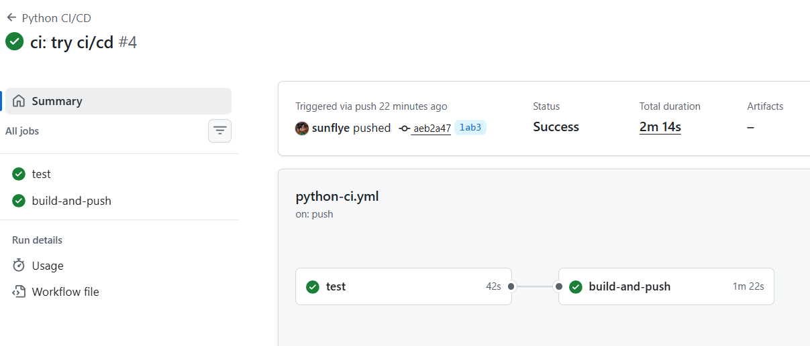
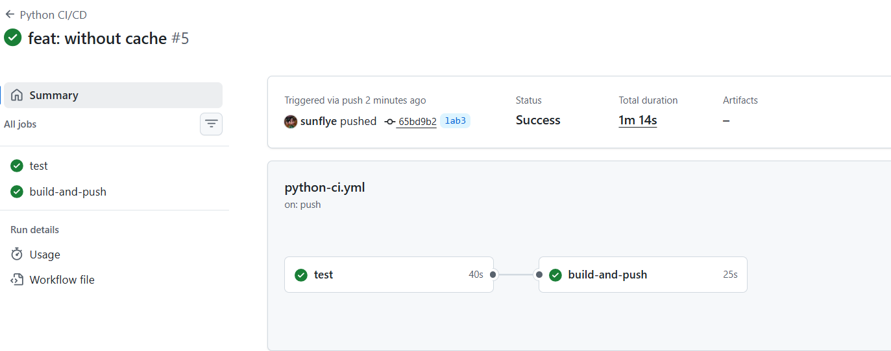
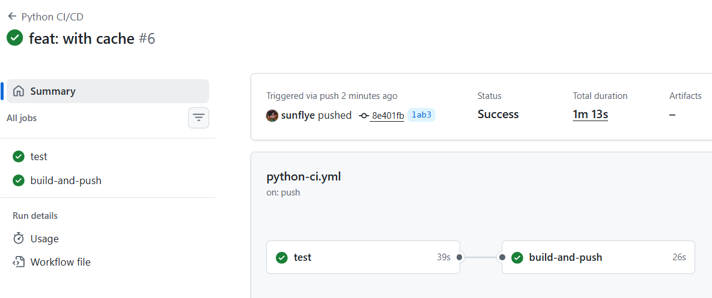

# Lab 3 — Continuous Integration (CI/CD): 

## Task 1 — Unit Testing

### Testing Framework: pytest

**Why pytest:**
- Simple, powerful syntax
- Great for testing Flask apps
- Built-in fixtures
- Coverage reporting with pytest-cov

### Test structure

Tests in `app_python/tests/test_app.py` cover:
- `GET /` endpoint - JSON structure, all fields, data types
- `GET /health` endpoint - Status, timestamp, uptime
- Error handling (404 responses)
- Data type validation

The tests are organized into classes by endpoint and purpose:

- **TestMainEndpoint** — tests for the main `/` endpoint.  
  Checks status code, content type, presence and structure of all required fields, and correct data types in the main service response.

- **TestHealthEndpoint** — tests for the `/health` endpoint.  
  Verifies the health check response, including status, timestamp, and uptime fields.

- **TestErrorHandling** — tests for error handling (e.g., 404 errors).  
  Ensures that invalid routes return the correct error code and JSON error format.

- **TestDataTypes** — tests for data type validation in responses.  
  Confirms that all fields in the main endpoint response have the expected data types.

Each class contains multiple test methods to cover both successful and error scenarios, ensuring comprehensive coverage of the application’s API.

### Running Tests Locally

```bash
cd app_python
pytest tests/ -v --cov=app --cov-report=term
```

### Test Results

```
(venv) PS D:\INNOPOLIS\DEVOPS ENGINEERING\DevOps-course\app_python> pytest tests/ -v --cov=app --cov-report=term
==================================================== test session starts =====================================================
platform win32 -- Python 3.13.5, pytest-7.4.3, pluggy-1.6.0 -- D:\INNOPOLIS\DEVOPS ENGINEERING\DevOps-course\venv\Scripts\python.exe
cachedir: .pytest_cache
rootdir: D:\INNOPOLIS\DEVOPS ENGINEERING\DevOps-course\app_python
plugins: cov-4.1.0
collected 15 items                                                                                                            

tests/test_app.py::TestMainEndpoint::test_main_endpoint_status_code PASSED                                              [  6%]
tests/test_app.py::TestMainEndpoint::test_main_endpoint_content_type PASSED                                             [ 13%] 
tests/test_app.py::TestMainEndpoint::test_main_endpoint_service_data PASSED                                             [ 20%] 
tests/test_app.py::TestMainEndpoint::test_main_endpoint_system_data PASSED                                              [ 26%] 
tests/test_app.py::TestMainEndpoint::test_main_endpoint_runtime_data PASSED                                             [ 33%] 
tests/test_app.py::TestMainEndpoint::test_main_endpoint_request_data PASSED                                             [ 40%] 
tests/test_app.py::TestMainEndpoint::test_main_endpoint_endpoints_list PASSED                                           [ 46%] 
tests/test_app.py::TestHealthEndpoint::test_health_endpoint_status_code PASSED                                          [ 53%] 
tests/test_app.py::TestHealthEndpoint::test_health_endpoint_content_type PASSED                                         [ 60%] 
tests/test_app.py::TestHealthEndpoint::test_health_endpoint_status_field PASSED                                         [ 66%] 
tests/test_app.py::TestHealthEndpoint::test_health_endpoint_timestamp PASSED                                            [ 73%] 
tests/test_app.py::TestHealthEndpoint::test_health_endpoint_uptime PASSED                                               [ 80%] 
tests/test_app.py::TestErrorHandling::test_404_not_found PASSED                                                         [ 86%] 
tests/test_app.py::TestErrorHandling::test_404_response_is_json PASSED                                                  [ 93%]
tests/test_app.py::TestDataTypes::test_main_endpoint_data_types PASSED                                                  [100%] 

---------- coverage: platform win32, python 3.13.5-final-0 -----------
Name     Stmts   Miss  Cover
----------------------------
app.py      46      5    89%
----------------------------
TOTAL       46      5    89%


===================================================== 15 passed in 0.35s ===================================================== 
(venv) PS D:\INNOPOLIS\DEVOPS ENGINEERING\DevOps-course\app_python> 
```

---

## Task 2 — GitHub Actions CI Workflow 

### Workflow Overview

**File:** `.github/workflows/python-ci.yml`

The workflow automates:
1. **Code Quality & Testing** - On every push/PR
2. **Linting** - flake8 code quality checks
3. **Docker Build & Push** - Automatic image publishing after tests pass
4. **Versioning** - CalVer strategy

### Workflow Triggers

The workflow runs on:
- Push to `master` or `lab3` (full CI/CD, including Docker build and push)
- Pull requests to `master` (runs tests and lint only, no Docker build)
- Git tags starting with `v` (builds and pushes with SemVer tag)

This ensures that only production-ready code triggers Docker builds, while PRs are tested for quality and correctness before merging.
```yaml
on:
  push:
    branches: [ master, lab3 ]
    tags:
      - 'v*'
  pull_request:
    branches: [ master ]
```

**Behavior:**
- **Push to master/lab3:** Run tests → Build Docker image
- **Pull Request to master:** Run tests only (no Docker build)
- **Git tag (v1.0.0):** Run tests → Build Docker image with SemVer version

### Marketplace Actions Used

- `actions/checkout@v4`: Official action to clone the repository.
- `actions/setup-python@v5`: Official action to set up Python with caching.
- `docker/login-action@v3`: Secure Docker Hub authentication.
- `docker/build-push-action@v5`: Efficient Docker build and push with caching.
- `codecov/codecov-action@v4`: Uploads coverage reports to Codecov.

These actions are chosen for reliability, security, and community support.

### Versioning Strategy: Hybrid (CalVer + SemVer)

**Default (CalVer):**
- Format: `YYYY.MM.DD` (e.g., 2024.01.27)
- Automatic from build date
- Tags: `sunflye/devops-info-service:2024.01.27` + `latest`

**On Git Tag (SemVer):**
- Format: `vMAJOR.MINOR.PATCH` (e.g., v1.0.0)
- Manual release tagging
- Tags: `sunflye/devops-info-service:v1.0.0` + `latest`

**Why this approach?**
- CalVer perfect for continuous deployment
- SemVer useful for explicit releases
- Both approaches provide flexibility

### Workflow Evidence

- [](https://github.com/sunflye/DevOps-course/actions/workflows/python-ci.yml)
- 

### Workflow Jobs

**Job 1: test**
- Checks out code
- Sets up Python 3.13 with pip cache
- Installs dependencies
- Runs flake8 linting
- Runs pytest with coverage
- Uploads coverage to Codecov

**Job 2: build-and-push**
- Depends on: `test` job (only runs if tests pass)
- Triggers on: push only (not on PR)
- Builds Docker image with Buildx
- Pushes to Docker Hub with 2 tags


### Docker Hub Images

All images available at:
https://hub.docker.com/r/sunflye/devops-info-service

**Example tags:**
- `sunflye/devops-info-service:2026.02.11`
- `sunflye/devops-info-service:latest`

---
## Task 3 — CI Best Practices & Security

---

### Best Practices Applied

#### 1. **Dependency Caching**
**Implementation:**
```yaml
cache: 'pip'
cache-dependency-path: 'app_python/requirements.txt'
```
**Why:** Saves 30-60 seconds per build by reusing downloaded packages.

#### 2. **Job Dependencies (Fail Fast)**
**Implementation:**
```yaml
build-and-push:
  needs: test  # Only runs if tests pass
```
**Why:** Prevents broken Docker images from being published.

#### 3. **Docker Layer Caching**
**Implementation:**
```yaml
cache-from: type=gha
cache-to: type=gha,mode=max
```
**Why:** Reuses Docker layers, faster builds (especially in rebuild scenarios).

#### 4. **Secrets Management**
**Implementation:**
- `DOCKER_USERNAME` and `DOCKER_TOKEN` stored as GitHub Secrets
- No credentials hardcoded in workflow files

**Why:** Security best practice, prevents credential leaks.

#### 5. **Conditional Triggers**
**Implementation:**
```yaml
if: github.event_name == 'push'  # Docker build only on push
```
**Why:** PRs don't push to Docker Hub, only runs tests.

#### 6. **Test Coverage Tracking**
**Implementation:**
- pytest-cov generates coverage reports
- Uploaded to Codecov for tracking

**Why:** Visibility into code coverage trends and quality.


### Performance Improvements

**Workflow timing comparison (real runs):**

| Scenario         | Total duration | test job | build-and-push job |
|------------------|---------------|----------|--------------------|
| Without cache    | 1m 14s        | 40s      | 25s                |
| With cache       | 1m 13s        | 39s      | 26s                |

<details>
<summary>Without cache</summary>


</details>

<details>
<summary>With cache</summary>


</details>

**Conclusion:**  
In this project, the workflow is already highly optimized, so the difference between runs with and without cache is minimal (about 1 second).  
However, in larger projects or with more dependencies, caching can save significant time.

### Security Scanning (Snyk)

**Integration:**
- Snyk scans `requirements.txt` for known vulnerabilities
- Configured with `--severity-threshold=high` (only fails on high/critical)
- Runs in parallel with main testing job

**Results:**
```
Testing /github/workspace...

Organization:      sunflye
Package manager:   pip
Target file:       app_python/requirements.txt
Project name:      app_python
Open source:       no
Project path:      /github/workspace
Licenses:          enabled

✔ Tested /github/workspace for known issues, no vulnerable paths found.
```