# Lab 13 — GitOps with ArgoCD

## Task 1 — ArgoCD Installation & Setup

### 1.1 ArgoCD Setup

#### Installation Steps

```powershell
# Step 1: Add Helm repository
PS D:\INNOPOLIS\DEVOPS ENGINEERING\DevOps-course> helm repo add argo https://argoproj.github.io/argo-helm
"argo" has been added to your repositories

PS D:\INNOPOLIS\DEVOPS ENGINEERING\DevOps-course> helm repo update
Hang tight while we grab the latest from your chart repositories...
...Successfully got an update from the "hashicorp" chart repository
...Successfully got an update from the "prometheus-community" chart repository
...Successfully got an update from the "argo" chart repository
Update Complete. ⎈Happy Helming!⎈

# Step 2: Create dedicated namespace
PS D:\INNOPOLIS\DEVOPS ENGINEERING\DevOps-course> kubectl create namespace argocd
namespace/argocd created

# Step 3: Install ArgoCD
PS D:\INNOPOLIS\DEVOPS ENGINEERING\DevOps-course> helm install argocd argo/argo-cd --namespace argocd
NAME: argocd
LAST DEPLOYED: Sun Apr 19 11:47:00 2026
NAMESPACE: argocd
STATUS: deployed
REVISION: 1
DESCRIPTION: Install complete
TEST SUITE: None
```

#### Verification

```powershell
PS D:\INNOPOLIS\DEVOPS ENGINEERING\DevOps-course> kubectl get pods -n argocd
NAME                                                READY   STATUS    RESTARTS   AGE
argocd-application-controller-0                     1/1     Running   0          113s
argocd-applicationset-controller-764f6cb5b6-fgqp4   1/1     Running   0          113s
argocd-dex-server-75584bc88d-gjg8w                  1/1     Running   0          113s
argocd-notifications-controller-5c7987d768-ktw88    1/1     Running   0          113s
argocd-redis-545df96696-qbm2m                       1/1     Running   0          113s
argocd-repo-server-9db6859b8-lxlqs                  1/1     Running   0          113s
argocd-server-ff9c49d6b-6fpxw                       1/1     Running   0          113s
```

**All components running successfully ✅**

---

### 1.2 Access ArgoCD UI

#### UI Access Method

**Step 1: Port Forwarding (keep in separate terminal)**

```powershell
(venv) PS D:\INNOPOLIS\DEVOPS ENGINEERING\DevOps-course> kubectl port-forward svc/argocd-server -n argocd 8080:443
Forwarding from 127.0.0.1:8080 -> 8080
Forwarding from [::1]:8080 -> 8080
Handling connection for 8080
```

**Step 2: Retrieve Admin Password**

```powershell
Polina@MagicBookX16 MINGW64 /d/INNOPOLIS/DEVOPS ENGINEERING/DevOps-course (lab13)
$ kubectl -n argocd get secret argocd-initial-admin-secret -o jsonpath="{.data.password}" | base64 -d
xQI7Sl56Zd9BiS53
```

**Step 3: Access Web Interface**

- **URL:** https://localhost:8080
- **Username:** admin
- **Password:** xQI7Sl56Zd9BiS53
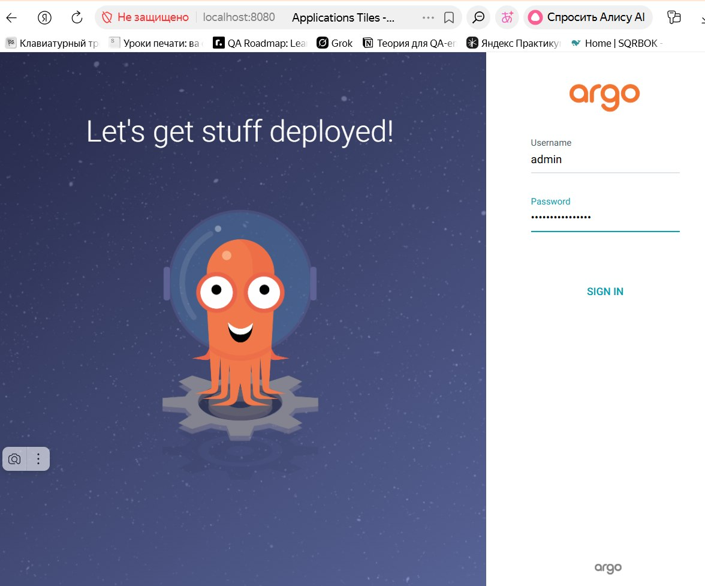

#### UI Features Explored

- Application list (currently empty, will deploy in Task 2)
- Application details and status
- Sync status and health indicators
- Settings and user management
- Notifications and logs

---

### 1.3 Install ArgoCD CLI

#### Installation

```powershell
# Download latest ArgoCD CLI for Windows
$ProgressPreference = 'SilentlyContinue'
$url = "https://github.com/argoproj/argo-cd/releases/latest/download/argocd-windows-amd64.exe"
$output = "$env:TEMP\argocd.exe"
Invoke-WebRequest -Uri $url -OutFile $output

# Copy to System32 (adds to PATH)
Copy-Item -Path $output -Destination "C:\Windows\System32\argocd.exe" -Force

# Verify installation
argocd version
```

#### Version Check

```powershell
PS D:\INNOPOLIS\DEVOPS ENGINEERING\DevOps-course> argocd version
argocd: v3.3.7+035e855
  BuildDate: 2026-04-16T15:58:07Z
  GitCommit: 035e8556c451196e203078160a5c01f43afdb92f
  GitTreeState: clean
  GoVersion: go1.25.5
  Compiler: gc
  Platform: windows/amd64
{"level":"fatal","msg":"Argo CD server address unspecified","time":"2026-04-19T11:57:48+03:00"}
```

#### CLI Login

```powershell
PS D:\INNOPOLIS\DEVOPS ENGINEERING\DevOps-course> argocd login localhost:8080 --insecure --usd "xQI7Sl56Zd9BiS53"
'admin:login' logged in successfully
Context 'localhost:8080' updated
```

#### Connection Verification

```powershell
PS D:\INNOPOLIS\DEVOPS ENGINEERING\DevOps-course> argocd account list
NAME   ENABLED  CAPABILITIES
admin  true     login
PS D:\INNOPOLIS\DEVOPS ENGINEERING\DevOps-course>
```

**Connection verified ✅**

---
## Task 2 — Application Deployment

### Application Configuration

#### Application Manifests

- The main ArgoCD Application manifest is `k8s/argocd/application.yaml`:

```yaml
apiVersion: argoproj.io/v1alpha1
kind: Application
metadata:
  name: python-app
  namespace: argocd
spec:
  project: default
  source:
    repoURL: https://github.com/sunflye/DevOps-course.git
    targetRevision: lab13
    path: k8s/app-python
    helm:
      valueFiles:
        - values.yaml
  destination:
    server: https://kubernetes.default.svc
    namespace: default
  syncPolicy:
    syncOptions:
      - CreateNamespace=true
```

#### Source and Destination Configuration

- **Source:**
  - `repoURL`: https://github.com/sunflye/DevOps-course.git
  - `targetRevision`: lab13 (the branch with the Helm chart)
  - `path`: k8s/app-python (path to the Helm chart)
  - `helm.valueFiles`: values.yaml (main values file)
- **Destination:**
  - `server`: https://kubernetes.default.svc (the current cluster)
  - `namespace`: default (target namespace for deployment)

#### Values File Selection

- The deployment uses [`k8s/app-python/values.yaml`](k8s/app-python/values.yaml) for configuration, which defines:
  - `replicaCount: 5`
  - Image, resources, ports, secrets, configmap, PVC, etc.

---

### GitOps Workflow Example

1. **Initial Deployment:**
   - Applied the Application manifest:
     ```powershell
     kubectl apply -f k8s\argocd\application.yaml
     ```
   - Observed the application in ArgoCD UI (status: OutOfSync/Missing).
   - Performed manual sync:
     ```powershell
     argocd app sync python-app
     argocd app wait python-app
     ```
   - Verified all resources were created:
     ```powershell
     PS D:\INNOPOLIS\DEVOPS ENGINEERING\DevOps-course> kubectl get deployment    
        NAME                    READY   UP-TO-DATE   AVAILABLE   AGE
        python-app-app-python   3/3     3            3           6m2s
        vault-agent-injector    1/1     1            1           14d
        PS D:\INNOPOLIS\DEVOPS ENGINEERING\DevOps-course> kubectl get pods         
        NAME                                     READY   STATUS    RESTARTS        AGE
        python-app-app-python-7f4dc999f9-lkjzh   1/1     Running   0               70s
        python-app-app-python-7f4dc999f9-nzzhf   1/1     Running   0               64s
        python-app-app-python-7f4dc999f9-shzj8   1/1     Running   0               57s
        vault-0                                  1/1     Running   2 (67m ago)     14d
        vault-agent-injector-86d76999fd-s7psw    1/1     Running   2 (7d12h ago)   14d
     ```
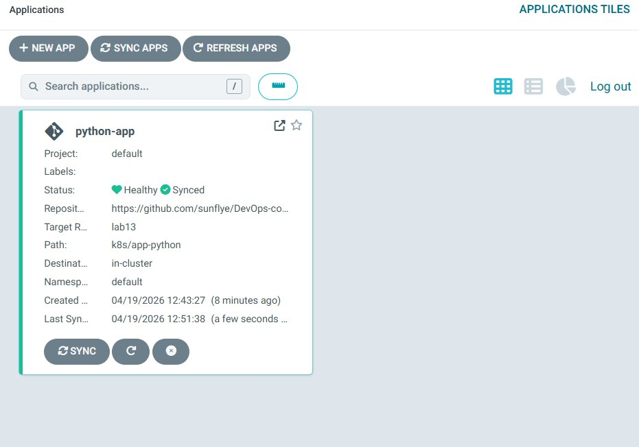

2. **GitOps Test (Drift & Sync):**
   - Changed `replicaCount` in `values.yaml` from 3 to 5.
   - Committed and pushed the change:
     ```powershell
     git add k8s/app-python/values.yaml
     git commit -m "Increase replicas to 5"
     git push origin lab13
     ```
   - ArgoCD detected the drift (status: OutOfSync).
   - Synced the application again:
     ```powershell
     argocd app sync python-app
     ```
   - Confirmed that 5 pods are running:
     ```powershell
     PS D:\INNOPOLIS\DEVOPS ENGINEERING\DevOps-course> kubectl get pods
        NAME                                     READY   STATUS    RESTARTS        AGE
        python-app-app-python-7f4dc999f9-6mvbt   1/1     Running   0               18m
        python-app-app-python-7f4dc999f9-lkjzh   1/1     Running   0               29m
        python-app-app-python-7f4dc999f9-mtpwm   1/1     Running   0               18m
        python-app-app-python-7f4dc999f9-nzzhf   1/1     Running   0               29m
        python-app-app-python-7f4dc999f9-shzj8   1/1     Running   0               29m
        vault-0                                  1/1     Running   2 (95m ago)     14d
        vault-agent-injector-86d76999fd-s7psw    1/1     Running   2 (7d12h ago)   14d
        PS D:\INNOPOLIS\DEVOPS ENGINEERING\DevOps-course>
     ```
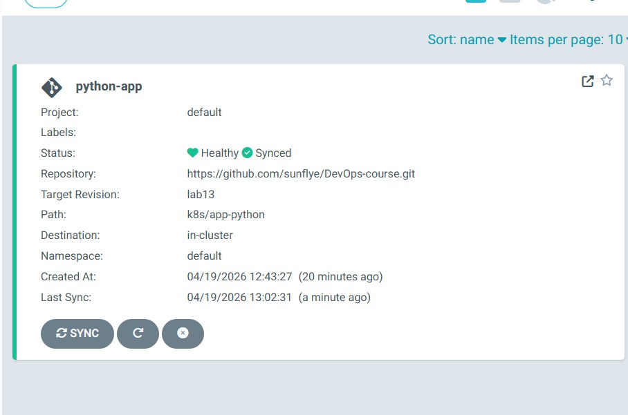
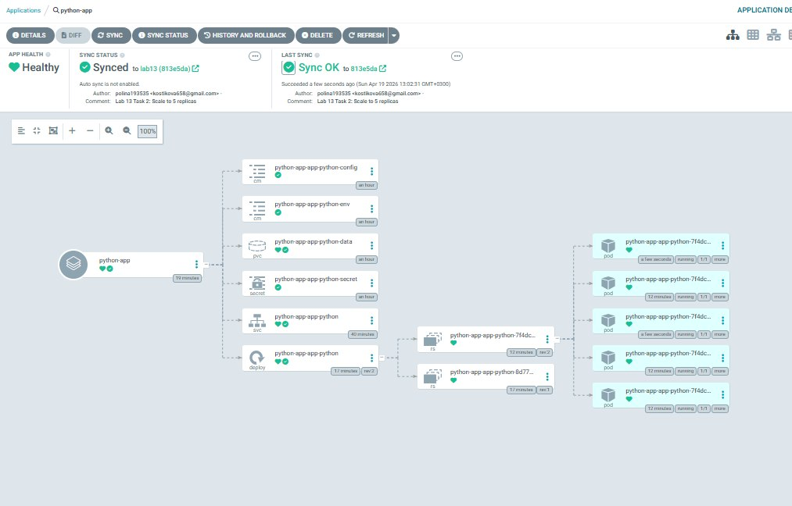
---

## Task 3 — Multi-Environment Deployment

### Namespace Separation

- Created two namespaces for isolated environments:
  ```powershell
  kubectl create namespace dev
  kubectl create namespace prod
  ```
- This keeps dev and prod resources independent.

### Dev vs Prod Configuration Differences

- **Dev** uses [`k8s/app-python/values-dev.yaml`](k8s/app-python/values-dev.yaml):
  - `replicaCount: 1`
  - Lower CPU/Memory requests and limits
  - Service type: `NodePort` (unique port)
- **Prod** uses [`k8s/app-python/values-prod.yaml`](k8s/app-python/values-prod.yaml):
  - `replicaCount: 5`
  - Higher CPU/Memory requests and limits
  - Service type: `NodePort` (unique port)

### Sync Policy Differences and Rationale

- **Dev** uses **auto-sync** with self-heal and prune:
  ```yaml
  syncPolicy:
    automated:
      prune: true
      selfHeal: true
    syncOptions:
      - CreateNamespace=true
  ```
  **Rationale:** fast iteration, automatic drift correction.

- **Prod** uses **manual sync**:
  ```yaml
  syncPolicy:
    syncOptions:
      - CreateNamespace=true
  ```
  **Rationale:** controlled releases, change review, and safer production updates.

### Verification

```powershell
PS D:\INNOPOLIS\DEVOPS ENGINEERING\DevOps-course> kubectl get pods -n dev
NAME                                        READY   STATUS    RESTARTS   AGE
python-app-dev-app-python-b5949589b-g7w52   1/1     Running   0          25m
PS D:\INNOPOLIS\DEVOPS ENGINEERING\DevOps-course> 

PS D:\INNOPOLIS\DEVOPS ENGINEERING\DevOps-course> kubectl get pods -n prod
NAME                                          READY   STATUS    RESTARTS   AGE
python-app-prod-app-python-5bf9d56575-4d78s   1/1     Running   0          24m
python-app-prod-app-python-5bf9d56575-hvl42   1/1     Running   0          24m
python-app-prod-app-python-5bf9d56575-np4mv   1/1     Running   0          24m
python-app-prod-app-python-5bf9d56575-rvhm8   1/1     Running   0          24m
python-app-prod-app-python-5bf9d56575-w45b9   1/1     Running   0          24m
PS D:\INNOPOLIS\DEVOPS ENGINEERING\DevOps-course> 

PS D:\INNOPOLIS\DEVOPS ENGINEERING\DevOps-course> kubectl get svc -n dev
NAME                        TYPE       CLUSTER-IP       EXTERNAL-IP   PORT(S)        AGE
python-app-dev-app-python   NodePort   10.102.104.150   <none>        80:30081/TCP   15m
PS D:\INNOPOLIS\DEVOPS ENGINEERING\DevOps-course> 

PS D:\INNOPOLIS\DEVOPS ENGINEERING\DevOps-course> kubectl get svc -n prod
NAME                         TYPE       CLUSTER-IP       EXTERNAL-IP   PORT(S)        AGE
python-app-prod-app-python   NodePort   10.104.251.217   <none>        80:30082/TCP   24m
PS D:\INNOPOLIS\DEVOPS ENGINEERING\DevOps-course> 

PS D:\INNOPOLIS\DEVOPS ENGINEERING\DevOps-course> argocd app list
NAME                    CLUSTER                         NAMESPACE  PROJECT  STATUS  HEALTH   SYNCPOLICY  CONDITIONS  REPO                                    
      PATH            TARGET
argocd/python-app       https://kubernetes.default.svc  default    default  Synced  Healthy  Manual      <none>      https://github.com/sunflye/DevOps-course.git  k8s/app-python  lab13
argocd/python-app-dev   https://kubernetes.default.svc  dev        default  Synced  Healthy  Auto-Prune  <none>      https://github.com/sunflye/DevOps-course.git  k8s/app-python  lab13
argocd/python-app-prod  https://kubernetes.default.svc  prod       default  Synced  Healthy  Manual      <none>      https://github.com/sunflye/DevOps-course.git  k8s/app-python  lab13
PS D:\INNOPOLIS\DEVOPS ENGINEERING\DevOps-course> 
```
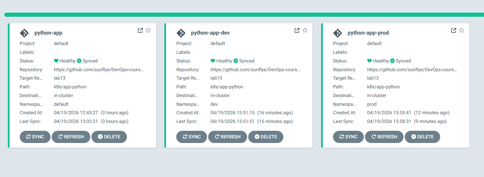
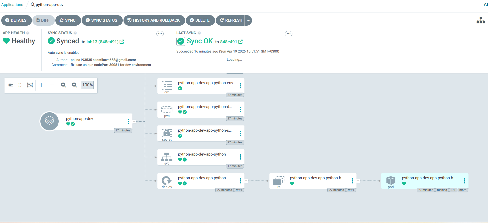
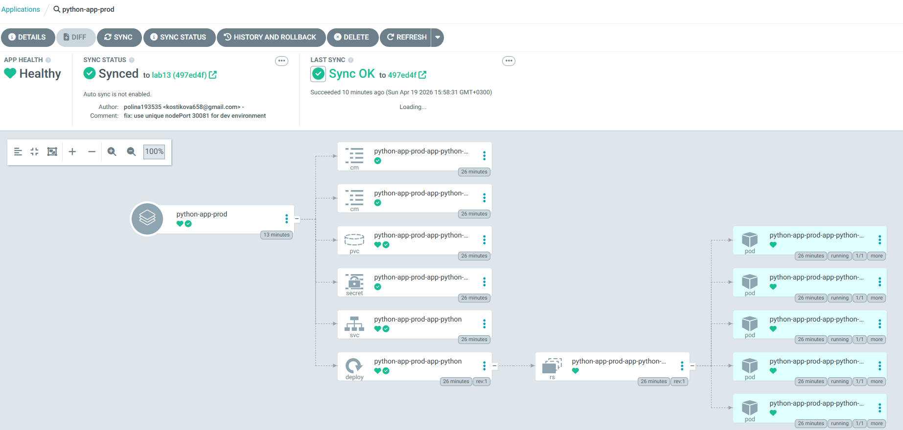


## Task 4 — Self-Healing & Sync Policies

### 4.1 Self-Healing Test (Dev)

**Manual scale (drift):**
```powershell
kubectl scale deployment python-app-dev-app-python -n dev --replicas=5
argocd app get python-app-dev
kubectl get pods -n dev -w
```

**Observed:**
- After manual scale, ArgoCD showed **OutOfSync**.
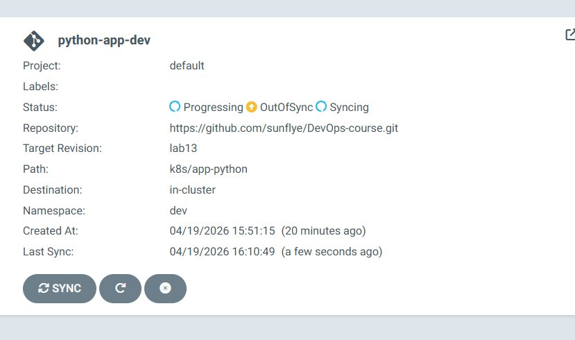
- Within ~3 minutes ArgoCD auto‑reverted replicas to `replicaCount: 1`.

```
PS D:\INNOPOLIS\DEVOPS ENGINEERING\DevOps-course> kubectl get pods -n dev -w
NAME                                        READY   STATUS        RESTARTS   AGE
python-app-dev-app-python-b5949589b-g7w52   1/1     Running       0          30m    
python-app-dev-app-python-b5949589b-h2krx   1/1     Terminating   0          49s    
python-app-dev-app-python-b5949589b-kmthd   1/1     Terminating   0          49s    
python-app-dev-app-python-b5949589b-rgk7c   1/1     Terminating   0          49s    
python-app-dev-app-python-b5949589b-vp2hh   1/1     Terminating   0          49s
```
- Status returned to **Synced/Healthy**.
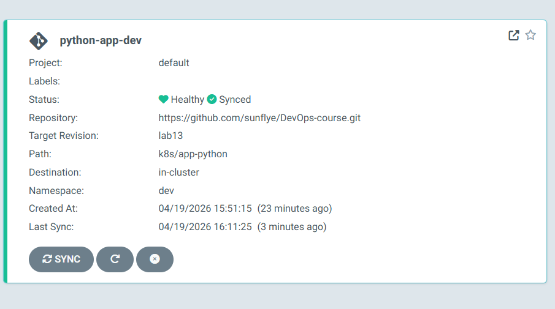
```
PS D:\INNOPOLIS\DEVOPS ENGINEERING\DevOps-course> kubectl get pods -n dev -w
NAME                                        READY   STATUS    RESTARTS   AGE
python-app-dev-app-python-b5949589b-g7w52   1/1     Running   0          31m 
```
---

### 4.2 Pod Deletion (Kubernetes Self-Healing)

```powershell
$POD = kubectl get pods -n dev -o jsonpath="{.items[0].metadata.name}"
kubectl delete pod $POD -n dev
kubectl get pods -n dev -w
```

**Observed:**

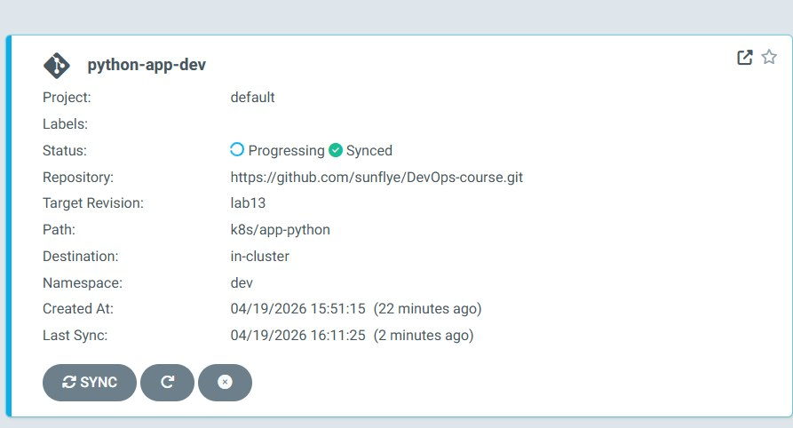
- Kubernetes immediately recreated the deleted pod.
```
PS D:\INNOPOLIS\DEVOPS ENGINEERING\DevOps-course> kubectl get pods -n dev -w        
NAME                                        READY   STATUS        RESTARTS   AGE    
python-app-dev-app-python-b5949589b-5vkk2   1/1     Running       0          21s    
python-app-dev-app-python-b5949589b-h9glj   1/1     Terminating   0          73s  
```
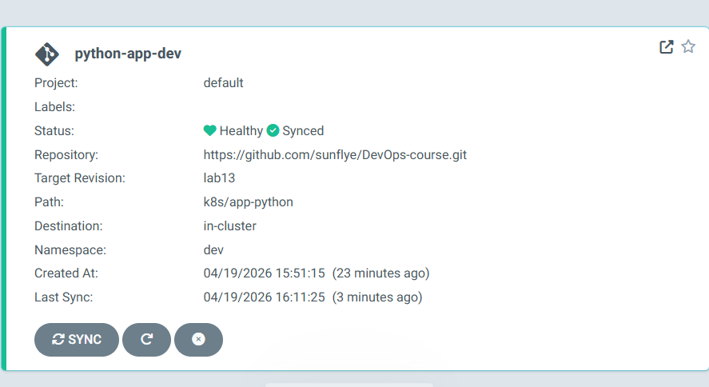
- This is **Kubernetes self‑healing**, not ArgoCD.

---

### 4.3 Configuration Drift Test

```powershell
PS D:\INNOPOLIS\DEVOPS ENGINEERING\DevOps-course> kubectl label deployment python-app-dev-app-python -n dev drift=manual
deployment.apps/python-app-dev-app-python labeled

PS D:\INNOPOLIS\DEVOPS ENGINEERING\DevOps-course> argocd app diff python-app-dev

PS D:\INNOPOLIS\DEVOPS ENGINEERING\DevOps-course> argocd app get python-app-dev
Name:               argocd/python-app-dev
Project:            default
Server:             https://kubernetes.default.svc
Namespace:          dev
URL:                https://argocd.example.com/applications/python-app-dev
Source:
- Repo:             https://github.com/sunflye/DevOps-course.git
  Target:           lab13
  Path:             k8s/app-python
  Helm Values:      values-dev.yaml
SyncWindow:         Sync Allowed
Sync Policy:        Automated (Prune)
Sync Status:        Synced to lab13 (497ed4f)
Health Status:      Healthy

GROUP  KIND                   NAMESPACE  NAME                                    STATUS     HEALTH   HOOK      MESSAGE
batch  Job                    dev        python-app-dev-app-python-pre-install   Succeeded           PreSync   job.batch/python-app-dev-app-python-pre-install created
       Secret                 dev        python-app-dev-app-python-secret        Synced                   
     secret/python-app-dev-app-python-secret configured
       ConfigMap              dev        python-app-dev-app-python-env           Synced                   
     configmap/python-app-dev-app-python-env unchanged
       ConfigMap              dev        python-app-dev-app-python-config        Synced                   
     configmap/python-app-dev-app-python-config unchanged
       PersistentVolumeClaim  dev        python-app-dev-app-python-data          Synced     Healthy            persistentvolumeclaim/python-app-dev-app-python-data unchanged
       Service                dev        python-app-dev-app-python               Synced     Healthy            service/python-app-dev-app-python unchanged
     configmap/python-app-dev-app-python-env unchanged
       ConfigMap              dev        python-app-dev-app-python-config        Synced                        configmap/python-app-dev-app-python-config unchanged
       PersistentVolumeClaim  dev        python-app-dev-app-python-data          Synced     Healthy            persistentvolumeclaim/python-app-dev-app-python-data unchanged
       Service                dev        python-app-dev-app-python               Synced     Healthy            service/python-app-dev-app-python unchanged
       PersistentVolumeClaim  dev        python-app-dev-app-python-data          Synced     Healthy            persistentvolumeclaim/python-app-dev-app-python-data unchanged
       Service                dev        python-app-dev-app-python               Synced     Healthy            service/python-app-dev-app-python unchanged
       Service                dev        python-app-dev-app-python               Synced     Healthy            service/python-app-dev-app-python unchanged
apps   Deployment             dev        python-app-dev-app-python               Synced     Healthy            deployment.apps/python-app-dev-app-python configured
batch  Job                    dev        python-app-dev-app-python-post-install  Succeeded           PostSync  job.batch/python-app-dev-app-python-post-install created
```

**Observed:**
- The manual label caused drift, but ArgoCD auto‑heal removed it quickly.
- `argocd app diff` showed no output because the drift was already reverted.
- Status returned to **Synced/Healthy** (Git state restored).

---

### 4.4 Sync Behavior Summary

- **ArgoCD syncs** when Git changes or when it detects drift (auto‑sync enabled in dev).
- **Kubernetes heals** only pod failures (recreates pods); it does **not** fix config drift.
- Default ArgoCD reconciliation interval is ~**3 minutes**, so auto‑heal happens within a few minutes.