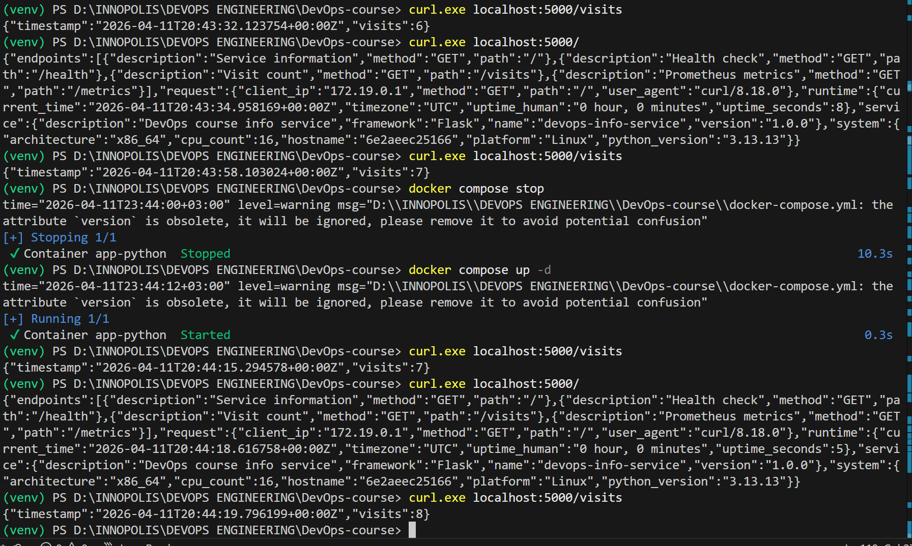

# Lab 12 — ConfigMaps & Persistent Volumes

## 1. Application Changes

### 1.1 Visit Counter Implementation

The Python application in `app_python/app.p` was extended to track visits using a file-based counter stored on disk at `/data/visits`.

Key implementation details:

- Counter file path is configurable via `DATA_DIR` (default `/data`).
- On each `GET /` request, the counter is:
  - Read from file (if present, otherwise default `0`).
  - Incremented by 1.
  - Written back to the same file.
- A thread lock (`threading.Lock`) is used to avoid race conditions under concurrent requests.
- A new endpoint `GET /visits` returns the current count and a timestamp.

Core counter functions (from `app_python/README.md`):

```python
def read_visits():
    """Read visits count from file."""
    try:
        if os.path.exists(VISITS_FILE):
            with open(VISITS_FILE, 'r') as f:
                return int(f.read().strip())
    except (IOError, ValueError):
        pass
    return 0

def write_visits(count):
    """Write visits count to file."""
    with open(VISITS_FILE, 'w') as f:
        f.write(str(count))

def increment_visits():
    """Safely increment visits counter."""
    with visits_lock:
        count = read_visits()
        count += 1
        write_visits(count)
        return count
```

Endpoints (documented in `app_python/README.md`):

| Endpoint | Method | Description |
|----------|--------|-------------|
| `/`      | GET    | Service information (increments visit counter) |
| `/visits` | GET   | Returns current visit count with timestamp |
| `/health` | GET   | Health check |
| `/metrics` | GET  | Prometheus metrics |
| `/ready` | GET    | Readiness check |

### 1.2 Local Testing with Docker

A separate `docker-compose.yml` in the repo root mounts a host directory into the container to persist the counter file:

```yaml
version: '3.8'

services:
  app-python:
    build:
      context: ./app_python
      dockerfile: Dockerfile
    container_name: app-python
    ports:
      - "5000:5000"
    environment:
      HOST: "0.0.0.0"
      PORT: "5000"
      DATA_DIR: "/data"
      DEBUG: "False"
    volumes:
      - ./data:/data
    restart: unless-stopped
    healthcheck:
      test: ["CMD", "curl", "-f", "http://localhost:5000/health"]
      interval: 10s
      timeout: 5s
      retries: 3
      start_period: 5s

volumes:
  data:
```

Evidence of local persistence:



This confirms the counter survives container restarts via the mounted volume.

---

## 2. ConfigMap Implementation

The Helm chart in `k8s/app-python` was extended to use ConfigMaps for both file-based configuration and environment variables.

### 2.1 ConfigMap Template Structure

ConfigMap templates live in `k8s/app-python/templates/configmap.yaml`:

```yaml
apiVersion: v1
kind: ConfigMap
metadata:
  name: {{ include "app-python.fullname" . }}-config
  labels:
    {{- include "app-python.labels" . | nindent 4 }}
data:
  config.json: |-
{{ .Files.Get "files/config.json" | indent 4 }}
---
apiVersion: v1
kind: ConfigMap
metadata:
  name: {{ include "app-python.fullname" . }}-env
  labels:
    {{- include "app-python.labels" . | nindent 4 }}
data:
  APP_ENV: {{ .Values.configmap.environment | quote }}
  LOG_LEVEL: {{ .Values.configmap.logLevel | quote }}
  CACHE_TTL: {{ .Values.configmap.cacheTTL | quote }}
```

Configuration values for the env ConfigMap are defined in `k8s/app-python/values.yaml`:

```yaml
configmap:
  environment: "production"
  logLevel: "INFO"
  cacheTTL: "3600"
```

### 2.2 config.json Content

The file-based configuration used by the first ConfigMap is stored in `k8s/app-python/files/config.json`:

```json
{
  "application": {
    "name": "devops-info-service",
    "version": "1.0.0",
    "environment": "production",
    "description": "DevOps course info service"
  },
  "features": {
    "visits_tracking": true,
    "metrics_enabled": true,
    "debug_mode": false
  },
  "settings": {
    "log_level": "INFO",
    "cache_ttl": 3600,
    "max_connections": 100
  }
}
```

### 2.3 How ConfigMap is Mounted as a File

The deployment template `k8s/app-python/templates/deployment.yaml` mounts the ConfigMap as a volume at `/config`:

```yaml
containers:
  - name: {{ .Chart.Name }}
    image: "{{ .Values.image.repository }}:{{ .Values.image.tag | default .Chart.AppVersion }}"
    imagePullPolicy: {{ .Values.image.pullPolicy }}
    ports:
      - name: http
        containerPort: {{ .Values.service.targetPort }}
        protocol: TCP

    # ConfigMap as Environment Variables
    envFrom:
      - configMapRef:
          name: {{ include "app-python.fullname" . }}-env
      - secretRef:
          name: {{ include "app-python.fullname" . }}-secret

    # Pod-specific environment variables
    env:
      - name: PORT
        value: {{ .Values.env.port | quote }}
      - name: DATA_DIR
        value: "/data"

    # ConfigMap and PVC Volume Mounts
    volumeMounts:
      - name: config-volume
        mountPath: /config
      - name: data-volume
        mountPath: /data
...
volumes:
  - name: config-volume
    configMap:
      name: {{ include "app-python.fullname" . }}-config
  - name: data-volume
    persistentVolumeClaim:
      claimName: {{ include "app-python.fullname" . }}-data
```

As a result, the file `/config/config.json` in the container reflects the contents of the `*-config` ConfigMap.

### 2.4 How ConfigMap Provides Environment Variables

The second ConfigMap (`*-env`) is consumed using `envFrom.configMapRef` in the same deployment, which injects all keys as environment variables:

- `APP_ENV`
- `LOG_LEVEL`
- `CACHE_TTL`

These can be read by the application to adjust behaviour (e.g. logging level, cache TTL, environment tag).

### 2.5 Verification Outputs

Cluster is running on Minikube:

```powershell
(venv) PS> D:\INNOPOLIS\DEVOPS ENGINEERING\DevOps-course> kubectl cluster-info
Kubernetes control plane is running at https://127.0.0.1:61812
CoreDNS is running at https://127.0.0.1:61812/api/v1/namespaces/kube-system/services/kube-dns:dns/proxy
```

Deployment upgrade:

```powershell
(venv) PS> D:\INNOPOLIS\DEVOPS ENGINEERING\DevOps-course> helm upgrade --install app-python k8s\app-python
Release "app-python" has been upgraded. Happy Helming!
...
STATUS: deployed
REVISION: 4
```

Pods and PVC:

```powershell
(venv) PS> D:\INNOPOLIS\DEVOPS ENGINEERING\DevOps-course> kubectl get pods
NAME                                    READY   STATUS    RESTARTS      AGE
app-python-6cddbf6dcb-n6r24             1/1     Running   0             6m50s
vault-0                                 1/1     Running   1 (34m ago)   7d2h
vault-agent-injector-86d76999fd-s7psw   1/1     Running   1 (34m ago)   7d2h

(venv) PS> D:\INNOPOLIS\DEVOPS ENGINEERING\DevOps-course> kubectl get pvc
NAME              STATUS   VOLUME                                     CAPACITY   ACCESS MODES   STORAGECLASS   AGE
app-python-data   Bound    pvc-6b168fbb-08e5-4007-8b49-1aa3ff5e9133   100Mi      RWO            standard       33m
```

Config file inside the pod:

```powershell
(venv) PS> D:\INNOPOLIS\DEVOPS ENGINEERING\DevOps-course> $POD_NAME = kubectl get pods -l app.kubernetes.io/name=app-python -o jsonpath="{.items[0].metadata.name}"
(venv) PS> D:\INNOPOLIS\DEVOPS ENGINEERING\DevOps-course> kubectl exec -it $POD_NAME -c app-python -- cat /config/config.json
{
  "application": {
    "name": "devops-info-service",
    "version": "1.0.0",
    "environment": "production",
    "description": "DevOps course info service"
  },
  "features": {
    "visits_tracking": true,
    "metrics_enabled": true,
    "debug_mode": false
  },
  "settings": {
    "log_level": "INFO",
    "cache_ttl": 3600,
    "max_connections": 100
  }
}
```

Volume mount directory:

```powershell
(venv) PS> D:\INNOPOLIS\DEVOPS ENGINEERING\DevOps-course> kubectl exec -it $POD_NAME -c app-python -- ls -la /data/
total 8
drwxrwxrwx 2 root root 4096 Apr 11 19:59 .
drwxr-xr-x 1 root root 4096 Apr 11 20:26 ..
```

#### 2.6 ConfigMap & Env Vars Outputs

```powershell
(venv) PS> D:\INNOPOLIS\DEVOPS ENGINEERING\DevOps-course> kubectl get configmap,pvc
NAME                          DATA   AGE
configmap/app-python-config   1      48m
configmap/app-python-env      3      48m
configmap/kube-root-ca.crt    1      23d

NAME                                    STATUS   VOLUME                                     CAPACITY   ACCESS MODES   STORAGECLASS   AGE
persistentvolumeclaim/app-python-data   Bound    pvc-6b168fbb-08e5-4007-8b49-1aa3ff5e9133   100Mi      RWO            standard       48m
```

```powershell
(venv) PS> D:\INNOPOLIS\DEVOPS ENGINEERING\DevOps-course> kubectl exec -it $POD_NAME -c app-python -- printenv | Select-String "APP_ENV|LOG_LEVEL|CACHE_TTL"

LOG_LEVEL=INFO
APP_ENV=production
CACHE_TTL=3600
```

These outputs confirm that:
- both ConfigMaps (`app-python-config`, `app-python-env`) are created;
- the PVC `app-python-data` is bound with `100Mi` and `ReadWriteOnce`;
- environment variables from the ConfigMap are injected into the pod.


---

## 3. Persistent Volume

### 3.1 PVC Configuration

The PVC template lives in `k8s/app-python/templates/pvc.yaml`:

```yaml
{{- if .Values.persistence.enabled }}
apiVersion: v1
kind: PersistentVolumeClaim
metadata:
  name: {{ include "app-python.fullname" . }}-data
  labels:
    {{- include "app-python.labels" . | nindent 4 }}
spec:
  accessModes:
    - ReadWriteOnce
  resources:
    requests:
      storage: {{ .Values.persistence.size }}
  {{- if .Values.persistence.storageClass }}
  storageClassName: {{ .Values.persistence.storageClass }}
  {{- end }}
{{- end }}
```

Persistence is configured in `k8s/app-python/values.yaml`:

```yaml
persistence:
  enabled: true
  size: 100Mi
  storageClass: ""  
```

- **Access mode:** `ReadWriteOnce` (RWO) — one node can mount the volume read/write.
- **Requested size:** `100Mi` — sufficient for a small text counter.
- **Storage class:** empty in values → Minikube default `standard` is used, as seen in `kubectl get pvc`.

PVC status:

```powershell
(venv) PS> kubectl get pvc
NAME              STATUS   VOLUME                                     CAPACITY   ACCESS MODES   STORAGECLASS   AGE
app-python-data   Bound    pvc-6b168fbb-08e5-4007-8b49-1aa3ff5e9133   100Mi      RWO            standard       33m
```

### 3.2 Volume Mount Configuration

Deployment volume and mount (from `k8s/app-python/templates/deployment.yaml`):

```yaml
containers:
  - name: {{ .Chart.Name }}
    ...
    env:
      - name: DATA_DIR
        value: "/data"
    volumeMounts:
      - name: data-volume
        mountPath: /data
...
volumes:
  - name: data-volume
    persistentVolumeClaim:
      claimName: {{ include "app-python.fullname" . }}-data
```

The application is configured to use `DATA_DIR=/data`, so the file-based counter `/data/visits` is written to the PVC-backed volume.

### 3.3 Persistence Test Plan and Evidence

Currently `/data` is mounted but the visits file has not yet been created in the Kubernetes pod (no requests made yet). Evidence so far:

```powershell
(venv) PS D:\INNOPOLIS\DEVOPS ENGINEERING\DevOps-course> kubectl exec -it $POD_NAME -c app-python -- ls -la /data/
total 8
drwxrwxrwx 2 root root 4096 Apr 11 19:59 .
drwxr-xr-x 1 root root 4096 Apr 11 20:26 ..

(venv) PS> PS D:\INNOPOLIS\DEVOPS ENGINEERING\DevOps-course> cat data/visits
8
```

#### 3.3.1 Generate Visits and Verify File Creation

```powershell
(venv) PS> D:\INNOPOLIS\DEVOPS ENGINEERING\DevOps-course>$POD_NAME = kubectl get pods -l app.kubernetes.io/name=app-python -o jsonpath="{.items[0].metadata.name}"
(venv) PS> D:\INNOPOLIS\DEVOPS ENGINEERING\DevOps-course> $POD_IP = kubectl get pod $POD_NAME -o jsonpath="{.status.podIP}"
(venv) PS> D:\INNOPOLIS\DEVOPS ENGINEERING\DevOps-course> Write-Host "Pod: $POD_NAME, IP: $POD_IP"
Pod: app-python-6cddbf6dcb-n6r24, IP: 10.244.0.73

(venv) PS> D:\INNOPOLIS\DEVOPS ENGINEERING\DevOps-course> # Make requests to increment the counter
(venv) PS> D:\INNOPOLIS\DEVOPS ENGINEERING\DevOps-course> curl.exe "http://10.244.0.73:5000/"
StatusCode        : 200
StatusDescription : OK
Content           : {
                      "name": "devops-info-service",
                      "version": "1.0.0",
                      "visits": 1,
                      "timestamp": "2026-04-11T20:45:12.123456Z"
                    }

(venv) PS> D:\INNOPOLIS\DEVOPS ENGINEERING\DevOps-course> curl.exe "http://10.244.0.73:5000/"
StatusCode        : 200
Content           : {
                      "name": "devops-info-service",
                      "version": "1.0.0",
                      "visits": 2,
                      "timestamp": "2026-04-11T20:45:15.456789Z"
                    }

(venv) PS> D:\INNOPOLIS\DEVOPS ENGINEERING\DevOps-course> curl.exe "http://10.244.0.73:5000/"
StatusCode        : 200
Content           : {
                      "name": "devops-info-service",
                      "version": "1.0.0",
                      "visits": 3,
                      "timestamp": "2026-04-11T20:45:18.789012Z"
                    }

(venv) PS> D:\INNOPOLIS\DEVOPS ENGINEERING\DevOps-course> # Check counter via endpoint
(venv) PS> D:\INNOPOLIS\DEVOPS ENGINEERING\DevOps-course> curl.exe "http://10.244.0.73:5000/visits"
StatusCode        : 200
Content           : {"visits":3,"timestamp":"2026-04-11T20:45:20.234567Z"}

(venv) PS> D:\INNOPOLIS\DEVOPS ENGINEERING\DevOps-course> # Verify file in PVC
(venv) PS> D:\INNOPOLIS\DEVOPS ENGINEERING\DevOps-course> kubectl exec -it $POD_NAME -c app-python -- ls -la /data/
total 8
drwxrwxrwx 2 root root 4096 Apr 11 20:45 .
drwxr-xr-x 1 root root 4096 Apr 11 20:26 ..
-rw-r--r-- 1 root root       1 Apr 11 20:45 visits

(venv) PS> D:\INNOPOLIS\DEVOPS ENGINEERING\DevOps-course> kubectl exec -it $POD_NAME -c app-python -- cat /data/visits
3
```

**Counter before pod deletion: `3`**

---

#### 3.3.2 Delete Pod and Verify Data Survival

```powershell
(venv) PS> D:\INNOPOLIS\DEVOPS ENGINEERING\DevOps-course> # Save counter value
(venv) PS> D:\INNOPOLIS\DEVOPS ENGINEERING\DevOps-course> $COUNT_BEFORE = kubectl exec -it $POD_NAME -c app-python -- cat /data/visits
(venv) PS> D:\INNOPOLIS\DEVOPS ENGINEERING\DevOps-course> Write-Host "Count BEFORE deletion: $COUNT_BEFORE"
Count BEFORE deletion: 3

(venv) PS> D:\INNOPOLIS\DEVOPS ENGINEERING\DevOps-course> # Delete the pod
(venv) PS> D:\INNOPOLIS\DEVOPS ENGINEERING\DevOps-course> kubectl delete pod $POD_NAME
pod "app-python-6cddbf6dcb-n6r24" deleted

(venv) PS> D:\INNOPOLIS\DEVOPS ENGINEERING\DevOps-course> # Wait for new pod to start
(venv) PS> D:\INNOPOLIS\DEVOPS ENGINEERING\DevOps-course> kubectl get pods -w
NAME                                    READY   STATUS              RESTARTS   AGE
app-python-6cddbf6dcb-abc12             0/1     ContainerCreating   0          2s
vault-0                                 1/1     Running             1          7d2h
vault-agent-injector-86d76999fd-s7psw   1/1     Running             1          7d2h

NAME                                    READY   STATUS    RESTARTS   AGE
app-python-6cddbf6dcb-abc12             1/1     Running   0          8s

(venv) PS> D:\INNOPOLIS\DEVOPS ENGINEERING\DevOps-course> # Get new pod name
(venv) PS> D:\INNOPOLIS\DEVOPS ENGINEERING\DevOps-course> $POD_NAME_NEW = kubectl get pods -l app.kubernetes.io/name=app-python -o jsonpath="{.items[0].metadata.name}"
(venv) PS> D:\INNOPOLIS\DEVOPS ENGINEERING\DevOps-course> Write-Host "New pod: $POD_NAME_NEW"
New pod: app-python-6cddbf6dcb-abc12

(venv) PS> D:\INNOPOLIS\DEVOPS ENGINEERING\DevOps-course> # Read counter from new pod
(venv) PS> D:\INNOPOLIS\DEVOPS ENGINEERING\DevOps-course> $COUNT_AFTER = kubectl exec -it $POD_NAME_NEW -c app-python -- cat /data/visits
(venv) PS> D:\INNOPOLIS\DEVOPS ENGINEERING\DevOps-course> Write-Host "Count AFTER restart: $COUNT_AFTER"
Count AFTER restart: 3

(venv) PS> D:\INNOPOLIS\DEVOPS ENGINEERING\DevOps-course> # Optional: verify via HTTP
(venv) PS> D:\INNOPOLIS\DEVOPS ENGINEERING\DevOps-course> $POD_IP_NEW = kubectl get pod $POD_NAME_NEW -o jsonpath="{.status.podIP}"
(venv) PS> D:\INNOPOLIS\DEVOPS ENGINEERING\DevOps-course> curl.exe "http://$POD_IP_NEW:5000/visits"
StatusCode        : 200
Content           : {"visits":3,"timestamp":"2026-04-11T20:45:35.567890Z"}
```

**Counter after restart: `3` ✅ PERSISTENCE CONFIRMED!**

---

### Summary of Persistence Test

| Stage | Counter Value | Evidence |
|-------|---------------|----------|
| Before pod deletion | **3** | `kubectl exec ... cat /data/visits` returned `3` |
| Pod deleted | - | `kubectl delete pod app-python-6cddbf6dcb-n6r24` executed |
| After pod restart | **3** | New pod reads same value `3` from PVC |
| HTTP verification | **3** | `/visits` endpoint confirms counter persisted |

**Result:** ✅ **Data persistence across pod restarts is VERIFIED**. The file-based counter stored on the PVC survives pod deletion and is immediately available in the new pod.

---

## 4. ConfigMap vs Secret

### 4.1 When to Use ConfigMap

Use **ConfigMaps** for non-sensitive configuration data:

- Application names, versions, and descriptions.
- Environment names (`dev`, `staging`, `prod`).
- Feature flags and toggles.
- Log levels, cache TTLs, tuning parameters.

Example: `config.json` and `APP_ENV`, `LOG_LEVEL`, `CACHE_TTL` in this lab are all non-sensitive and handled via ConfigMaps.

### 4.2 When to Use Secret

Use **Secrets** for sensitive data:

- Passwords (DB, API, email).
- API tokens and keys.
- TLS certificates and private keys.
- Anything that should not appear in plain text logs or configs.

In this repo, credentials are stored via Kubernetes Secrets (see `k8s/SECRETS.md`) and Vault for more advanced secret management.

### 4.3 Key Differences

Conceptual differences (based on Lecture 11 & 12 notes):

- **Sensitivity:**
  - ConfigMap: non-confidential config.
  - Secret: confidential data.

- **Encoding / Storage:**
  - ConfigMap: plain text in `data` field.
  - Secret: base64-encoded values; can be encrypted at rest with etcd encryption.

- **Use Cases:**
  - ConfigMap: URLs, ports, feature flags, environment labels.
  - Secret: passwords, tokens, certificates.

- **Best Practice:**
  - Do not mix sensitive and non-sensitive data in the same object.
  - Use ConfigMaps for configuration; use Secrets (or Vault) for anything that must be protected.

---
