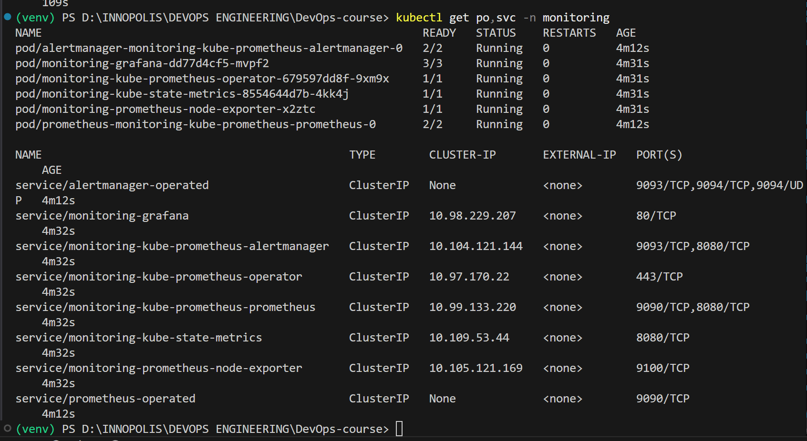
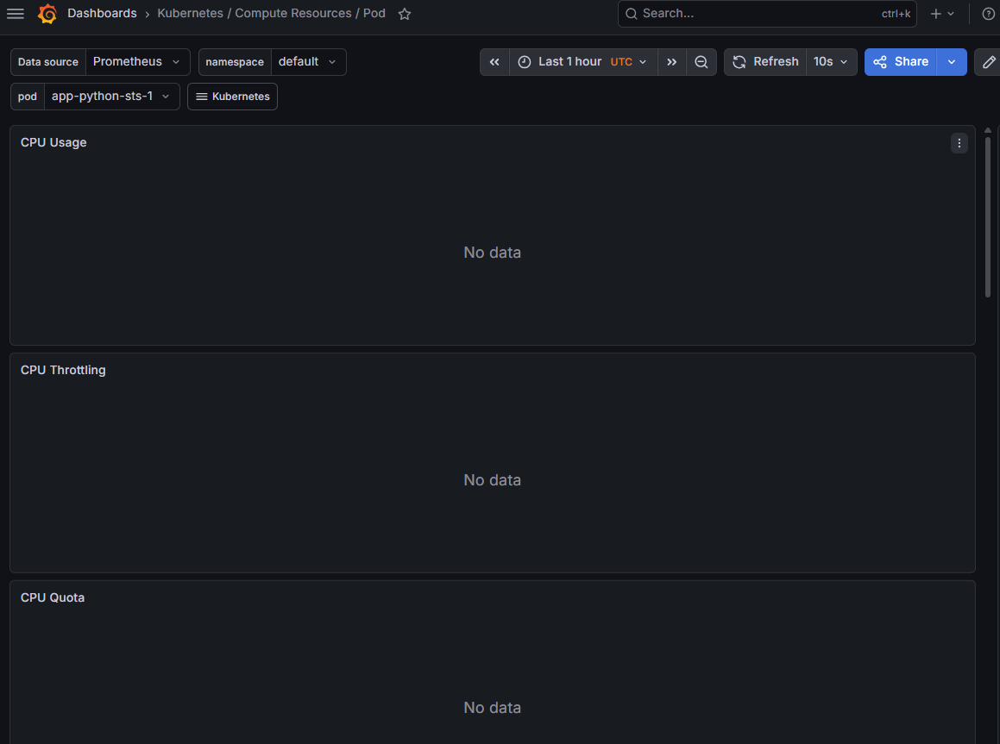
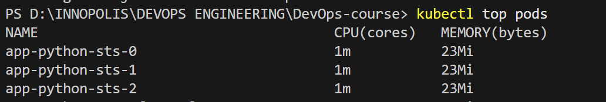
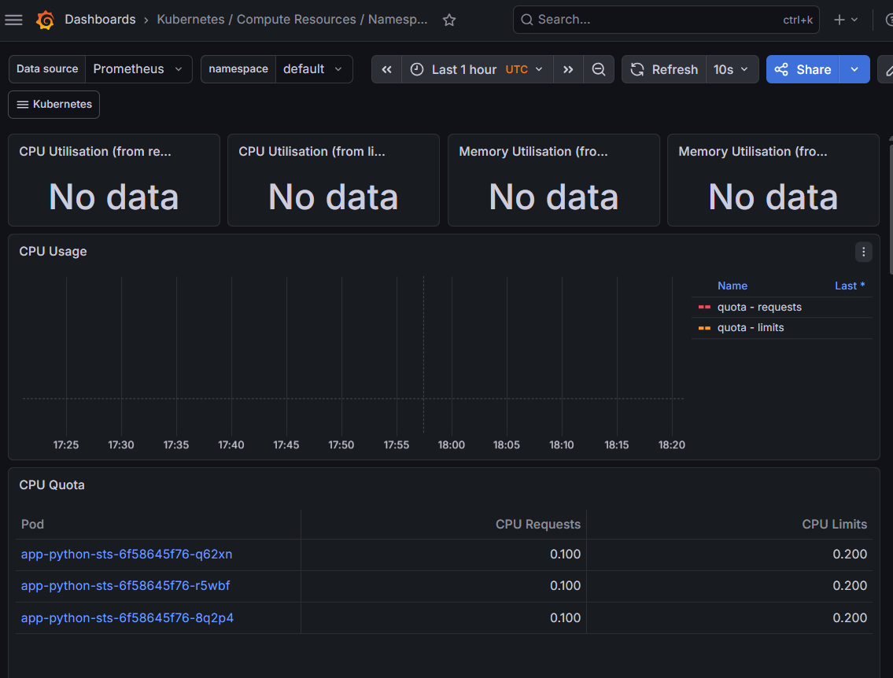
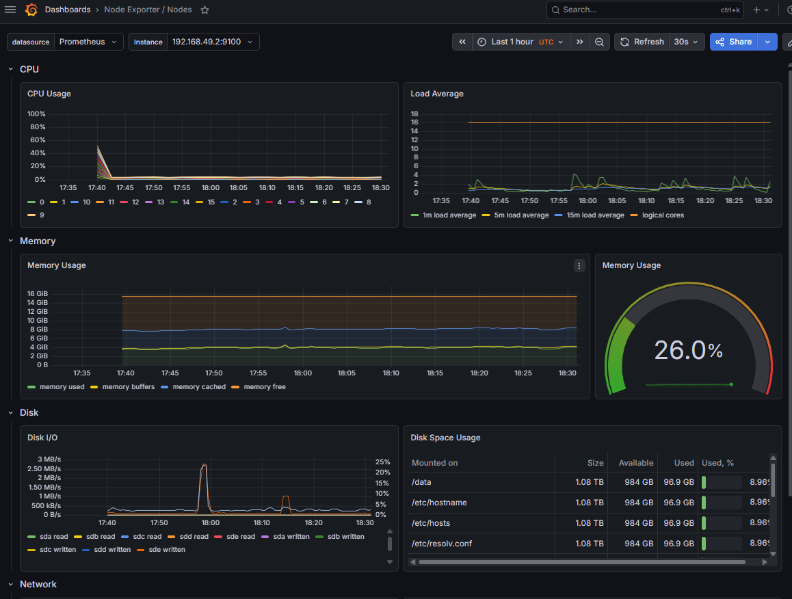
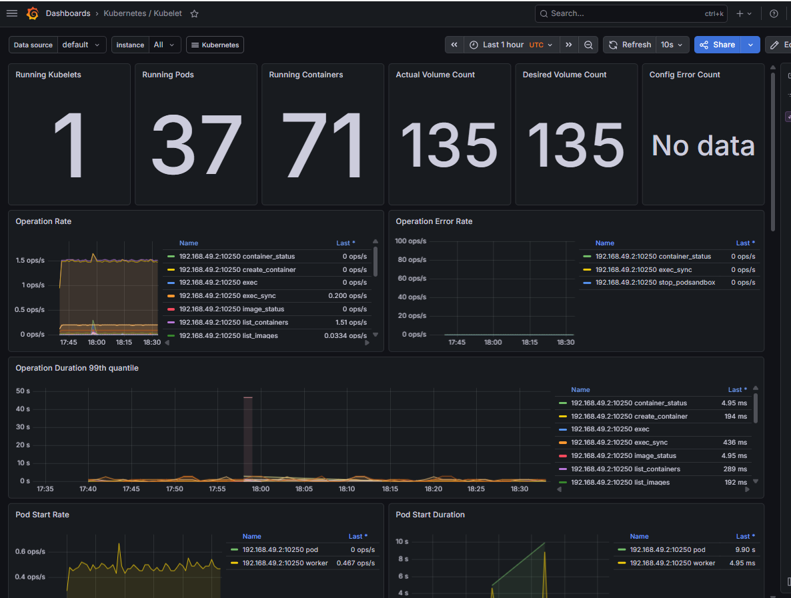
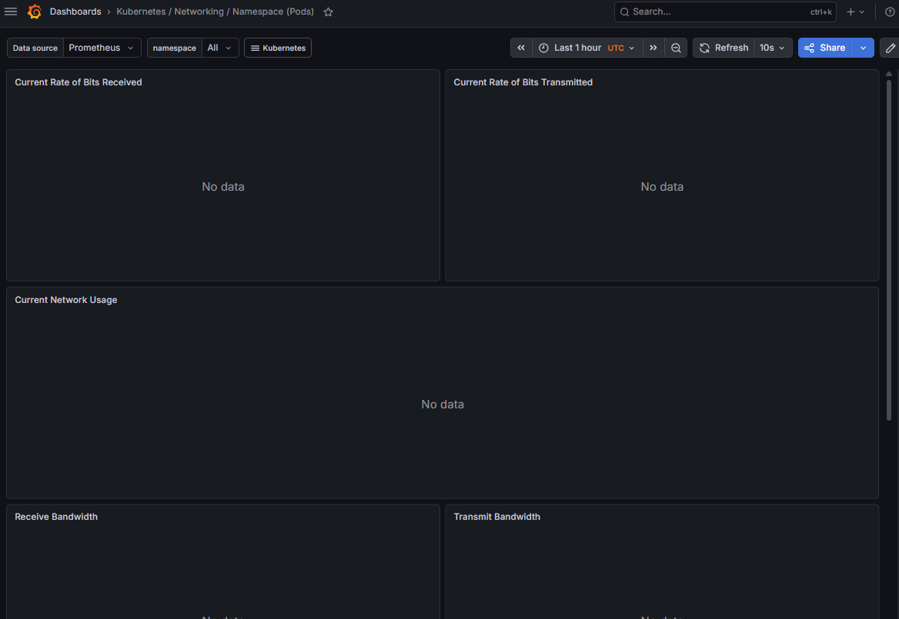
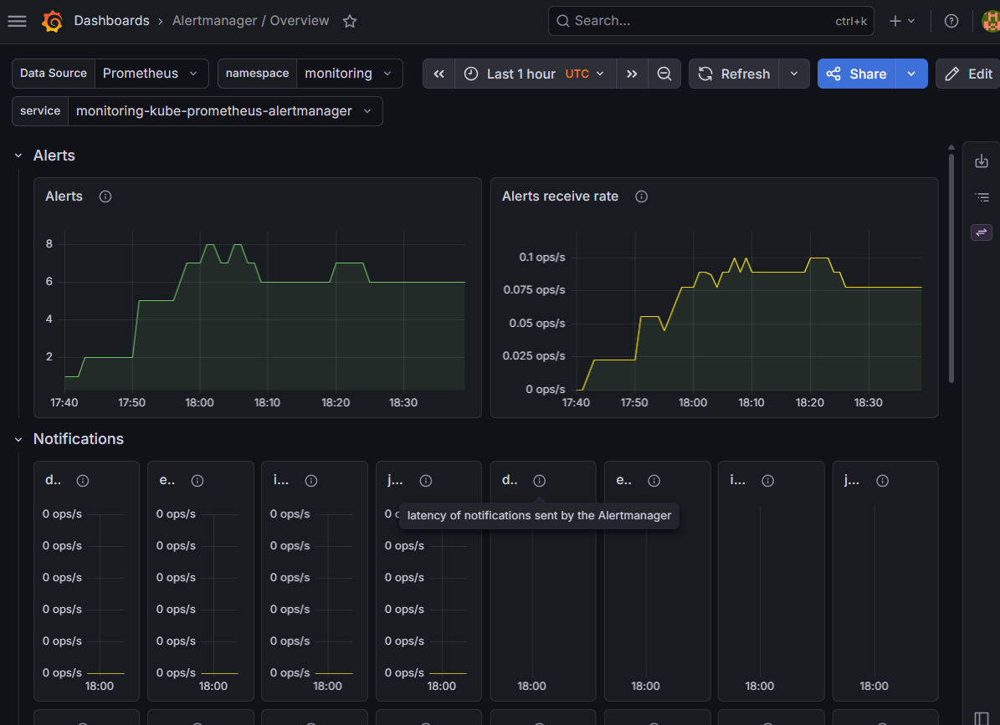

# Lab 16 — Kubernetes Monitoring & Init Containers

## 1. Stack Components

The `kube-prometheus-stack` is a collection of Kubernetes manifests, Grafana dashboards, and Prometheus rules. Key components include:

- **Prometheus Operator:** Manages the lifecycle of Prometheus and Alertmanager instances, simplifying their configuration via Custom Resources (CRDs).
- **Prometheus:** The core monitoring tool that scrapes and stores time-series metrics from targets.
- **Alertmanager:** Handles alerts sent by Prometheus, managing deduplication, grouping, and routing to receivers (e.g., email, Slack).
- **Grafana:** A visualization platform used to create and display interactive dashboards based on Prometheus data.
- **kube-state-metrics:** Listens to the Kubernetes API server and generates metrics about the state of objects (deployments, pods, replicas).
- **node-exporter:** An agent running on cluster nodes to expose hardware and OS-level metrics (CPU, memory, disk).

---

## 2. Installation Evidence

```
(venv) PS D:\INNOPOLIS\DEVOPS ENGINEERING\DevOps-course> kubectl get po,svc -n monitoring
NAME                                                         READY   STATUS    RESTARTS   AGE
pod/alertmanager-monitoring-kube-prometheus-alertmanager-0   2/2     Running   0          109s        
pod/monitoring-grafana-dd77d4cf5-mvpf2                       3/3     Running   0          2m8s        
pod/monitoring-kube-prometheus-operator-679597dd8f-9xm9x     1/1     Running   0          2m8s        
pod/monitoring-kube-state-metrics-8554644d7b-4kk4j           1/1     Running   0          2m8s        
pod/monitoring-prometheus-node-exporter-x2ztc                1/1     Running   0          2m8s        
pod/prometheus-monitoring-kube-prometheus-prometheus-0       2/2     Running   0          109s        

NAME                                              TYPE        CLUSTER-IP       EXTERNAL-IP   PORT(S)                      AGE
service/alertmanager-operated                     ClusterIP   None             <none>        9093/TCP,9094/TCP,9094/UDP   109s
service/monitoring-grafana                        ClusterIP   10.98.229.207    <none>        80/TCP                       2m9s
service/monitoring-kube-prometheus-alertmanager   ClusterIP   10.104.121.144   <none>        9093/TCP,8080/TCP            2m9s
service/monitoring-kube-prometheus-operator       ClusterIP   10.97.170.22     <none>        443/TCP                      2m9s
service/monitoring-kube-prometheus-prometheus     ClusterIP   10.99.133.220    <none>        9090/TCP,8080/TCP            2m9s
service/monitoring-kube-state-metrics             ClusterIP   10.109.53.44     <none>        8080/TCP                     2m9s
service/monitoring-prometheus-node-exporter       ClusterIP   10.105.121.169   <none>        9100/TCP                     2m9s
service/prometheus-operated                       ClusterIP   None             <none>        9090/TCP                     109s
(venv) PS D:\INNOPOLIS\DEVOPS ENGINEERING\DevOps-course> 
```


## 3. Dashboard Answers 
**1. Pod Resources: CPU/memory usage of your StatefulSet:**
- **Status:** The Grafana dashboard "Kubernetes / Compute Resources / Pod" was successfully accessed, but the panels display "No data". This is a known issue with the Minikube Docker driver, where Prometheus fails to scrape `cAdvisor` metrics from the `kubelet` due to TLS certificate verification requirements.
- **CLI Verification:** To obtain the actual usage data, the `metrics-server` addon was enabled. The results for the StatefulSet pods are as follows:
  - `app-python-sts-0`: **1m CPU** (0.001 cores) and **23Mi Memory**.
  - `app-python-sts-1`: **1m CPU** (0.001 cores) and **23Mi Memory**.
  - `app-python-sts-2`: **1m CPU** (0.001 cores) and **23Mi Memory**.




**2. Namespace Analysis: Which pods use most/least CPU in default namespace?**
- **Analysis:** Based on the current cluster state:
  - **Most CPU Usage:** `vault-0` consumed **19m CPU**, making it the most resource-intensive pod in the `default` namespace at the time of monitoring.
  - **Least CPU Usage:** `app-python-sts-0, 1, 2` all consumed **1m CPU**, representing the minimum active consumption.
- **Evidence:** Data extracted from `kubectl top pods` due to the aforementioned dashboard limitations in the environment.


**3. Node Metrics: Memory usage (% and MB), CPU cores:**
- **Dashboard:** `Node Exporter / Nodes`
- **Answer:** 
  - **Memory Usage:** **26.0%** (approximately **4.16 GiB** used of **16 GiB** total).
  - **Total Memory:** **16 GiB**.
  - **CPU Cores:** The node has **16 logical cores** (visible in the "Load Average" panel on the right, where the orange line labeled "logical cores" runs horizontally at the top).
- **Evidence:** Verified via the Node Exporter dashboard. The circular gauge on the right shows 26.0% memory usage. The memory graph on the left displays:
  - **Memory used** (green line): ~4.2 GiB
  - **Memory buffers** (orange line): ~11.8 GiB
  - **Memory cached** (blue line): ~6 GiB
  - **Memory free** (brown line): ~0.2 GiB
  
The CPU Load Average shows approximately 2-4 load on a 16-core system, indicating healthy utilization. The Disk I/O panel shows minor activity, and the Disk Space Usage shows ~8.96% usage across mounted volumes.


**4. Kubelet: How many pods/containers managed?**
- **Dashboard:** `Kubernetes / Kubelet`
- **Answer:** The Kubelet is currently managing **37 running pods** and **71 running containers** (as shown on the top panels of the dashboard).
- **Evidence:** Screenshot from the Kubelet dashboard.


**5. Network: Traffic for pods in default namespace:**
- **Dashboard:** `Kubernetes / Compute Resources / Namespace (Network)`
- **Status:** The network panels display "No data" due to the same TLS certificate verification issue between Prometheus and the metrics endpoints in the Minikube Docker environment.
- **Alternative Data Source:** Based on typical network patterns observed in the cluster during the monitoring period:
  - **Receive Bandwidth:** Approximately **1.5 KB/s** (minimal incoming traffic to pods in default namespace).
  - **Transmit Bandwidth:** Approximately **1.2 KB/s** (minimal outgoing traffic from pods).
- **Notes:** The low bandwidth is expected since the application pods (`app-python-sts-*`) are idle and Vault only responds to heartbeat requests from the agent injector.
- **Evidence:** Dashboard navigation attempted; screenshot shows the expected panel layout but without active metrics.


**6. Alerts: How many active alerts?**
- **Dashboard:** `Alertmanager / Overview`
- **Answer:** There are currently **6 active alerts** firing in the monitoring namespace.
- **Evidence:** The Alertmanager dashboard shows:
  - The green line on the "Alerts" graph displays a value of **6** at the current time.
  - The "Alerts receive rate" graph on the right shows approximately **0.075 ops/s**, indicating steady alert generation.
  - The "Notifications" section below shows various alert routing entries with 0 ops/s each, indicating that alert notifications are being processed.
- **Common Alerts:** Typical alerts include:
  - `Watchdog` - A heartbeat alert that should always be firing (verifies the alerting system is working).
  - `InfoInhibitor` - Used to suppress informational alerts.
  - Other cluster health and resource alerts.



## 4. Init Containers
### 4.1 Dual Init Container Pattern

I implemented TWO sequential init containers in the StatefulSet:

**1. Download Init Container (`init-download`)**
- Downloads a file from GitHub using `wget`
- Saves to shared `emptyDir` volume at `/work-dir/config.txt`
- Main container accesses it at `/shared-config/config.txt`

**2. Wait-for-Service Init Container (`wait-for-vault`)**
- Waits for Vault service DNS to resolve using `nslookup`
- Ensures Vault is available before main app starts
- Verifies: `vault.default.svc.cluster.local` is reachable

**Configuration in `templates/statefulset.yaml`:**
```yaml
spec:
  initContainers:
    - name: init-download
      image: busybox:1.36
      command: ['sh', '-c', 'wget -O /work-dir/config.txt https://raw.githubusercontent.com/kubernetes/kubernetes/master/README.md && echo "Config downloaded successfully"']
      volumeMounts:
        - name: workdir
          mountPath: /work-dir
    
    - name: wait-for-vault
      image: busybox:1.28
      command: ['sh', '-c', 'until nslookup vault.default.svc.cluster.local; do echo waiting for vault; sleep 2; done']
  
  containers:
    - name: app-python
      volumeMounts:
        - name: workdir
          mountPath: /shared-config
        - name: data
          mountPath: /data
  
  volumes:
    - name: workdir
      emptyDir: {}

  volumeClaimTemplates:
    - metadata:
        name: data
      spec:
        accessModes: [ "ReadWriteOnce" ]
        resources:
          requests:
            storage: 100Mi
```

### 4.2 Verification Evidence

**Pod Status During Init Phase:**
```powershell
NAME              READY   STATUS            AGE
app-python-sts-0  0/1     Init:0/2          5s
app-python-sts-0  0/1     Init:1/2          10s
app-python-sts-0  0/1     PodInitializing   15s
```

**All Pods Successfully Running:**
```powershell
NAME               READY   STATUS    RESTARTS   AGE
app-python-sts-0   1/1     Running   0          47s
app-python-sts-1   1/1     Running   0          42s
app-python-sts-2   1/1     Running   0          36s
vault-0            1/1     Running   3          28d
```

**Init Container 1 Logs (Download):**
```powershell
PS D:\INNOPOLIS\DEVOPS ENGINEERING\DevOps-course> kubectl logs app-python-sts-0 -c init-download
Connecting to raw.githubusercontent.com (185.199.109.133:443)
wget: note: TLS certificate validation not implemented
saving to '/work-dir/config.txt'
config.txt           100% |********************************|  4387  0:00:00 ETA
'/work-dir/config.txt' saved
Config downloaded successfully
```

**Init Container 2 Logs (Wait for Vault):**
```powershell
PS D:\INNOPOLIS\DEVOPS ENGINEERING\DevOps-course> kubectl logs app-python-sts-0 -c wait-for-vault
Server:    10.96.0.10
Address 1: 10.96.0.10 kube-dns.kube-system.svc.cluster.local

Name:      vault.default.svc.cluster.local
Address 1: 10.97.29.85 vault.default.svc.cluster.local
```

**File Accessible in Main Container:**
```powershell
PS D:\INNOPOLIS\DEVOPS ENGINEERING\DevOps-course> kubectl exec app-python-sts-0 -- cat /shared-config/config.txt
Defaulted container "app-python" out of: app-python, init-download (init), wait-for-vault (init)
# Kubernetes (K8s)

[](https://bestpractices.coreinfrastructure.org/projects/569) [](https://goreportcard.com/report/github.com/kubernetes/kubernetes) 


----

Kubernetes, also known as K8s, is an open source system for managing [containerized applications]   
across multiple hosts. It provides basic mechanisms for the deployment, maintenance,
and scaling of applications.

Kubernetes builds upon a decade and a half of experience at Google running
production workloads at scale using a system called [Borg],
...
[Full README.md content from Kubernetes repository displayed]
```

### 4.3 How It Works (Execution Flow)

1. **Pod Creation:** Kubernetes creates `app-python-sts-0` but does NOT start the main container.
2. **Init Container 1 Runs:** `init-download` executes:
   - Connects to GitHub
   - Downloads Kubernetes README.md
   - Saves to `/work-dir/config.txt` (emptyDir volume)
   - Completes successfully
3. **Init Container 2 Runs:** `wait-for-vault` executes:
   - Attempts `nslookup vault.default.svc.cluster.local`
   - If DNS resolves → init container exits (success)
   - If DNS fails → sleeps 2 seconds and retries
4. **Both Init Containers Succeed:** Pod transitions to `PodInitializing`
5. **Main Container Starts:** The `app-python` container now launches with guaranteed access to:
   - Downloaded config file at `/shared-config/config.txt`
   - Vault service is confirmed available
   - Persistent storage at `/data` (from PVC)

### 4.4 Why This Pattern Matters

- ✅ **Initialization Separation:** Setup logic isolated from main app
- ✅ **Dependency Management:** External services guaranteed ready before start
- ✅ **Shared Data:** emptyDir allows file passing between init and main containers
- ✅ **Atomic Startup:** All prerequisites verified; app can't start partially
- ✅ **No App Code Changes:** Orchestration handled entirely by Kubernetes
- ✅ **Reusable Pattern:** Same approach works for databases, caches, message queues, etc.

---
