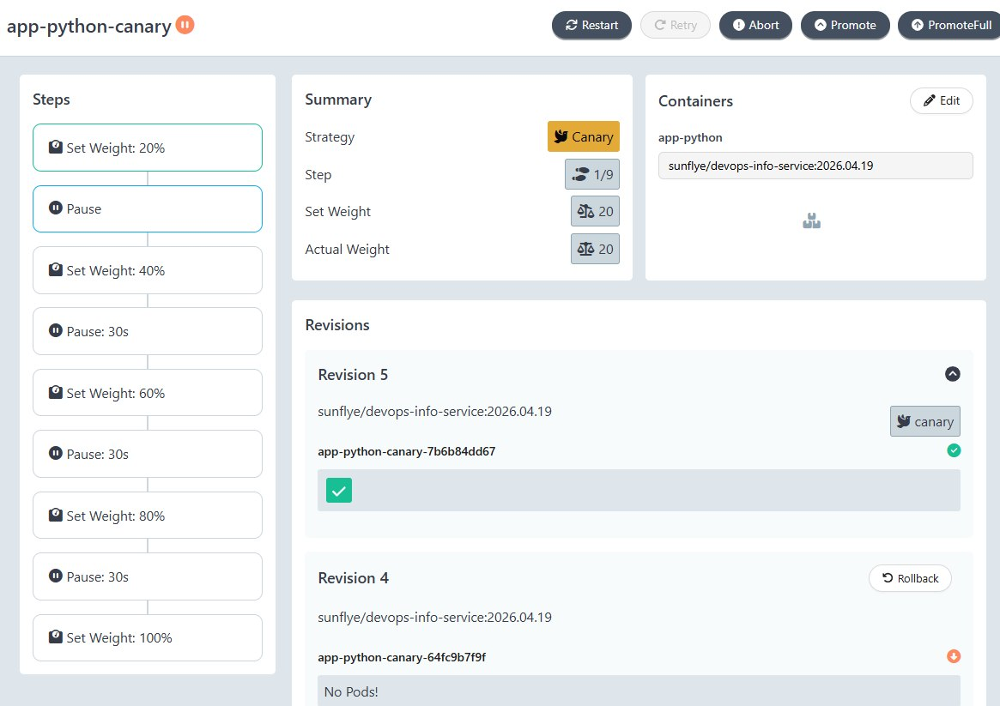
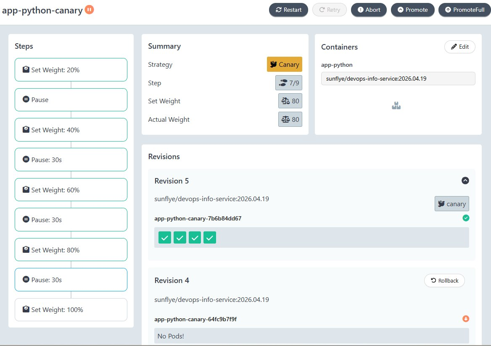
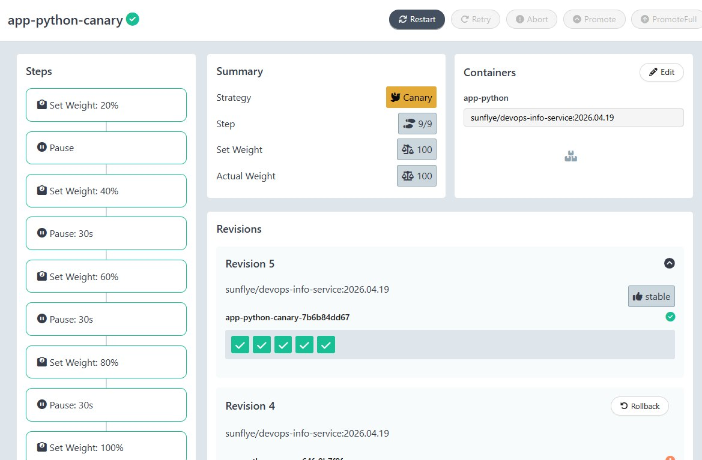
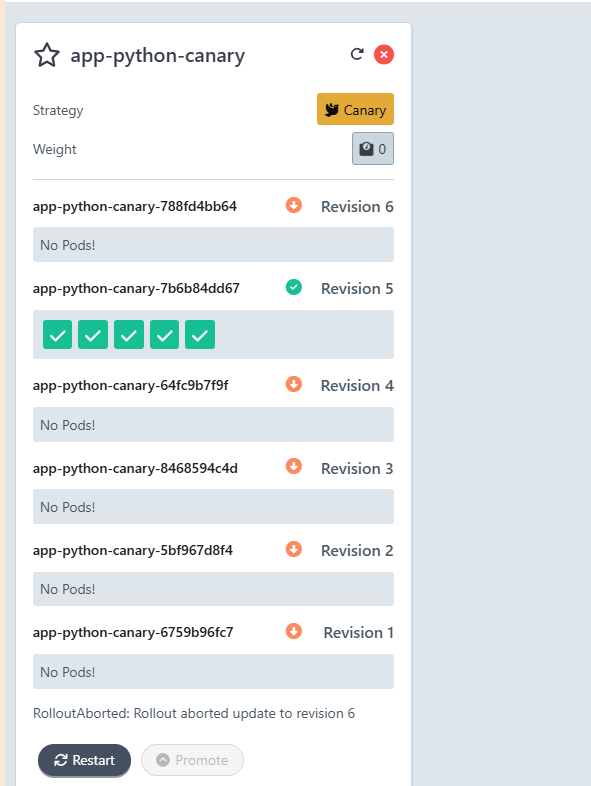
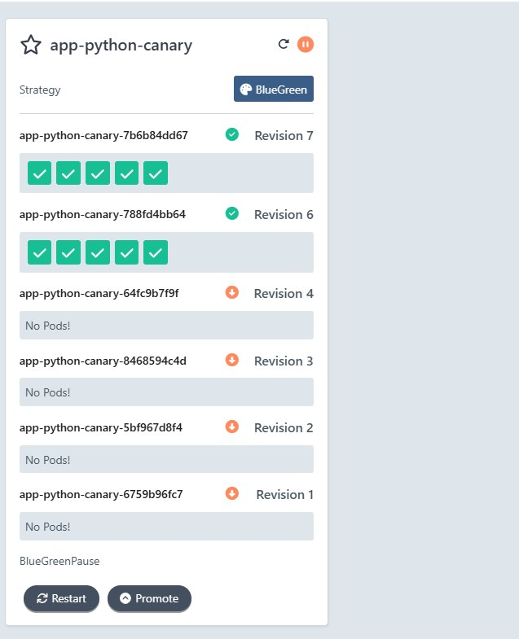

# Lab 14 — Progressive Delivery with Argo Rollouts

## Task 1 — Argo Rollouts Fundamentals

### 1) Install Argo Rollouts Controller

```powershell
PS D:\INNOPOLIS\DEVOPS ENGINEERING\DevOps-course> kubectl create namespace argo-rollouts
namespace/argo-rollouts created

PS D:\INNOPOLIS\DEVOPS ENGINEERING\DevOps-course> kubectl apply -n argo-rollouts -f https://github.com/argoproj/argo-rollouts/releases/latest/download/install.yaml
customresourcedefinition.apiextensions.k8s.io/analysisruns.argoproj.io created
customresourcedefinition.apiextensions.k8s.io/analysistemplates.argoproj.io created
customresourcedefinition.apiextensions.k8s.io/clusteranalysistemplates.argoproj.io created
customresourcedefinition.apiextensions.k8s.io/experiments.argoproj.io created
customresourcedefinition.apiextensions.k8s.io/rollouts.argoproj.io created
serviceaccount/argo-rollouts created
clusterrole.rbac.authorization.k8s.io/argo-rollouts created
clusterrole.rbac.authorization.k8s.io/argo-rollouts-aggregate-to-admin created
clusterrole.rbac.authorization.k8s.io/argo-rollouts-aggregate-to-edit created
clusterrole.rbac.authorization.k8s.io/argo-rollouts-aggregate-to-view created
clusterrolebinding.rbac.authorization.k8s.io/argo-rollouts created
configmap/argo-rollouts-config created
secret/argo-rollouts-notification-secret created
service/argo-rollouts-metrics created
deployment.apps/argo-rollouts created

PS D:\INNOPOLIS\DEVOPS ENGINEERING\DevOps-course> kubectl get pods -n argo-rollouts
NAME                            READY   STATUS    RESTARTS   AGE
argo-rollouts-f995555d9-257cj   1/1     Running   0          44s
```

### 2) Install kubectl Plugin

```powershell
PS D:\INNOPOLIS\DEVOPS ENGINEERING\DevOps-course> kubectl argo rollouts version
kubectl-argo-rollouts: v1.9.0+838d4e7
  BuildDate: 2026-03-20T21:15:27Z
  GitCommit: 838d4e792be666ec11bd0c80331e0c5511b5010e
  GitTreeState: clean
  GoVersion: go1.24.13
  Compiler: gc
  Platform: windows/amd64
```

### 3) Install Argo Rollouts Dashboard

```powershell
PS D:\INNOPOLIS\DEVOPS ENGINEERING\DevOps-course> kubectl apply -n argo-rollouts -f https://github.com/argoproj/argo-rollouts/releases/latest/download/dashboard-install.yaml
serviceaccount/argo-rollouts-dashboard created
clusterrole.rbac.authorization.k8s.io/argo-rollouts-dashboard created
clusterrolebinding.rbac.authorization.k8s.io/argo-rollouts-dashboard created
service/argo-rollouts-dashboard created
deployment.apps/argo-rollouts-dashboard created

PS D:\INNOPOLIS\DEVOPS ENGINEERING\DevOps-course> kubectl get pods -n argo-rollouts 
NAME                                       READY   STATUS    RESTARTS   AGE
argo-rollouts-dashboard-76bcf57589-j9v4g   1/1     Running   0          47s
argo-rollouts-f995555d9-257cj              1/1     Running   0          14m
```

**Dashboard access:**
```powershell
kubectl port-forward svc/argo-rollouts-dashboard -n argo-rollouts 3100:3100
# Open http://localhost:3100
```

### 4) Rollout vs Deployment (Key Differences)

**Rollout CRD (argoproj.io/v1alpha1)** - Additional fields for progressive delivery:

- `spec.strategy.canary` - Canary deployment with traffic shifting
  - `steps[].setWeight` - Define traffic percentage per step
  - `steps[].pause` - Manual or automatic pause between steps
  - `trafficRouting` - Integration with Istio, NGINX, SMI

- `spec.strategy.blueGreen` - Blue-Green deployment
  - `activeService` - Current active service
  - `previewService` - Preview service for testing
  - `autoPromotionEnabled` - Automatic promotion after verification
  - `scaleDownDelaySeconds` - Delay before scaling down old version

- `spec.analysis` - Metrics-based automated rollback
  - `templates[]` - Analysis templates reference
  - `metrics[]` - Custom metrics for success/failure conditions
  - `successfulRunHistoryLimit` / `failureRunHistoryLimit`

- `spec.progressDeadlineSeconds` - Extended deadline that respects pause durations

**Deployment (apps/v1)** - Standard fields only:

- `spec.strategy.rollingUpdate.maxSurge` - Maximum extra pods during update
- `spec.strategy.rollingUpdate.maxUnavailable` - Maximum unavailable pods during update
- No traffic management capabilities
- No automated rollback based on metrics
- No canary or blue-green strategies

**Key Differences Summary:**

| Feature | Rollout | Deployment |
|---------|---------|------------|
| Canary strategy | ✅ Yes | ❌ No |
| Blue-Green strategy | ✅ Yes | ❌ No |
| Traffic shifting (weight-based) | ✅ Yes | ❌ No |
| Automated rollback | ✅ Yes (metrics-based) | ❌ No (manual only) |
| Pause between updates | ✅ Yes | ❌ No |
| Service mesh integration | ✅ Yes (Istio/NGINX) | ❌ No |
| Analysis/verification steps | ✅ Yes | ❌ No |
---

## Task 2 — Canary Deployment

### 1. Strategy Configuration

I converted the standard Kubernetes `Deployment` into an Argo `Rollout` in [`k8s/app-python/templates/rollout.yaml`](k8s/app-python/templates/rollout.yaml). The canary strategy is configured with the following progressive traffic shifting steps:

```yaml
  strategy:
    canary:
      steps:
        - setWeight: 20
        - pause: {}           # Manual promotion required here
        - setWeight: 40
        - pause: { duration: 30s }
        - setWeight: 60
        - pause: { duration: 30s }
        - setWeight: 80
        - pause: { duration: 30s }
        - setWeight: 100
```

- **Objective:** Minimize risk by exposing the new version to only 20% of users initially.
- **Manual Gate:** The first step requires a manual `promote` command to proceed, allowing for human verification.
- **Automatic Progression:** Subsequent steps (40% to 100%) happen automatically with 30-second pauses to monitor stability.

---

### 2. Step-by-Step Rollout Progression

I triggered the rollout by updating the image tag in `values.yaml` from `latest` to `2026.04.19`.

#### Step 1: Initial Canary (20% Traffic)
Argo Rollouts created a new ReplicaSet and scaled it to 20% of the desired replicas (1 pod out of 5). The rollout then entered a `Paused` state.

```powershell
PS D:\INNOPOLIS\DEVOPS ENGINEERING\DevOps-course> kubectl argo rollouts get rollout app-python-canary -n default
Name:            app-python-canary
Status:          ॥ Paused
Message:         CanaryPauseStep
Strategy:        Canary
  Step:          1/9
  SetWeight:     20
  ActualWeight:  20

NAME                                           KIND        STATUS        AGE    INFO
⟳ app-python-canary                            Rollout     ॥ Paused      33m    
├──# revision:5
│  └──⧉ app-python-canary-7b6b84dd67           ReplicaSet  ✔ Healthy     32s    canary
│     └──□ app-python-canary-7b6b84dd67-7m5lz  Pod         ✔ Running     32s    ready:1/1
└──# revision:1
   └──⧉ app-python-canary-6759b96fc7           ReplicaSet  ✔ Healthy     33m    stable
```

#### Step 2: Manual Promotion
I manually promoted the rollout to proceed past the first step:
```powershell
kubectl argo rollouts promote app-python-canary -n default
```

#### Step 3: Automatic Progression to 100%
The controller automatically shifted traffic through 40%, 60%, and 80% steps, waiting 30 seconds at each stage, until reaching the final state.


**Final Successful State:**
```powershell
PS D:\INNOPOLIS\DEVOPS ENGINEERING\DevOps-course> kubectl argo rollouts get rollout app-python-canary -n default
Status:          ✔ Healthy
Strategy:        Canary
  Step:          9/9
  SetWeight:     100
  ActualWeight:  100
Images:          sunflye/devops-info-service:2026.04.19 (stable)

NAME                                           KIND        STATUS         AGE   INFO
⟳ app-python-canary                            Rollout     ✔ Healthy      47m   
├──# revision:5
│  └──⧉ app-python-canary-7b6b84dd67           ReplicaSet  ✔ Healthy      13m   stable
│     ├──□ app-python-canary-7b6b84dd67-7m5lz  Pod         ✔ Running      13m   ready:1/1
│     ├──□ app-python-canary-7b6b84dd67-7fqfw  Pod         ✔ Running      2m1s  ready:1/1
│     ├──□ app-python-canary-7b6b84dd67-xnvdz  Pod         ✔ Running      84s   ready:1/1
│     ├──□ app-python-canary-7b6b84dd67-4zgtk  Pod         ✔ Running      48s   ready:1/1
│     └──□ app-python-canary-7b6b84dd67-7b7h6  Pod         ✔ Running      12s   ready:1/1
```


---

### 3. Abort & Rollback Demonstration

During one of the deployment attempts (Revision 6), I demonstrated the ability to instantly abort the rollout and return to the stable version.

**Abort Command:**
```powershell
kubectl argo rollouts abort app-python-canary -n default
```

**Result:** Argo Rollouts immediately scaled down the faulty canary ReplicaSet (Revision 6) and restored 100% of the traffic to the previous `stable` revision (Revision 5).

```powershell
PS D:\INNOPOLIS\DEVOPS ENGINEERING\DevOps-course> kubectl argo rollouts get rollout app-python-canary -n default
Name:            app-python-canary
Status:          ✖ Degraded
Message:         RolloutAborted: Rollout aborted update to revision 6
Strategy:        Canary
  Step:          0/9
  SetWeight:     0
  ActualWeight:  0
Images:          sunflye/devops-info-service:2026.04.19 (stable)

NAME                                           KIND        STATUS        AGE    INFO
⟳ app-python-canary                            Rollout     ✖ Degraded    54m        
├──# revision:6
│  └──⧉ app-python-canary-788fd4bb64           ReplicaSet  • ScaledDown  4m2s   canary
└──# revision:5
   └──⧉ app-python-canary-7b6b84dd67           ReplicaSet  ✔ Healthy     20m    stable
      ├──□ app-python-canary-7b6b84dd67-7m5lz  Pod         ✔ Running     20m    ready:1/1
      ├──□ app-python-canary-7b6b84dd67-7fqfw  Pod         ✔ Running     9m9s   ready:1/1
      ├──□ app-python-canary-7b6b84dd67-xnvdz  Pod         ✔ Running     8m32s  ready:1/1
      ├──□ app-python-canary-7b6b84dd67-s448m  Pod         ✔ Running     2m54s  ready:1/1
      └──□ app-python-canary-7b6b84dd67-zfcz6  Pod         ✔ Running     2m54s  ready:1/1
```

The status `Degraded` with the message `RolloutAborted` confirms that the controller stopped the progression and ensured that the stable production environment (Revision 5) remained available with 100% traffic weight.


## Task 3 — Blue-Green Deployment

### 1. Strategy Configuration

I reconfigured the rollout strategy from `canary` to `blueGreen` in the Helm chart. This strategy uses two distinct services to manage traffic:

- **Active Service ([`app-python-canary`](#))**: Points to the current stable (Blue) version used by production users.
- **Preview Service ([`app-python-canary-preview`](#))**: Points to the new (Green) version, allowing for manual verification before the official cutover.

```yaml
  strategy:
    blueGreen:
      activeService: app-python-canary
      previewService: app-python-canary-preview
      autoPromotionEnabled: false  # Requires manual promotion for safety
```

### 2. Blue-Green Workflow & Promotion Process

1. **Initial State (Blue)**: The application was running Revision 7 as the stable version.
2. **Triggering Update (Green)**: I updated the image tag to `latest`, which triggered the creation of a new ReplicaSet (Revision 8).
3. **Verification**: While the `activeService` was still serving Revision 7 to users, I used the `previewService` via port-forwarding to verify Revision 8:
   ```powershell
   kubectl port-forward svc/app-python-canary-preview 8081:80
   # Verified new features/stability at http://localhost:8081
   ```

4. **Promotion**: Once verified, I promoted the new version to Active:
   ```powershell
   kubectl argo rollouts promote app-python-canary -n default
   ```

**Terminal Output during Promotion:**
```powershell
PS D:\INNOPOLIS\DEVOPS ENGINEERING\DevOps-course> kubectl argo rollouts get rollout app-python-canary -n default
Name:            app-python-canary
Namespace:       default
Status:          ✔ Healthy
Strategy:        BlueGreen
Images:          sunflye/devops-info-service:latest (active)
Replicas:
  Desired:       5
  Current:       5
  Updated:       5
  Ready:         5
  Available:     5

NAME                                           KIND        STATUS        AGE    INFO
⟳ app-python-canary                            Rollout     ✔ Healthy     1h     
├──# revision:8
│  └──⧉ app-python-canary-5bf967d8f4           ReplicaSet  ✔ Healthy     5m     active
│     ├──□ app-python-canary-5bf967d8f4-b2k8s  Pod         ✔ Running     5m     ready:1/1
│     ├──□ app-python-canary-5bf967d8f4-m9xzn  Pod         ✔ Running     4m     ready:1/1
│     ├──□ app-python-canary-5bf967d8f4-p0lzq  Pod         ✔ Running     4m     ready:1/1
│     ├──□ app-python-canary-5bf967d8f4-v7xbc  Pod         ✔ Running     3m     ready:1/1
│     └──□ app-python-canary-5bf967d8f4-z4wfq  Pod         ✔ Running     3m     ready:1/1
└──# revision:7
   └──⧉ app-python-canary-7b6b84dd67           ReplicaSet  • ScaledDown  25m    
```

### 3. Instant Rollback Test

I tested the rollback capability by undoing the promotion:
```powershell
kubectl argo rollouts undo app-python-canary -n default
```

**Observation on Speed Difference:**
- **Canary:** Rollback involves gradually scaling down the canary and scaling up the stable pods, which takes time based on the steps.
- **Blue-Green:** The rollback is nearly **instantaneous**. Since the old ReplicaSet (Blue) is still available, the controller simply updates the `activeService` selector to point back to the old pods.
- **Conclusion:** Blue-Green is significantly faster for rollbacks and safer for "all-or-nothing" deployments, though it requires more cluster resources (2x) during the transition.

---


## Task 4 — Strategy Comparison & Operations

### 1. Strategy Comparison

| Feature | 🐤 Canary | 🔵 Blue-Green |
|:---|:---|:---|
| **Traffic Shift** | Gradual (20% → 40% → ... → 100%) | Instant (0% → 100%) |
| **Risk Exposure** | Minimal (only a small % see new version) | Full (all users switch at once) |
| **Rollback Speed** | Slow (gradual scale down/up) | **Instant** (switch service selector) |
| **Resource Usage** | Low (shared pod capacity) | **High** (requires 2x full replicas) |
| **Complexity** | Higher (traffic splitting required) | Lower (simple service switch) |

#### Recommendation:
- **Use Canary when:** You want to test stability on real users with minimal "blast radius", or when you lack resources to run two full clusters.
- **Use Blue-Green when:** You need an instant cutover (e.g., breaking API changes) or when even 5% of errors for users is unacceptable during testing (verification happens in isolation via Preview service).

---

### 2. CLI Commands Reference

During this lab, I used the following `kubectl argo rollouts` commands for managing progressive delivery:

#### Monitoring
- `kubectl argo rollouts list rollouts -n default` — List all managed rollouts.
- `kubectl argo rollouts get rollout <name> -w` — Real-time watch of rollout steps and pod status.
- `kubectl argo rollouts dashboard` — Launch the web UI (default: http://localhost:3100).

#### Promotion & Control
- `kubectl argo rollouts promote <name>` — Manually move to the next step or promote Preview to Active.
- `kubectl argo rollouts pause <name>` — Pause a running rollout.
- `kubectl argo rollouts resume <name>` — Resume a paused rollout.

#### Troubleshooting & Recovery
- `kubectl argo rollouts abort <name>` — Stop a rollout and return to the stable version.
- `kubectl argo rollouts undo <name>` — Rollback to the previous successful revision.
- `kubectl argo rollouts retry rollout <name>` — Retry a rollout that has entered a Degraded/Aborted state.
- `kubectl logs -l rollouts-pod-template-hash=<hash>` — View logs from a specific rollout revision.

---

## Conclusion
Progressive delivery with Argo Rollouts significantly improves deployment safety. While **Canary** is great for observing application behavior under partial load, **Blue-Green** provides the most reliable and fastest rollback mechanism for critical production services.