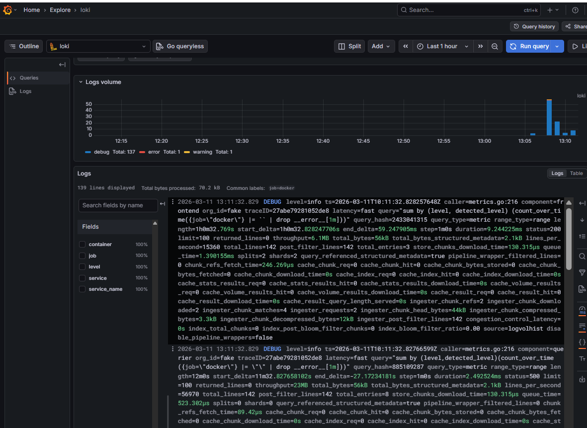
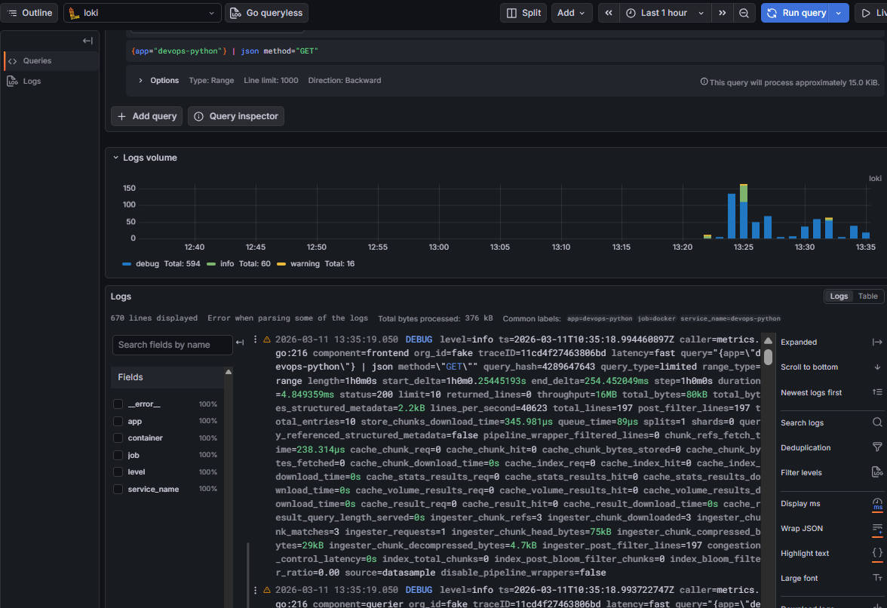
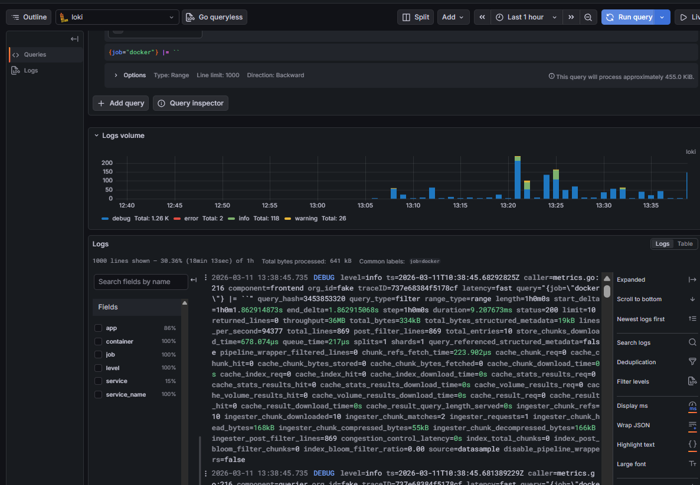
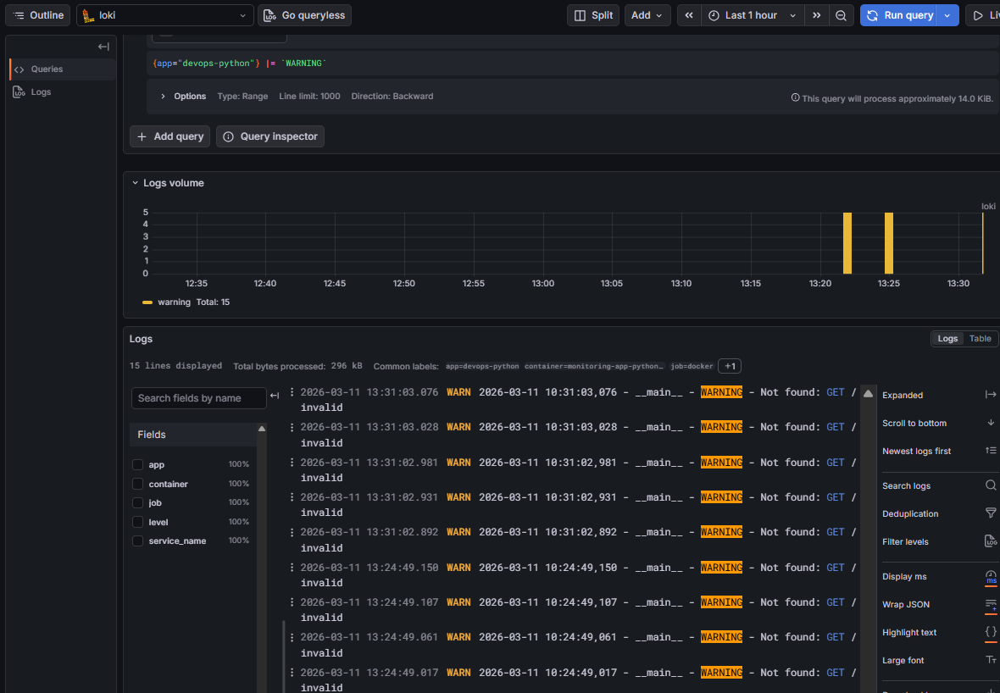
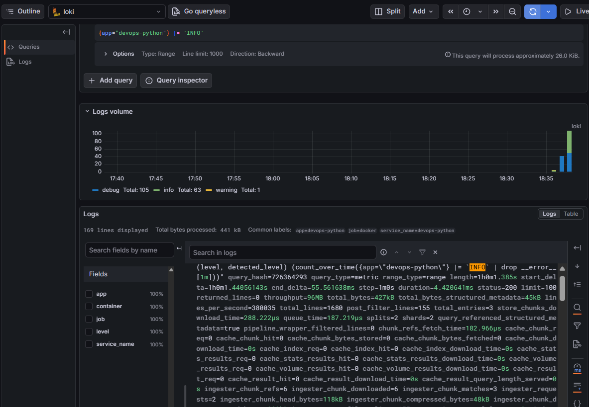
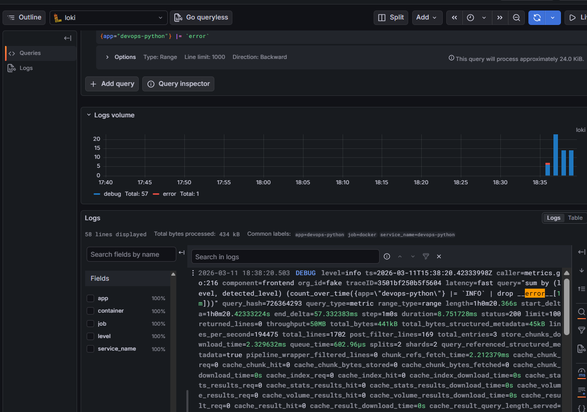
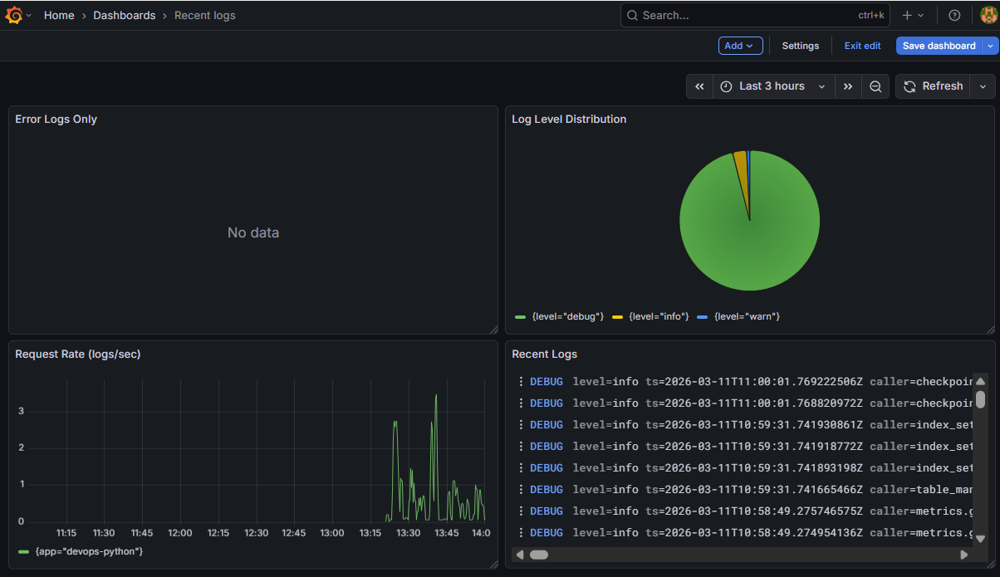
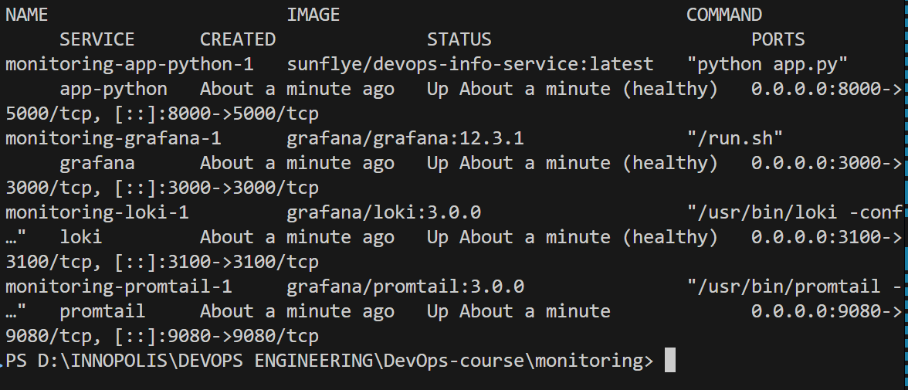
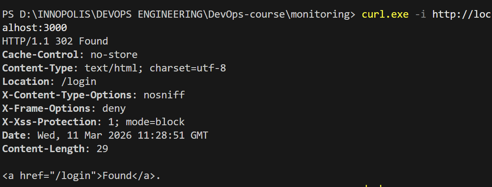
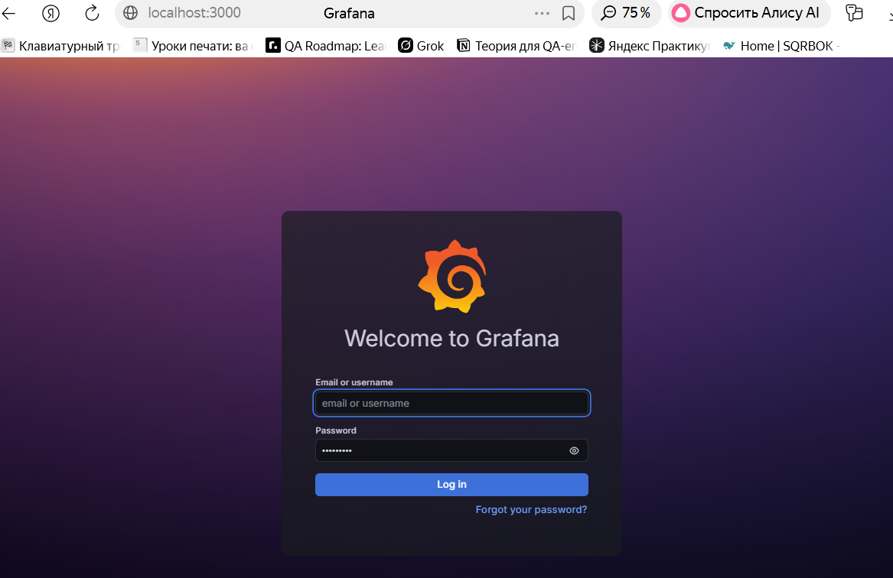

# Lab 7 — Observability & Logging with Loki Stack


## 1. Architecture

```plaintext
┌─────────────────────────────────────────────────────────────┐
│                         Docker Host                         │
├─────────────────────────────────────────────────────────────┤
│                                                             │
│       ┌──────────────┐   ┌──────────────┐                   │
│       │  app-python  │   │  other apps  │                   │
│       │ (port 8000)  │   │ (optional)   │                   │
│       │  JSON logs   │   │  JSON logs   │                   │
│       └──────┬───────┘   └──────┬───────┘                   │
│              │                  │                           │
│              └──────────────────┼                           │
│                                 │                           │
│                  ┌──────────────▼───────────────┐           │
│                  │      Promtail Agent          │           │
│                  │ (Log Collector, port 9080)   │           │
│                  └──────────────┬───────────────┘           │
│                                 │ Push Logs (HTTP/gRPC)     │
│                  ┌──────────────▼───────────────┐           │
│                  │           Loki               │           │
│                  │   (Log Storage, port 3100)   │           │
│                  └──────────────┬───────────────┘           │
│                                 │ Query Logs (LogQL)        │
│                  ┌──────────────▼───────────────┐           │
│                  │          Grafana             │           │
│                  │(Visualization, port 3000)    │           │
│                  └──────────────────────────────┘           │
│                                                             │
│             Network: logging (bridge)                       │
└─────────────────────────────────────────────────────────────┘
```

**Data flow:**  
Application logs → Promtail (collects, labels, pushes) → Loki (stores, indexes) → Grafana (visualizes, queries)


##  2. Setup Guide

### Step 1: Project Structure

Create the directory structure:

```
mkdir -p monitoring/{loki,promtail,docs}
cd monitoring
```

### Step 2: Create Environment Variables

File: `monitoring/.env`
```ini
GRAFANA_ADMIN_USER=admin
GRAFANA_ADMIN_PASSWORD=secure_password_here
LOKI_VERSION=3.0.0
PROMTAIL_VERSION=3.0.0
GRAFANA_VERSION=12.3.1
COMPOSE_PROJECT_NAME=logging_stack
```

### Step 3: Create .gitignore

File: `monitoring/.gitignore`
```
.env
.env.local
terraform.tfstate*
__pycache__/
.DS_Store
```

### Step 4: Deploy Services

```
cd monitoring

# Start all services in background
docker compose up -d

# Verify health status
docker compose ps

# Check logs if needed
docker compose logs -f loki
docker compose logs -f promtail
docker compose logs -f grafana
```

## 3. Configuration

### Loki (`loki/config.yml`)

- **TSDB storage** (`store: tsdb`): Enables fast queries and efficient log storage, recommended for Loki 3.0+.
- **Filesystem backend** (`object_store: filesystem`): Simple, reliable storage for single-node deployments.
- **Retention** (`retention_period: 168h`): Keeps logs for 7 days, balancing storage cost and troubleshooting needs.
- **Schema v13**: Latest schema for Loki, ensures compatibility and performance.
- **Inmemory ring** (`kvstore: store: inmemory`): No external dependencies (like Consul), ideal for single-node setups.

**Example snippet:**
```yaml
schema_config:
  configs:
    - from: 2020-10-24
      store: tsdb
      object_store: filesystem
      schema: v13
limits_config:
  retention_period: 168h
common:
  ring:
    kvstore:
      store: inmemory
```
### Promtail (promtail/config.yml)
- **Docker service discovery (docker_sd_configs)**: Automatically finds running containers, no manual config needed.
- **Relabeling:** Extracts useful labels (app, container_name, image, job) from Docker metadata for log filtering and querying.
- **Low cardinality labels:** Avoids performance issues by not indexing unique values (like container IDs).
- **Positions file:** Tracks log read progress, prevents duplicate ingestion.

**Example snippet:**
```yaml
scrape_configs:
  - job_name: docker
    docker_sd_configs:
      - host: unix:///var/run/docker.sock
        refresh_interval: 5s
    relabel_configs:
      - source_labels: ['__meta_docker_container_name']
        regex: '/(.+)'
        target_label: 'container_name'
      - source_labels: ['__meta_docker_container_label_app']
        target_label: 'app'
      - source_labels: ['__meta_docker_image_name']
        target_label: 'image'
positions:
  filename: /tmp/positions.yaml
```
### Why:

- Docker SD + relabeling = automatic, scalable log collection.
- Only meaningful labels indexed for efficient LogQL queries.
- Retention and storage settings ensure logs are available but not wasteful.

## Task 1 — Deploy Loki Stack


## 4. Application Logging

### Implementation

- Used a custom `JSONFormatter` class in `app_python/app.py` to output logs in structured JSON format.
- Configured Python's `logging` module to use this formatter for all log messages.
- Logs include fields: `timestamp`, `level`, `logger`, `message`, and (if available) `endpoint`, `method`, `status_code`, `response_time`, `request_id`, and exception info.
- Logging occurs for:
  - Application startup
  - Each HTTP request (`@app.before_request`)
  - Each response (`@app.after_request`)
  - Errors (`@app.errorhandler` for 404/500)

### Example code snippet

```python
import logging
import json
from datetime import datetime, timezone

class JSONFormatter(logging.Formatter):
    def format(self, record):
        log_data = {
            "timestamp": datetime.now(timezone.utc).isoformat().replace("+00:00", "") + "Z",
            "level": record.levelname,
            "logger": record.name,
            "message": record.getMessage(),
        }
        if record.exc_info:
            log_data["exception"] = self.formatException(record.exc_info)
        for field in ["endpoint", "method", "status_code", "response_time", "request_id"]:
            if hasattr(record, field):
                log_data[field] = getattr(record, field)
        return json.dumps(log_data)

handler = logging.StreamHandler()
handler.setFormatter(JSONFormatter())
logger = logging.getLogger(__name__)
logger.handlers.clear()
logger.addHandler(handler)
logger.setLevel(logging.INFO)
```

### Why JSON logging?
- Structured logs are easy to parse and filter in Loki/Grafana.
- Enables LogQL queries by field (e.g., level="ERROR", method="GET").
- Consistent format for all log events.
- Supports production monitoring and debugging.

## 5. Dashboard

### Dashboard Panels

#### Panel 1: Recent Logs (Logs Panel)

**LogQL Query**:
```
{app=~"devops-.*"}
```

**Settings**:
- Max lines: 50
- Show labels: app, container_name
- Sort by: timestamp descending

**Purpose**: View raw application logs with automatic JSON parsing

---

#### Panel 2: Request Rate (Metric)

**LogQL Query**:
```
sum by (app) (rate({app=~"devops-.*"} [1m]))
```

**Settings**:
- Graph type: Time series
- Legend: {{endpoint}}
- Y-axis label: requests/sec

**Purpose**: Monitor HTTP request throughput per endpoint

---

#### Panel 3: Error Logs (Logs Panel)

**LogQL Query**:
```
{app=~"devops-.*"} | json | level="ERROR"
```

**Settings**:
- Max lines: 100
- Highlight keywords: ERROR, exception
- Unique: enabled

**Purpose**: Quick access to error messages and exceptions

---

#### Panel 4: Log Level Distribution (Stat)

**LogQL Query**:
```
sum by (level) (count_over_time({app=~"devops-.*"} | json [5m]))
```

**Settings**:
- Display: Pie chart
- Unit: short
- Color mode: Value

**Purpose**: Show distribution of log severity levels

---

### Accessing Grafana

1. **Open browser**: http://localhost:3000
2. **Login**: 
   - Username: `admin`
   - Password: (from .env file)
3. **Add Loki datasource**:
   - Settings → Data Sources → Add data source
   - Select Loki
   - URL: `http://loki:3100`
   - Save & test
4. **Import dashboard**:
   - Create new dashboard
   - Add 4 panels as described above
   - Set appropriate refresh intervals (5s for logs, 30s for metrics)

---
 ## Task 2 — Integrate Your Applications

**JSON log output from your app:**


**Grafana showing logs from both applications:**


**Only warning logs:**


**Only info logs:**


**With error word:**


## Task 3 — Build Log Dashboard 


## 6. Production Configuration

### Resource Limits (docker-compose.yml)

```yaml
services:
  loki:
    image: grafana/loki:${LOKI_VERSION}
    deploy:
      resources:
        limits:
          cpus: '1.0'
          memory: 1G
        reservations:
          cpus: '0.5'
          memory: 512M
    healthcheck:
      test: ["CMD", "wget", "--spider", "-q", "http://localhost:3100/ready"]
      interval: 10s
      timeout: 10s
      retries: 5
      start_period: 30s

  promtail:
    image: grafana/promtail:${PROMTAIL_VERSION}
    deploy:
      resources:
        limits:
          cpus: '0.5'
          memory: 512M
        reservations:
          cpus: '0.25'
          memory: 256M

  grafana:
    image: grafana/grafana:${GRAFANA_VERSION}
    environment:
      GF_SECURITY_ADMIN_PASSWORD: ${GRAFANA_ADMIN_PASSWORD}
      GF_SECURITY_DISABLE_BRUTE_FORCE_LOGIN_PROTECTION: 'false'
      GF_USERS_ALLOW_SIGN_UP: 'false'
    deploy:
      resources:
        limits:
          cpus: '0.5'
          memory: 256M
```

### Security Measures

- **Grafana authentication:** Anonymous access disabled, admin password set via `.env` and environment variables.
- **Sensitive data:** `.env` file is gitignored, secrets never committed.
- **Network isolation:** All services run on a dedicated Docker bridge network (`logging`), restricting access.
- **Promtail Docker socket:** Mounted read-only (`:ro`) for least privilege.
- **Health checks:** All services have health checks to ensure availability and auto-restart if unhealthy.
- **Resource limits:** CPU and memory limits set for each service to prevent resource exhaustion.


### Retention Policy
- **Loki retention:** Configured to keep logs for 7 days (retention_period: 168h).
- **Why:** Balances troubleshooting needs and disk usage; old logs are automatically deleted.
- **Persistent volumes:** Loki and Grafana use named Docker volumes (loki-data, grafana-data) to ensure data survives container restarts.

## Task 4 — Production Readiness


**`docker-compose ps` showing all services healthy:**


**Screenshot of Grafana login page (no anonymous access):**




## 7. Testing

### 1. Service Health Check

```bash
docker compose ps
```

Expected: All services show "Up (healthy)"

### 2. Generate Test Logs

```bash
# Generate HTTP traffic
for i in {1..100}; do
  curl -s http://localhost:8000/ > /dev/null
  curl -s http://localhost:8000/health > /dev/null
  sleep 0.5
done
```

### 3. Query Logs via Grafana

```
1. Navigate to Explore
2. Select Loki datasource
3. Query: {job="docker"} | json
4. Verify logs appear with parsed JSON fields
```

### 4. Check LogQL Patterns

```logql
# Count logs by level
sum by (level) (count_over_time({job="docker"} | json [5m]))

# Find errors
{job="docker"} | json | level="ERROR" | error != ""

# Request rate by endpoint
rate({job="docker"} | json | endpoint != "" [5m])

# Long requests (>100ms)
{job="docker"} | json | duration > 100
```

### 5. Validate Persistence

```bash
# Stop services
docker compose down

# Check volumes still exist
docker volume ls | grep loki

# Restart services
docker compose up -d

# Verify old logs are still queryable
```

## 8. Challenges

### Loki Ring Module Errors
**Problem:** Loki startup failed with errors about Consul connection.
**Solution:** Changed ring configuration to use `kvstore: store: inmemory` instead of Consul, as recommended for single-node setups.


