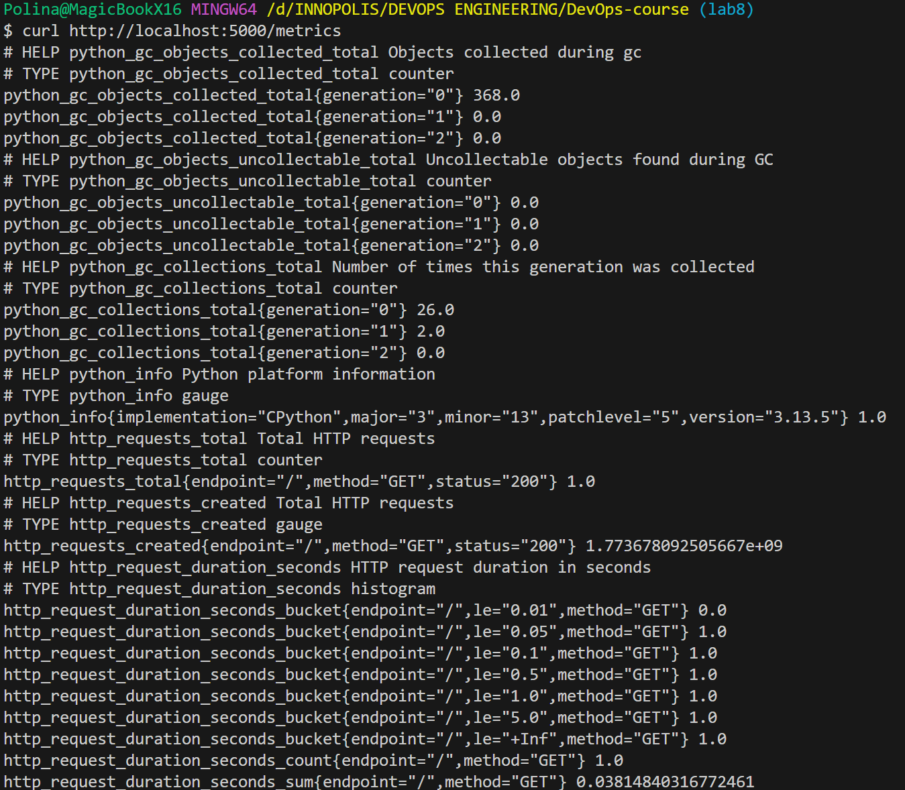
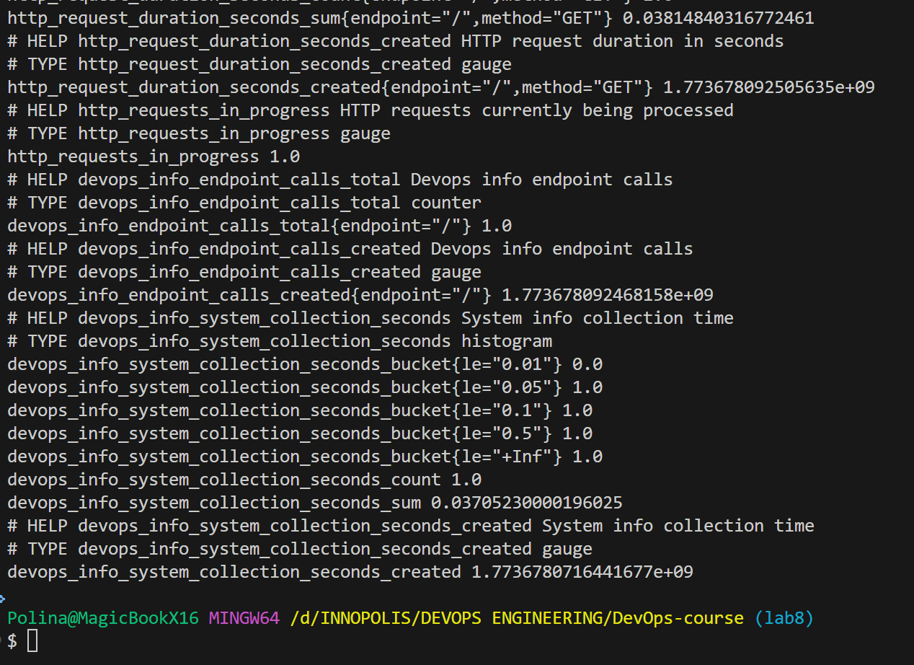
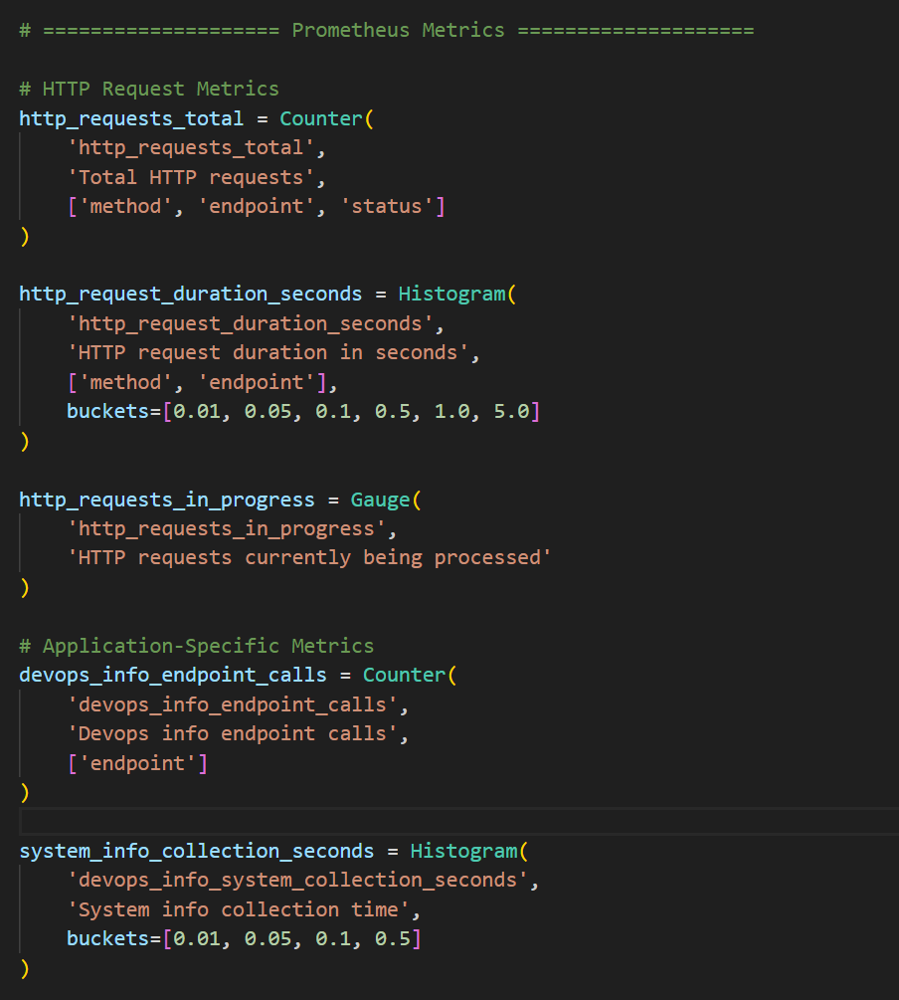
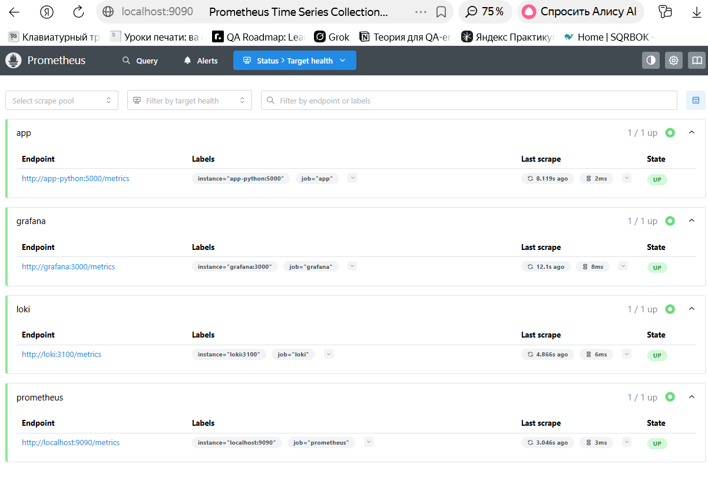
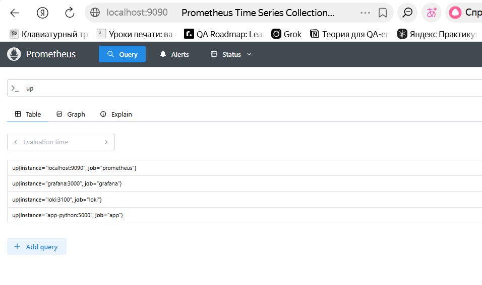
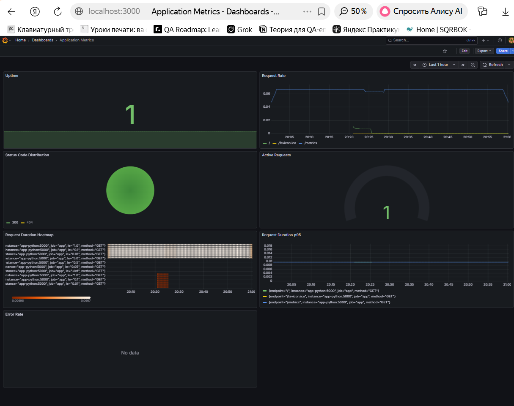
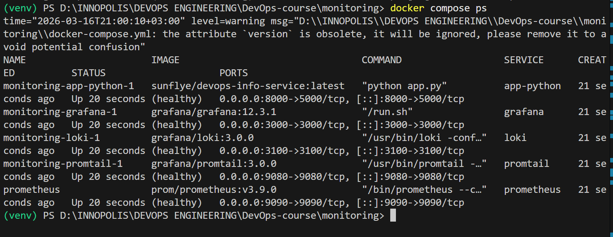
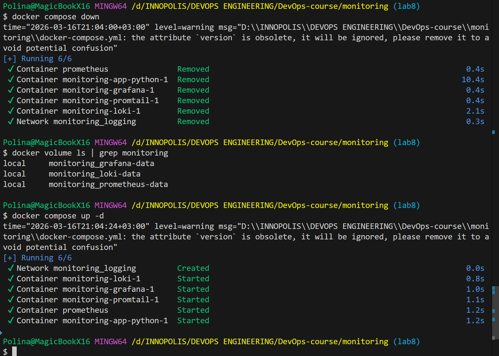
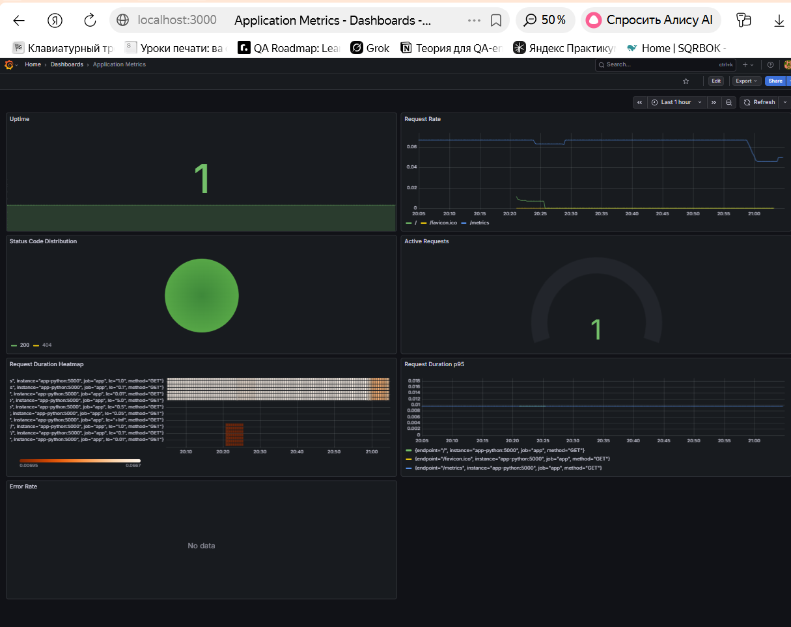

# Lab 8 — Metrics & Monitoring with Prometheus

## 1. Architecture

```text
                        metrics (/metrics)
+-------------------+ ------------------------------> +------------------------+
| app-python :5000  |                                 | Prometheus :9090       |
| Flask + RED       | <------------------------------ | scrape interval: 15s   |
| business metrics  |        PromQL queries           | retention: 15d / 10GB  |
+-------------------+                                 +-----------+------------+
                                                                |
                                                                | queries / datasource
                                                                v
                                                        +------------------------+
                                                        | Grafana :3000          |
                                                        | Prometheus dashboard   |
                                                        | login required         |
                                                        +------------------------+

+-------------------+      container logs      +-------------------+      push      +-------------------+
| app-python/app-go | -----------------------> | Promtail :9080    | -------------> | Loki :3100        |
+-------------------+                          +-------------------+                +-------------------+
```

## 2. Application Instrumentation

### Metrics Implemented

| Metric | Type | Purpose | Labels | Why? |
|--------|------|---------|--------|------|
| `http_requests_total` | Counter | Total HTTP requests received | method, endpoint, status | RED method: Rate |
| `http_request_duration_seconds` | Histogram | Request latency distribution | method, endpoint | RED method: Duration |
| `http_requests_in_progress` | Gauge | Active concurrent requests | - | Resource usage monitoring |
| `devops_info_endpoint_calls` | Counter | Endpoint-specific call count | endpoint | Business metric tracking |
| `devops_info_system_collection_seconds` | Histogram | System info collection time | - | Performance monitoring |

### Implementation Details

**Location:** `app_python/app.py`

**Key Code Sections:**

```python
# Prometheus Metrics Definition
http_requests_total = Counter(
    'http_requests_total',
    'Total HTTP requests',
    ['method', 'endpoint', 'status']
)

http_request_duration_seconds = Histogram(
    'http_request_duration_seconds',
    'HTTP request duration in seconds',
    ['method', 'endpoint'],
    buckets=[0.01, 0.05, 0.1, 0.5, 1.0, 5.0]
)

http_requests_in_progress = Gauge(
    'http_requests_in_progress',
    'HTTP requests currently being processed'
)

# Request hooks to track metrics
@app.before_request
def before_request_hook():
    http_requests_in_progress.inc()
    request.start_time = time.time()

@app.after_request
def after_request_hook(response):
    duration = time.time() - request.start_time
    http_request_duration_seconds.labels(
        method=request.method,
        endpoint=request.path
    ).observe(duration)
    
    http_requests_total.labels(
        method=request.method,
        endpoint=request.path,
        status=response.status_code
    ).inc()
    
    http_requests_in_progress.dec()
    return response

# Metrics endpoint
@app.route("/metrics")
def metrics():
    return Response(generate_latest(), mimetype=CONTENT_TYPE_LATEST)
```

**Why These Metrics?**
- **RED Method:** Rate (requests/sec), Errors (5xx rate), Duration (latency)
- **Counter:** Total requests never decrease, perfect for tracking totals
- **Histogram:** Buckets allow percentile calculation (p95, p99 latency)
- **Gauge:** Active requests show current system load
- **Low cardinality labels:** endpoint, method, status are bounded values (no user IDs)

## 3. Prometheus Configuration

### File: `monitoring/prometheus/prometheus.yml`

```yaml
global:
  scrape_interval: 15s
  evaluation_interval: 15s

storage:
  tsdb:
    retention_time: 15d
    retention_size: 10GB

scrape_configs:
  - job_name: 'prometheus'
    static_configs:
      - targets: ['localhost:9090']

  - job_name: 'app'
    static_configs:
      - targets: ['app-python:5000']
    metrics_path: '/metrics'

  - job_name: 'loki'
    static_configs:
      - targets: ['loki:3100']
    metrics_path: '/metrics'

  - job_name: 'grafana'
    static_configs:
      - targets: ['grafana:3000']
    metrics_path: '/metrics'
```

### Configuration Explanation

| Parameter | Value | Purpose |
|-----------|-------|---------|
| `scrape_interval` | 15s | Prometheus scrapes every 15 seconds |
| `evaluation_interval` | 15s | Alert rules evaluated every 15 seconds |
| `retention_time` | 15d | Keep metrics for 15 days |
| `retention_size` | 10GB | Or when disk reaches 10GB (whichever first) |
| `app-python:5000` | Internal Docker port | Inside Docker network uses internal port, not external 8000 |
| `metrics_path` | /metrics | All services expose metrics at /metrics |

### Why These Settings?

- **15s scrape interval:** Balance between granularity and load (standard for Docker apps)
- **15d retention:** Allows trend analysis over 2 weeks without huge storage
- **10GB size limit:** Prevents runaway disk usage in production
- **Internal ports in Docker:** Prometheus is inside Docker network, uses internal service names and ports

## 4. Dashboard Walkthrough

### Dashboard: "Application Metrics" (7 panels)

#### Panel 1: Request Rate (Time Series)
- **Query:** `sum(rate(http_requests_total[5m])) by (endpoint)`
- **Type:** Time series graph
- **Purpose:** Shows requests per second for each endpoint
- **What it means:** 
  - Flat line = consistent traffic
  - Spike = traffic burst
  - Drop = reduced usage
- **Example reading:** `/` endpoint at 0.06 requests/sec = 3.6 requests/minute

#### Panel 2: Error Rate (Time Series)
- **Query:** `sum(rate(http_requests_total{status=~"5.."}[5m]))`
- **Type:** Time series graph
- **Purpose:** Shows 5xx (server) errors per second
- **What it means:**
  - Should be near zero in healthy system
  - Any spike indicates problems
  - Correlate with other metrics to find cause
- **Healthy value:** < 0.01 requests/sec

#### Panel 3: p95 Latency (Time Series)
- **Query:** `histogram_quantile(0.95, rate(http_request_duration_seconds_bucket[5m]))`
- **Type:** Time series graph
- **Purpose:** 95th percentile request duration (slowest 5%)
- **What it means:**
  - 95% of requests faster than this
  - p95 = 0.05s = 50ms latency
  - Better metric than average (resistant to outliers)
- **Healthy value:** < 100ms for web apps

#### Panel 4: Request Duration Heatmap
- **Query:** `rate(http_request_duration_seconds_bucket[5m])`
- **Type:** Heatmap
- **Purpose:** Distribution of request latencies
- **What it means:**
  - Orange = common latency range
  - Shows if latency is consistent or variable
  - Heatmap reveals patterns average can't show
- **Reading:** Most requests cluster in lower latency range (good)

#### Panel 5: Active Requests (Gauge)
- **Query:** `http_requests_in_progress`
- **Type:** Gauge (circular dial)
- **Purpose:** Current concurrent requests right now
- **What it means:**
  - Gauge = instantaneous snapshot
  - High gauge + long request duration = bottleneck
  - Spike = burst of traffic
- **Healthy value:** < 10 for single-instance app

#### Panel 6: Status Code Distribution (Pie Chart)
- **Query:** `sum by (status) (rate(http_requests_total[5m]))`
- **Type:** Pie chart
- **Purpose:** Breakdown of 2xx, 4xx, 5xx responses
- **What it means:**
  - Green (2xx) = successful responses
  - Yellow (4xx) = client errors (missing pages, bad requests)
  - Red (5xx) = server errors (should be rare)
- **Healthy ratio:** 95%+ 2xx, <1% 4xx, ~0% 5xx

#### Panel 7: Uptime (Stat)
- **Query:** `up{job="app"}`
- **Type:** Stat (big number display)
- **Purpose:** Service health status
- **What it means:**
  - `1` = UP (green)
  - `0` = DOWN (red)
  - Shows if service is reachable
- **Healthy value:** Always 1

## 5. PromQL Examples & Explanations

### Basic Queries

#### 1. Request Rate (per second)
```promql
rate(http_requests_total[5m])
```
- **Breakdown:**
  - `http_requests_total` = counter (always increasing)
  - `[5m]` = look at last 5 minutes of data
  - `rate()` = calculate per-second increase
- **Example output:** 0.06 = 3.6 requests/minute
- **When to use:** Understand traffic volume

#### 2. Error Rate (percentage)
```promql
sum(rate(http_requests_total{status=~"5.."}[5m])) 
  / 
sum(rate(http_requests_total[5m])) * 100
```
- **Breakdown:**
  - `status=~"5.."` = regex match: 500, 501, 502, etc.
  - First sum = 5xx errors per second
  - Second sum = all requests per second
  - `/` = divide, `*100` = convert to percentage
- **Example output:** 0.5% = 1 error per 200 requests
- **When to use:** Monitor application reliability

#### 3. P95 Latency (95th percentile)
```promql
histogram_quantile(0.95, rate(http_request_duration_seconds_bucket[5m]))
```
- **Breakdown:**
  - `http_request_duration_seconds_bucket` = histogram buckets
  - `rate()` = rate of requests in each bucket
  - `histogram_quantile(0.95, ...)` = find value where 95% of requests are faster
- **Example output:** 0.05 = 50 milliseconds
- **When to use:** Understand user experience (not affected by one slow outlier)

#### 4. Average Latency (for comparison)
```promql
rate(http_request_duration_seconds_sum[5m]) 
  / 
rate(http_request_duration_seconds_count[5m])
```
- **Breakdown:**
  - Histogram provides `_sum` (total time) and `_count` (request count)
  - Divide sum by count = average
- **Why p95 > average:** Outliers pull up average
- **When to use:** For reference, p95 is better metric

#### 5. Requests by Endpoint
```promql
sum by (endpoint) (rate(http_requests_total[5m]))
```
- **Breakdown:**
  - `sum` = aggregate across all label values
  - `by (endpoint)` = group by endpoint label
  - Groups requests from different methods/statuses
- **Example output:**
  ```
  {endpoint="/"} = 0.05
  {endpoint="/health"} = 0.01
  {endpoint="/metrics"} = 0.0002
  ```
- **When to use:** Find which endpoints are most used

#### 6. Requests by Method
```promql
sum by (method) (rate(http_requests_total[5m]))
```
- **Breakdown:**
  - Same `sum by` pattern but group by HTTP method
- **Example output:**
  ```
  {method="GET"} = 0.06
  {method="POST"} = 0.001
  ```
- **When to use:** Understand API usage patterns

## 6. Production Setup

### Health Checks

All services have health checks in `docker-compose.yml`:

**How it works:**
- Every 10 seconds, Docker runs health check
- If it fails 5 times in a row, container marked unhealthy
- Docker can auto-restart unhealthy containers
- Prometheus won't scrape unhealthy targets

### Resource Limits

```yaml
prometheus:
  deploy:
    resources:
      limits:
        cpus: '1.0'      # Max 1 CPU core
        memory: 1G       # Max 1GB RAM
      reservations:
        cpus: '0.5'      # Guaranteed 0.5 CPU
        memory: 512M     # Guaranteed 512MB RAM
```

**Why limits matter:**
- **Limits:** Prevent runaway resource usage
- **Reservations:** Ensure minimum resources available
- **Prometheus:** Needs 1GB for 15d retention at 1000 series/sec
- **Scaling:** If needs exceed limit, container stops

### Data Retention

```yaml
command:
  - '--config.file=/etc/prometheus/prometheus.yml'
  - '--storage.tsdb.retention.time=15d'
  - '--storage.tsdb.retention.size=10GB'
```

**Retention Strategy:**
- **15 days:** Allows trend analysis, not too old
- **10GB limit:** Fits in typical Docker volume
- **Whichever comes first:** If 10GB fills before 15d, older data deleted
- **Trade-off:** More data = slower queries, less data = less history

### Persistent Volumes

```yaml
volumes:
  prometheus-data:
    driver: local
```

**Why persistence matters:**
- Data survives container restart
- Dashboards don't disappear after crash
- Historical data available after redeployment
- Dashboard (in Grafana volume) survives

### Network Security

```yaml
networks:
  logging:
    driver: bridge
```

**Security benefits:**
- All services on isolated Docker bridge network
- Not exposed to host unless port published
- Services can reach each other by name (DNS)
- `prometheus` service can reach `app-python:5000` internally
- Only Prometheus port 9090 exposed to host for Grafana

## 7. Testing Results
**Task 1:**
- Screenshot of /metrics endpoint output



- Code showing metric definitions


**Task 2:**
- Screenshot of /targets page showing all targets UP


- Screenshot of a successful PromQL query


**Task 3:**
- Screenshot of your custom application dashboard with live data

- Exported dashboard JSON file (located at `monitoring/dashboard/application_metrics_lab8.json`)

**Task 4:**
- `docker compose ps` showing all services healthy


- Proof of data persistence after restart




## 8. Challenges & Solutions

### Challenge 1: App target showing 404 NOT FOUND

**Problem:** Prometheus tried `app-python:8000/metrics` instead of `app-python:5000/metrics`

**Root cause:** Port mismapping - 8000 is external port, 5000 is internal Docker port

**Solution:** Changed prometheus.yml to use internal port:
```yaml
targets: ['app-python:5000']  # Internal Docker port
```

**Lesson:** Inside Docker networks, use service names and internal ports. External port 8000 is only for host access.

### Challenge 2: Metrics not appearing in app

**Problem:** `/metrics` endpoint returned 404 even though code was added

**Root cause:** Old Docker image being used - needed to rebuild

**Solution:** 
```bash
docker build -t sunflye/devops-info-service:latest app_python/
docker compose down
docker compose up -d --force-recreate app-python
```

**Lesson:** Docker images are cached. Always rebuild after code changes.


## 9. Integration with Lab 7 (Loki + Logs)

### How Metrics and Logs Work Together

| Aspect | Logs (Lab 7 - Loki) | Metrics (Lab 8 - Prometheus) |
|--------|---------------------|------------------------------|
| **Data type** | Raw event text | Time-series numbers |
| **Storage** | High volume (Loki TSDB) | Compressed (Prometheus TSDB) |
| **Retention** | 7 days | 15 days |
| **Query** | LogQL (text/JSON search) | PromQL (math/aggregation) |
| **Use case** | "What happened at 3pm?" | "How many requests at 3pm?" |
| **Example** | `{"level": "ERROR", "msg": "..."}` | `http_requests_total = 1234` |

**Working Together:**
1. **Metrics alert** → "Error rate spiked to 5%"
2. **Go to Grafana** → Look at Loki dashboard
3. **LogQL query** → `{app="app-python"} |= "ERROR"`
4. **Root cause found** → "Database connection timeout"

### Complete Observability Stack

```
┌─────────────────────────────────┐
│     Application Code            │
│  (app_python/app.py)            │
└────────┬────────────────────────┘
         │
    ┌────┴────────────────────┐
    │                         │
┌───▼─────────┐      ┌──────▼──────┐
│   Logs      │      │   Metrics   │
│  (JSON)     │      │  (numbers)  │
│             │      │             │
└────┬────────┘      └──────┬──────┘
     │                      │
┌────▼────────┐      ┌──────▼──────┐
│  Promtail   │      │ Prometheus  │
│ (collects)  │      │ (scrapes)   │
└────┬────────┘      └──────┬──────┘
     │                      │
┌────▼────────┐      ┌──────▼──────┐
│   Loki      │      │ Prometheus  │
│ (stores)    │      │  (stores)   │
└────┬────────┘      └──────┬──────┘
     │                      │
     └──────────┬───────────┘
                │
           ┌────▼──────┐
           │   Grafana │
           │ (unified) │
           └───────────┘
           
Result: Complete visibility into system behavior
```

